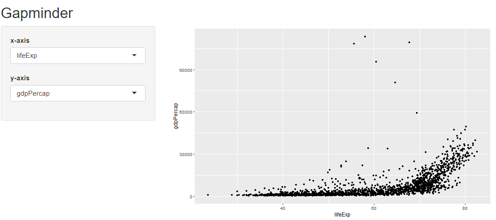
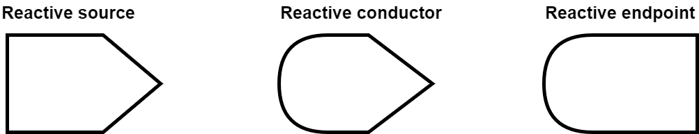
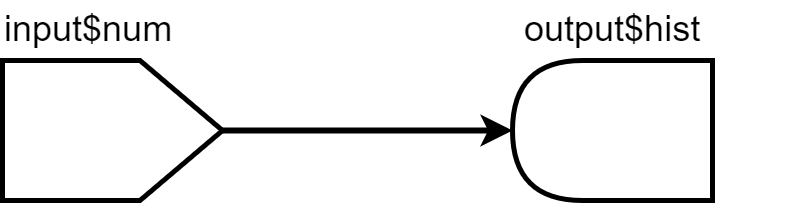
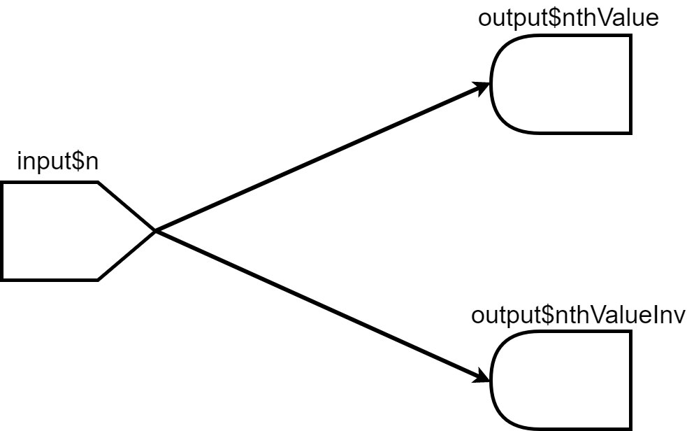
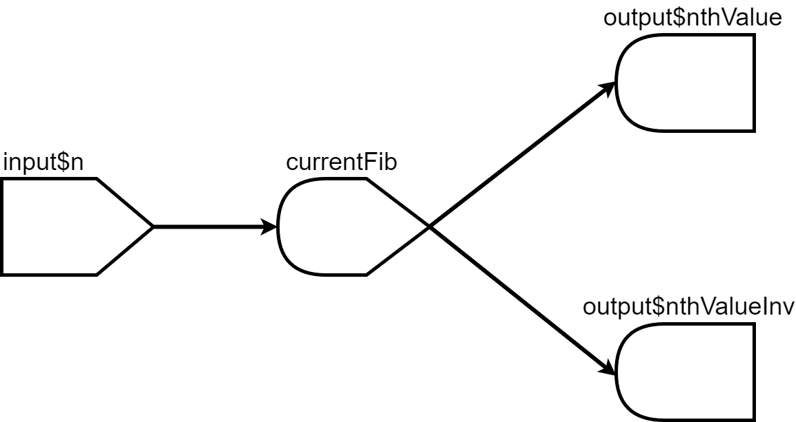
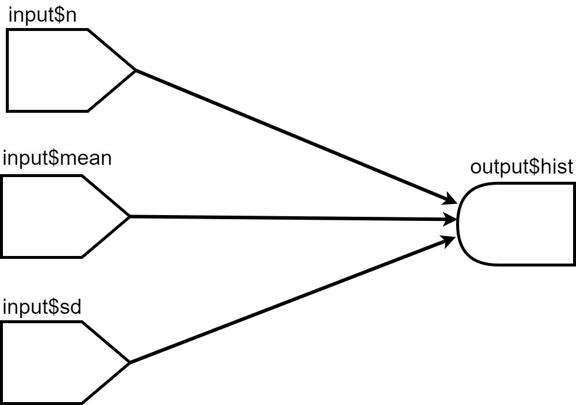
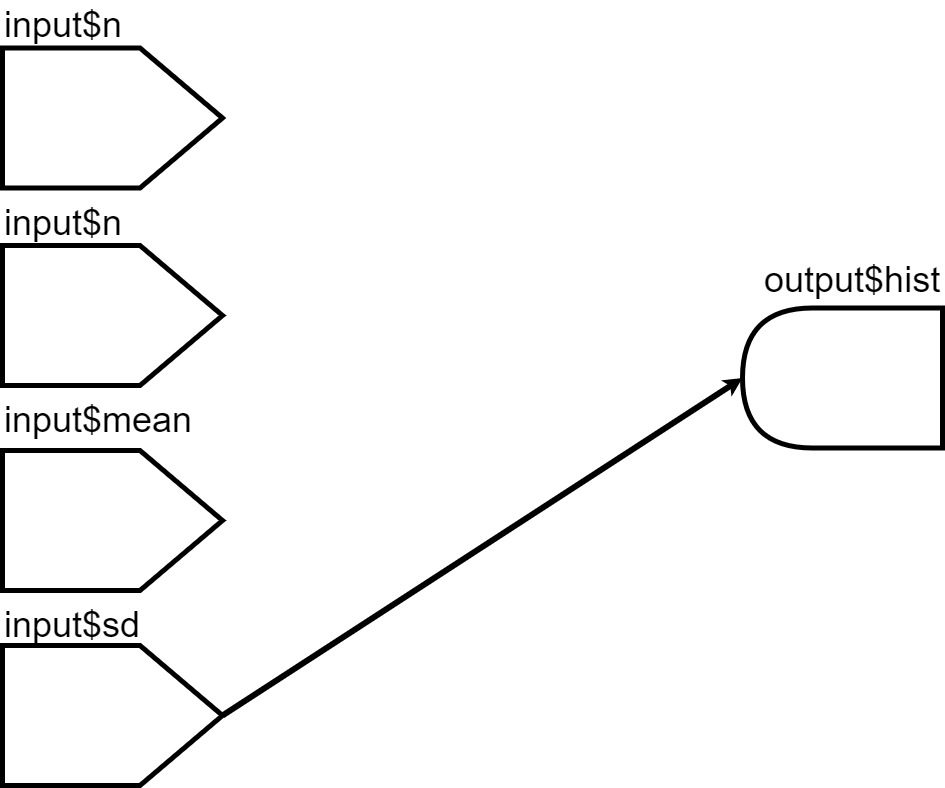

```{r moon_reader, include = FALSE, eval = FALSE}
# setup for moon reader
# copy it to console
options(servr.interval = 0.5)
xaringan::inf_mr()
```

```{r xaringanExtra-clipboard_2, echo=FALSE}
# copy button styles mainly in ude.css
htmltools::tagList(
  xaringanExtra::use_clipboard(
    button_text = "<i class=\"fa fa-clipboard\"></i>",
    success_text = "<i class=\"fa fa-check\" style=\"color: #00ff00\"></i>",
    error_text = "<i class=\"fa fa-times-circle\" style=\"color: #F94144\"></i>"
  ),
  rmarkdown::html_dependency_font_awesome()
)
```

```{r set-up, include = FALSE}
knitr::opts_chunk$set(echo = TRUE, eval = FALSE)
library(icons)

# pre-define icons
desktop <- icons::icon_style(icons::fontawesome$solid$desktop, fill = "#004c93")
checker_green <- icons::icon_style(icons::fontawesome$solid$check, fill = "green")
times_red <- icons::icon_style(icons::fontawesome$solid$times, fill = "red")
```

class: title-slide title-shiny center middle

# `r rmarkdown::metadata$title`
## `r rmarkdown::metadata$subtitle`
### `r rmarkdown::metadata$author`

---
## What is Shiny? 

.font90[
The `shiny` package allows to build interactive web applications for e.g. data analysis.
]

--

.font90[
It can be used for,inter alia:

- building a graphical user interface for R
- reporting results
- creating interactive documents.
]

--

.font90[
- To build a Shiny app you only need to learn the Shiny syntax.  
- If you want to customize your app you can use HTML/CSS/Javascript.  
]

--
.font90[
Here are some examples: 

- [K-Means](https://shiny.rstudio.com/gallery/kmeans-example.html)
- [Genome Viewer](https://shiny.rstudio.com/gallery/genome-browser.html)
- [Dashboard](https://www.rgonzo.us/shiny/apps/textanalysis/)
]

--
.font90[
There is also a [cheatsheet](https://shiny.rstudio.com/images/shiny-cheatsheet.pdf). 
]

???
https://corona.stat.uni-muenchen.de/maps/
https://experience.arcgis.com/experience/478220a4c454480e823b17327b2bf1d4


---


## Structure

A Shiny app consist of 2 parts

1. The user interface script 
    - controls the layout and appearance of your app.
    - contains elements for user input.
    - contains the output you want to visualize.
    
--

<ol start = "2">
  <li> The server script </li>
  <ul>
    <li>contains the instructions for the R session which always works behind the scene</li>
    <li>takes the user input and produces the output which is sent back to the UI</li>
  </ul> 
</ol>
    

---

## A minimal example 


```{r}
library(shiny)

# The user interface
ui <- fluidPage()

# Instructions for the R backend
server <- function(input, output) {}

# Run the shiny app 
shinyApp(ui = ui, server = server)
```

Another way to build an app is 
- create a new directory (say `.../App-1`) with files `ui.R` and `server.R`
- run `shiny::runApp(".../App-1"). `

---

## User Interface  

We will now extend our app by adding a simple sidebar layout. 

```{r, eval = FALSE, echo = TRUE, results='asis'}
ui <- fluidPage(
  
  titlePanel("Title Panel"), 

  sidebarLayout(
       sidebarPanel( "Sidebar Panel"),
       mainPanel("Main Panel")
       )
)
server <- function(input, output) {}
shinyApp(ui = ui, server = server)
```

- `fluidPage()` creates a new website that we can fill with content.
-  Type any of those functions in the R console to see that HTML code is returned. 

---
## Adding Elements for User Input 
  
```{r}
ui <- fluidPage(
  titlePanel("Title Panel"), 
  sidebarLayout(
    sidebarPanel("Sidebar Panel",
                 br(),                               # linebreak
                 br(),
                 sliderInput(
                 inputId = "num",                    # input value can be accessed from the server 
                 label = "Choose a number",          # function via the inputId
                 value = 25, min = 1, max = 100)
                 ),
    mainPanel("Main Panel")
  )
)
```
  
You can find an overview of input elements [here](https://shiny.rstudio.com/gallery/widget-gallery.html).
A very convenient input element not yet contained in the overview is [varSelectInput](https://shiny.rstudio.com/reference/shiny/latest/varSelectInput.html). 
---
## Create Output in the Server Function 

The server function takes the input from the UI and returns e.g. text, plots or tables
back to the UI. 

There are some rules: 

- the input is accessed by `input$inputId`.
- the output that depends on user input needs to be created by a render function.
- the output to be displayed needs to be saved as `output$outputId`.


```{r}
server <- function(input, output) {
  
  output$hist <- renderPlot({ 
    hist(rnorm(input$num)) 
    })
  
}
```


---
## Display Output in the User Interface

Output can be added to the user interface by one of the output functions. 

```{r}
ui <- fluidPage(
  titlePanel("Title Panel"), 
  sidebarLayout(
    
    sidebarPanel("Sidebar Panel",
                 br(),                        
                 br(),
                 sliderInput(inputId = "num", 
                       label = "Choose a number", 
                       value = 25, min = 1, max = 100)
                       ),
    
    mainPanel("Main Panel",
              br(),                    
              br(),
              plotOutput("hist")
              )
  )
)
```


---
## Which Render and Output Functions belong together?
<br>
```{r, eval = TRUE, echo = FALSE, warning=FALSE, message=FALSE, results='asis'}
library(pander)
a <- cbind(c("dataTableOutput","htmlOutput","imageOutput","plotOutput","tableOutput","textOutput", "verbatimTextOutput", "uiOutput"),
           c("renderDataTable","","renderImage","renderPlot","renderTable"," renderText", "renderPrint","renderUI"),
           c("DT::datatable","raw HTML","e.g. .png, .jpeg","e.g. a ggplot","e.g. data frame, matrix","value output", "print output","shiny UI element"))
colnames(a) <- c("Output Function","Render Function",  "What?")
a <- as.data.frame(a)
#emphasize.strong.cols(c(1,2,3))
#panderOptions("table.style", "rmarkdown")
print(knitr::kable(a, format = "html"))
```


---
## Gapminder 

<iframe width="1051" height="550" src="https://www.youtube.com/embed/jbkSRLYSojo?list=PLB33D8_2SjkZvPYB1CbyMtQhlM-D106hk" frameborder="0" allow="accelerometer; autoplay; encrypted-media; gyroscope; picture-in-picture" allowfullscreen></iframe>

---
## Exercises

Install and load the `gapminder` package.

1. Recreate the following app.  
Hints: The variables on the x and y axis must be numeric. The values returned by the input widgets are character strings.  

    ```{r, eval = TRUE, echo = FALSE, out.width = "800px"}

    ```


---
<ol start=2>
<li> Add two more input variables that control the color and size of the points. </li>
<li> Add a slider that allows to subset the data by year.<br>
<br>
    ```{r, eval = TRUE, echo = FALSE, out.width = "700px"}
knitr::include_graphics("../img/shiny2.png")
    ```
</li>
</ol>

---
## Reactivity

We have seen that the output created by a render function changes automatically when we change input values. This behavior is called reactivity. 

- There are 3 kinds of reactive objects. 

```{r, eval = TRUE, echo = FALSE, fig.align='center', out.width="40%"}

```

- The reactive source is usually the user input which is accessible through `input$inputId`. It can only have dependents (it is always a parent node). 
- The reactive endpoint is usually produced by one of the render functions and assigned to `output$OutputId`. It can only be dependent (it is always a child node). 

---
## Reactivity

We have already written a simple app using those two elements.  

```{r, eval = TRUE, echo = FALSE, fig.align='center', out.width="40%"}

```

Whenever  `input$num` changes the reactive endpoints using this input are notified that they need to re-execute. 

---
## Reactivity

.font90[
Which structure has the following code?

```{r, echo = TRUE}
# Calculate nth number in Fibonacci sequence
fib <- function(n) ifelse(n<3, 1, fib(n-1)+fib(n-2))
server <- function(input, output) {
  output$nthValue    <- renderText({ fib(as.numeric(input$n)) })
  output$nthValueInv <- renderText({ 1 / fib(as.numeric(input$n)) })
}
```
]
--
.font90[
There are two child nodes depending on one parent node. 

```{r, eval = TRUE, echo = FALSE, fig.align='center', out.width="35%"}

```

Furthermore, each of the childs evaluates `fib()` separately, which leads to redundant computations.  
]

---
## Reactivity

By using a reactive conductor created by `reactive()` we can rewrite the code so that `fib()` executes only once. 

```{r}
server <- function(input, output) {
  # reactive conductor depending on reactive source
  currentFib         <- reactive({ fib(as.numeric(input$n)) })
  # reactive endpoints depending on reactive conductor
  output$nthValue    <- renderText({ currentFib() })
  output$nthValueInv <- renderText({ 1 / currentFib() })
}
```

```{r, eval = TRUE, echo = FALSE, fig.align='center', out.width="35%"}

```
  
Note that you need `()` (here ` currentFib()`) to access the value computed by `reactive()`. 

---
## Prevent reactivity with `isolate()`

Consider the case where we we have multiple inputs and the receiving end node runs some heavy computation.   


```{r, eval = TRUE, echo = FALSE, fig.align='center', out.width="35%"}

```
  
  
What is the problem here?

---
## Example 


```{r}
ui <- fluidPage(
  numericInput("n", "Number of observations" ,10),
  numericInput("mean", "Mean" ,10),
  numericInput("sd", "Standard Deviation" ,10),
  actionButton("goButton", "Go!"),
  plotOutput("hist")
)

server <- function(input, output) {
  
output$hist <- renderPlot({
  x <- rnorm(input$n, mean = input$mean, sd = input$sd)
  hist(x)
  })

} 

shinyApp(ui, server)
```


---
## Prevent reactivity with `isolate()`

We can solve this by making the render function producing the output unresponsive to a change of the inputs using `isolate()`. When the user finished entering all input values e.g. a button could be used to start the 
computation. 

```{r, eval = TRUE, echo = FALSE, fig.align='center', out.width="35%"}

```
  
---
## Example

```{r}
ui <- fluidPage(
  numericInput("n", "Number of observations" ,100),
  numericInput("mean", "Mean" ,0),
  numericInput("sd", "Standard Deviation" ,1),
  actionButton("goButton", "Go!"),
  plotOutput("hist")
)

server <- function(input, output) {
  
output$hist <- renderPlot({
  # Take a dependency on input$goButton
  input$goButton
  # Use isolate() to avoid dependency on the other inputs
  x <- isolate(rnorm(input$n, mean = input$mean, sd = input$sd))
  hist(x)
  })

} 

shinyApp(ui, server)
```

---
## Exercises 

<ol start=4>
<li> Add a button to the Gapminder app and let the graph only re-render if this button is hit. </li>
<li> Add a checkbox "Only continents" to your app. If this checkbox is activated, a new data set
  should be computed which summarises the data on continent level. Aggregate the data in a sensible way.  
  Use a reactive conductor to only compute the aggregated data set once when the checkbox is activated. </li>
</ol> 


---
## DataTables

The `DT` package provides a powerful tool for interactive inspection and filtration of rectangular data. 

```{r}
library(DT)

ui <- basicPage(
  h2("The mtcars data"),
  DT::dataTableOutput("mytable")
)

server <- function(input, output) {
  output$mytable = DT::renderDataTable({
    mtcars
  }, 
  filter = "top"
  )
}
  
shinyApp(ui, server)
```

---
## DataTables

We can even use the filtered rows for further computation. 

```{r}
ui <- basicPage(
  h2("The mtcars data"),
  DT::dataTableOutput("mytable"),
  plotOutput("hist")
)

server <- function(input, output){
  
  output$mytable = DT::renderDataTable({
    mtcars
  }, 
  filter = "top"
  )
  
  output$hist <- renderPlot({
    hist(mtcars[input$mytable_rows_all, "wt"], xlim = c(min(mtcars$wt), max(mtcars$wt)))
    })
  
}
  
shinyApp(ui, server)
```

---
## Exercises 
<ol start=6>
<li> Add a DataTable displaying the selcted data to your Gapminder app. Use a <a href = "https://shiny.rstudio.com/articles/tabsets.html">Tab Panel</a> to allow switching between the
table and the plot. </li>  
</ol>


