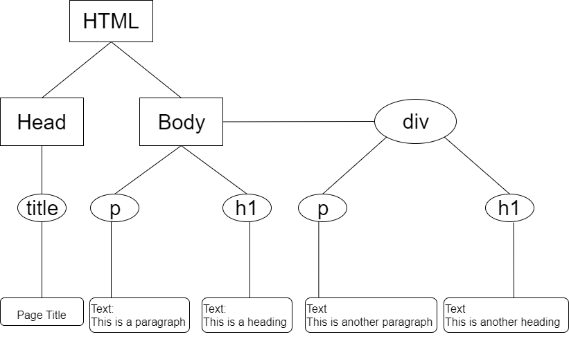

```{r xaringanExtra-clipboard_2, echo=FALSE}
# copy button styles mainly in ude.css
htmltools::tagList(
  xaringanExtra::use_clipboard(
    button_text = "<i class=\"fa fa-clipboard\"></i>",
    success_text = "<i class=\"fa fa-check\" style=\"color: #00ff00\"></i>",
    error_text = "<i class=\"fa fa-times-circle\" style=\"color: #F94144\"></i>"
  ),
  rmarkdown::html_dependency_font_awesome()
)
```

```{r setup, include=FALSE}
knitr::opts_chunk$set(echo = TRUE, warning=FALSE, message=FALSE)
options(htmltools.dir.version = FALSE)
def.chunk.hook  <- knitr::knit_hooks$get("chunk")

library(icons)

# pre-define icons
desktop <- icons::icon_style(icons::fontawesome$solid$desktop, fill = "#004c93")
checker_green <- icons::icon_style(icons::fontawesome$solid$check, fill = "green")
times_red <- icons::icon_style(icons::fontawesome$solid$times, fill = "red")
```

class: title-slide title-rvest center middle

# `r rmarkdown::metadata$title`
## `r rmarkdown::metadata$subtitle`
### `r rmarkdown::metadata$author`
---
class: left, top
## What is Web Scraping?

Web scraping is the process of extracting data from websites. It can be used if the desired data 
are not readily available via e.g. a download link or an API.

--

.font90.blockquote.exercise[

#### `r desktop` Example

Consider the website https://www.trustpilot.com/ which is a platform for customer reviews.

Each review consists of different parts such as
- a short text
- a date
- a rating from 1 to 5 stars. 
]

--

Let's say we are interested whether the ratings of a shop change over time. For this we would need 
to gather the date and the star rating which are, however, not downloadable. 


We will learn how we can access these data nontheless to perform the analysis. 

---
class: left, top
## Legal Issues

Web scraping is generally legal. However, depending on the jurisdiction it can be considered illegal in some cases.

--

You should be careful if...

- you have to sign in into e.g. a social network since you agree to their rules
- you circumvent web security measures
- you scrape personal information such as email addresses, etc. 
- you scrape a substantial amount of a website's content
- you want to republish the scraped content, e.g. an article from a newspage. 
- webscraping is prohibited by the Terms of Service, even if this doesn't make it illegal per se.  

--

**Important**: avoid troubles by limiting the number of requests to a reasonable amount (e.g. 1 request every 10 seconds). Otherwise it could be considered as a denial of service attack. 


---
## The Structure of a Website

.font80[
To extract data from a website it is necessary to understand the basics of how a website is built. 
]

--

.font70.blockquote.exercise[

#### `r desktop` Basic HTML example:

```{}
<!DOCTYPE html>
  <html>
  <head>
  <title>Page Title</title>
  </head>
  <body>

  <h1>This is a Heading</h1>
  <p>This is a paragraph.</p>
  
  <div>
  <h1>This is another Heading</h1>
  <p>This is another paragraph.</p>
  </div>
  
  </body>
  </html>
```
]

--

.font80[
- The `<html>...</html>` tags are the container for all other HTML elements.
- The `<head>...</head>` tags contain meta data which are not directly visible on the web page.
- `<body>...</body>` contains everything we can see such as text, links, images, tables, lists, etc. This is the most relevant part for webscraping. 
]
---
## The Body

.code70.blockquote.exercise[

#### `r desktop` Exmaple
```{}
  <body>
  
  <h1>This is a Heading</h1>
  <p>This is a paragraph.</p>
  
  <div>
  <h1>This is another Heading</h1>
  <p>This is another paragraph.</p>
  </div>
  
  </body>
```
]

--

.font90[
- In the body part tags are used to give the displayed information a structure. In our example we use: 
    - `<h1>...</h1>`   to define a heading
    - `<p>...</p>`     to define text
    - `<div>...</div>` to define different sections.

- Look at the [w3schools tag list](https://www.w3schools.com/tags/default.asp) for other tags you might encounter. 
]

--

.font90[
We will start by scraping the simple HTML page from before. 
Create a new HTML document and copy the code form the last slide into it.
]

---
## `read_html()`


The package `rvest` makes use of the structure of an HTML document to extract the relevant information. 

The first step is to load the website into R using `xml2::read_html()` ( `rvest` depends on `xml2` whereby `xml2`  automatically loads when `rvest` gets loaded). 

<br>

--

.code90.blockquote.exercise[
#### `r desktop` Exmaple

```{r}
library(rvest)
URL <- here::here("SoSe_2022/webscraping/examples/simple_html_page.html") # path of my html file
(page <- read_html(URL))
```
]

---
## XML Structure

.font90[
Our page is now stored as an `xml` document which has a hierarchical data structure. For our page it looks like this. ]

```{r, eval = TRUE, echo = FALSE, out.width = "600px", fig.align='center'}

```

--

.font90[
- We call everything sourrounded by a rectangle or a circle a node. 
- We call everything sourrounded by a rectangle with rounded corners data. 
]
---
## `html_node()`

We can navigate through the `xml` object using `rvest::html_node()`.

-  Get all `p` node
.blockquote.exercise[
```{r}
page %>% rvest::html_nodes("p")
```
]

--

-  Get only `p` nodes which are children of `div` nodes
.blockquote.exercise[
```{r}
page %>% 
  rvest::html_nodes("div") %>% 
  rvest::html_nodes("p")
```
]

---
## `html_text()`
If we got the nodes which contain the data we want to scrape, we can use `rvest::html_text()` to 
extract the data (i.e. the text between the tags) as a normal character vector. 

<br>

--

.blockquote.exercise[
```{r}
page %>% 
  html_nodes("div") %>% 
  html_nodes("p") %>%  
  html_text()
  
```
]

---
## CSS 

.font90[
Websites are not only built with HTML. CSS is the language which is used to style a website.
Let's add a bit more to our simple page: 

- add a link to a `css` file (which doesn't exist now) in the head section of your html file 
.blockquote.exercise[
```{}
<link rel="stylesheet" href="stylesheet.css">
```
]]

--

.font90[
- add another `div` with a heading and a paragraph

- create a new file `stylesheet.css` in the same folder as your HTML file 

- copy the following code into that file and see what happens]

--

.blockquote.exercise[
```{}
div h1 {
  color: green;
  text-align: center;
};
```
]

---
## CSS Selectors

What if we want different `div` sections to look differently?

For this classes and ids can be specified. For web scraping we usually only need 
to know about classes, but ids work quite similar. 

- change the code of one `div` section to  

```{}
<div class = "blue"> ... </div> 
```
and the other to 

```{}
<div class = "red"> ... </div> 
```

---
## CSS Selectors

Having added a class attribute to our `div` sections, we can now use this class in the CSS file as 
follows

.code90[
```{}
.blue h1 {
  color: blue;
  text-align: center;
}

.red h1 {
  color: green;
  text-align: center;
}
```
]

What is before the `{}` is called a CSS selector. It can consist of classes, ids, tags and of 
any combination of those elements. E.g. `.blue h1` reads as: select all `h1` headings inside an element with class `blue`. 
Note: you need to put a `.` before the class name. 


For more on selectors look at [w3chools CSS Selector Reference](https://www.w3schools.com/cssref/css_selectors.asp).


The web developer uses selectors to style similar content in the same way (e.g. on trustpilot.com 
each user review looks the same). We can use those to scrape the content we desire more specifically.   


---
## Use the Selectors 

Let's say we want to select all paragraphs (`p`) which are a decendent of an element with class `.red`. We can achieve this with

```{r}
url <- here::here("SoSe_2022/webscraping/examples/simple_html_page_with_css.html")
page <- url %>% read_html()
page %>%  
  html_nodes(".red") %>% 
  html_nodes("p") %>%
  html_text()
```

or in short

```{r}
page %>%  
  html_nodes(".red p") %>% 
  html_text()
```

---
## Extract attributes

Sometimes we are not interested in the text between element tags but the relevant information is hidden 
in the tag attributes. Attributes are everything that is defined in the opening tag, e.g in 

```{}
<div class = "blue"> ... </div> 
```
`class = "blue"` is an attribute. With `html_attrs()` and `html_attr()`  we can extract these information.
.code70[
```{r}
# Get all attributes
page %>%  
  html_nodes(".red") %>% 
  html_attrs()

# Get a specific attribute
page %>%  
  html_nodes(".red") %>% 
  html_attr("class")
```
]

---
## HTML tables 

Since data are often stored in tables, `rvest` provides the function `html_table()` which parses a HTML table into a data frame. Tables in HTML look like this: 
.code70[
```{}
<table style="width:100%">
  <tr>
    <th>Firstname</th>
    <th>Lastname</th>
    <th>Age</th>
  </tr>
  <tr>
    <td>Jill</td>
    <td>Smith</td>
    <td>50</td>
  </tr>
  <tr>
    <td>Eve</td>
    <td>Jackson</td>
    <td>94</td>
  </tr>
</table>
```
]

Add this table to your HTML file and try to scrape the data using `html_table()`.
```{r, echo=FALSE, eval = FALSE}
page %>%  
  html_nodes("table") %>%
  html_table()
```

---
## CSS Selector Gadget

How do we find the CSS selectors

1. Looking into the source code (depending on your web browser you can right click on the webpage and click e.g. source code, inspect, ...)

2. Digging through the source code is often not necessary. If you use Chrome install 
   the [Selector Gadget](https://cran.r-project.org/web/packages/rvest/vignettes/selectorgadget.html).


---
## A real example: trustpilot.com

We want to write a function that for each review extracts

- the name of the reviewer
- the number of stars
- the date
- the review title
- the review text

The final function to extract data from one URL might look like this: 

.code70[
```{r, eval = FALSE}
get_reviews <- function(url){
  page <- read_html(url)
  tibble(
  name   = get_name(page),
  rating = get_rating(page), 
  date   = get_date(page), 
  title  = get_title(page),
  text   = get_text(page)
  )
}
```
]

---
## A real example: trustpilot.com

Not only do we want to scrape all reviews from one URL but all reviews for a company which 
are distributed over many URLs. Can you write a function which can do this?


