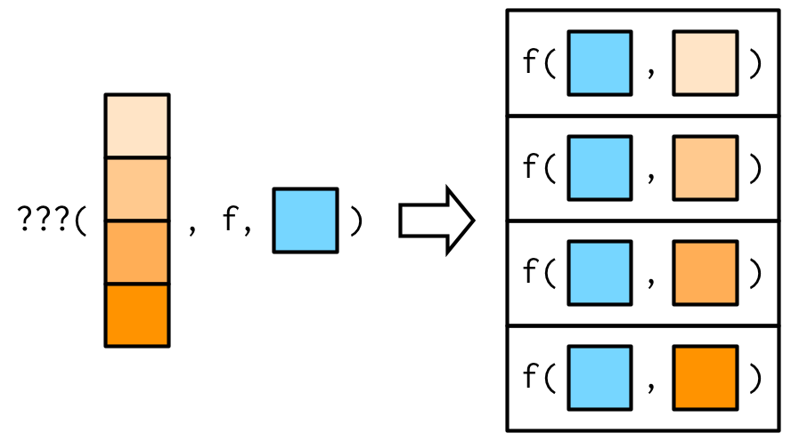

```{r xaringanExtra-clipboard_2, echo=FALSE}
# copy button styles mainly in ude.css
htmltools::tagList(
  xaringanExtra::use_clipboard(
    button_text = "<i class=\"fa fa-clipboard\"></i>",
    success_text = "<i class=\"fa fa-check\" style=\"color: #00ff00\"></i>",
    error_text = "<i class=\"fa fa-times-circle\" style=\"color: #F94144\"></i>"
  ),
  rmarkdown::html_dependency_font_awesome()
)
```

```{r setup, include=FALSE}
knitr::opts_chunk$set(warning=FALSE, message=FALSE)
options(htmltools.dir.version = FALSE)
library(dplyr)
library(purrr)
library(readr)
library(icons)

# pre-define icons
desktop <- icons::icon_style(icons::fontawesome$solid$desktop, fill = "#004c93")
checker_green <- icons::icon_style(icons::fontawesome$solid$check, fill = "green")
times_red <- icons::icon_style(icons::fontawesome$solid$times, fill = "red")
```

class: title-slide title-purrr center middle

# `r rmarkdown::metadata$title`
## `r rmarkdown::metadata$subtitle`
### `r rmarkdown::metadata$author`

---
class: segue-red
### Part I

Functional Programming Using `purrr`

---
class: left 
## Functional Style Programming

<blockquote style ="margin-top:15%;">
To become significantly more reliable, code must become more transparent. In particular, nested conditions and loops must be viewed with great suspicion. Complicated control flows confuse programmers. Messy code often hides bugs.
.right[&mdash; <cite>Bjarne Stroustrup</cite>]
</blockquote>

---
## FAQs

<style>
  strong {
    color:#e64626;
  }
  
</style>

```{r, eval = FALSE}
# Packages needed
library(dplyr)
library(purrr)
library(readr)
# or simply attach the tidyverse
```

**What is a functional programming language?**

- Simply put: a language which is centered on problem solving using functions!

- There are two common threads:

    1. A functional language has **first-class functions** which behave like any other data type. In R this means we may treat function like variables (i.e. assign them, store them in a list or pass them as arguments to other functions)
    
    2. Many functional languages require **pure** functions only. These are functions which have no side-effects: they do not interfere with anything outside their scope and produce output which depends only on the input.

???

1. R has first-class functions.

2. Does R allow for pure functions only? No: e.g. `print()` has side-effects. Obviously all functions which return pseudo-random numbers are not pure functions.
---
## FAQs
    
**Is R a functional programming language?**

- R is not a functional programming language but we may adopt a *functional style* of programming.

- **Functionals** are functions which take functions as input and produce, e.g. vector output

**Why should I use functional style programming?**

- Functional programming is often space efficient, very comprehensible and easily adopted to new situations

- Functionals are easily analysed in isolation and thus are often straightforward to optimize and parallelise

    (We'll discuss functionals in a minute)

???
You've probably used functionals already: `lapply()` and `integrate()` are prominent examples.

---
## FAQs

**What does 'functional programming style' even mean?**

It’s hard to describe exactly what a functional style is, but generally we will refer to the following definition:  

<br>
<blockquote>
Functional programming style means decomposing a big problem into smaller pieces, then solving each piece with a function or combination of functions.
.right[&mdash; <cite>Hadley Wickham</cite>]
</blockquote>

---
## FAQs

We will briefly discuss key techniques in functional R programming which are best summarized be the table below. We will focus on `purrr` functionals and applications of function factories.  

<br>
<br>


---
## Functionals

A **functional** takes a function as an input and returns a vector as output.

```{r}
randomise <- function(f) f(rnorm(1e3))
randomise(mean)
randomise(sum)
```

???

Functionals can also produce other data structures, e.g., data frames as output.

---
## Functionals

.smaller[

- Functionals are often used as alternatives to loops. Not because loops are inherently slow (which is common wisdom), but because loops 

    - make it relatively cumbersome to harness the power of iteration

    - are prone to typos that are difficult to identify

    - can be *overly flexible*: loops convey that an iteration is done, but not what should be done with the results.
    
- Functionals are tailored to specific tasks which immediately convey *why* they are being used and what output format they produce.
    
- Switching from loops to functionals doesn't necessarily mean that we must write our own functionals: the `purrr` package provides functionals which are very concise and also fast as they are written in C.

]

???

- With functionals we don't need to worry about indexing, brackets, curly braces etc. 

- Of course, flexibility isn't bad. They idea of a functional programming is to use functionals that perform a specific iteration which returns a specific output format.

- Others are likely to be puzzled by looking at your code if it uses a lot of loops. Functionals immediately convey which iteration is done and which output is returned.

    'Others' also includes your future self :-)

---
## Functionals &mdash; `purrr::map()`

.smaller[

`map()` is the `purrr` version of `lapply()`. 

.pull-left[
<br>
<br>
<br>


]

.pull-right[
.blockquote.exercise[
#### `r desktop` Example: `map()`

`map(1:3, f)` is `list(f(1), f(2), f(3))`.
```{r}
triple <- function(x) x * 3
map(1:3, triple)
```
]]]

???

Obviously `map()` returns a list.

---
## `purrr::map_*()` &mdash; Producing Atomic Vectors

.smaller[

- There are helper functions which are more convenient if simpler data structures are required: `map_lgl()`, `map_int()`, `map_dbl()`, and `map_chr()` return an atomic vector of the specified type

- Base R equivalents are `sapply()` and `vapply()`

.blockquote.exercise[
#### `r desktop` Example: `map_*()`
.pull-left[
<br>


]

.pull-right[
.smaller[
```{r}
map_lgl(mtcars, is.double)

n_unique <- function(x) length(unique(x))
map_int(mtcars, n_unique)
```
]]]]

???

- Remember that `logical`, `integer`, `double` and `character` are atomic types

- `mtcars` is a data frame thus the `map_*()` functions map the columns

- Of course, the `*` in `map_*()` must match the return type of the functions used for mapping

---
## `purrr::map_*()` &mdash; Producing Atomic Vectors

.smaller[

- The *twiddle operator* `~` allows to use anonymous functions in a less verbose manner. It conveys that the subsequent expression is a formula.

- A good rule of thumb is that if a function spans lines or uses `{...}`, we should give it a name.

.blockquote.exercise[
#### `r desktop` Example: `map_*()` with inline anonymous function

```{r}
map_dbl(mtcars, function(x) length(unique(x)))
```

```{r}
map_dbl(mtcars, ~ length(unique(.x)))
```

]]

---
## `purrr::map_*()` &mdash; Producing Atomic Vectors

.smaller[

The `map_*()` functions are  useful for selecting elements from lists by name, position or both.

.blockquote.exercise[
#### `r desktop` Example: element extraction with `map_*()`

```{r}
x <- list(
  list(-1, x = 1, y = c(2), z = "a"),
  list(-2, x = 4, y = c(5, 6), z = "b"),
  list(-3, x = 8, y = c(9, 10, 11))
)
```

```{r}
map_dbl(x, "x")   # select by name
map_dbl(x, 1)     # select by position
```
]]

???

In base R we'd have to write a function that iterates through `x` or use `sapply()`.

---
## `purrr::map_*()` &mdash; Producing Atomic Vectors

<br>
<br>
<br>
<br>
.content-box-white[
**Task:** 

Write short Base R code which works on `x` from the previous slide and returns 

  1. all entries named `'x'` and 
  
  2. all entries at position 1 from this nested list.
]

???

```{r, results='hold'}
# 1.
sapply(x, "[[", "x")
# 2.
sapply(x, "[[", 1)
```

---
## `purrr::map_*()` &mdash; Producing Atomic Vectors

.smaller[
.blockquote.exercise[
#### `r desktop` Example: element extraction with `map_*()`

Note that components must exist in all lists. 

```{r, error=TRUE}
map_chr(x, "z")   # z doesn't exist in x[[3]]
```

To prevent this error a `.default` value can be supplied.

```{r}
map_chr(x, "z", .default = NA)
```
]]

???

Keep in mind that this requires your subsequent code to work with `NA`s.

---
## `purrr::map_*()` &mdash; Producing Atomic Vectors

.smaller[
.blockquote.exercise[
#### `r desktop` Example: mapping with additional arguments &mdash; ctd.

Additional arguments to the mapping function may be passed *after* the function name. But think about evaluation!

<br>

.pull-left[
  <br>
  
  
]

.pull-right[

```{r}
x <- list(1:5, c(1:10, NA))
map_dbl(x, ~ mean(.x, na.rm = TRUE))
```

More efficient:

```{r}
map_dbl(x, mean, na.rm = TRUE)
```

]]]

???

Arguments passed to an anonymous function are evaluated in every iteration. The latter approach is more efficient because additional arguments are evaluated just once.

---
## `purrr::map_*()` &mdash; Producing Atomic Vectors

.smaller[
.blockquote.exercise[
#### `r desktop` Example: mapping with additional arguments &mdash; ctd.

Additional arguments are *not decomposed*: `map_*()` is only vectorised over the data passed as the first argument. Vector arguments are passed along.

<br>

.pull-left[
<br>
 
 
]

.pull-right[
```{r}
# Arg. 'mean' is recycled
map(1:3, rnorm, mean = c(100, 10, 1))
```
]]]

---
## `purrr::map_*()` &mdash; Producing Atomic Vectors

.medium[

.blockquote.exercise[
#### `r desktop` Example: mapping over a different argument

Assume you'd like to investigate the impact of different amounts of trimming when computing the sample mean of observations from a heavy-tailed distribution.

.pull-left[
  <br>
  <br>
  
  
]

.pull-right[

```{r}
trims <- c(0, 0.1, 0.2, 0.5)
x <- rcauchy(1000)
```

We may switch arguments using an anonymous function:

```{r}
map_dbl(trims, ~ mean(x, trim = .x))
```

This is equivalent to:

```{r}
map_dbl(trims, function(trim) mean(x, trim = trim))
```

]]]

---
## `purrr::map_*()` &mdash; Exercises

1. `map(1:3, ~ runif(2))` is a useful pattern for generating random numbers, but `map(1:3, runif(2))` is not. Why not? Can you explain why it returns the result that it does?

2. The following code simulates the performance of a t-test for non-normal data. Extract the p-value from each test, then visualise.
    ```{r, eval=F}
    trials <- map(1:100, ~ t.test(rpois(10, 10), rpois(10, 7)))
    ```

3. Use `map()` to fit linear models to the `mtcars` dataset using the formulas stored in this list:
    ```{r, eval = F}
    formulas <- list(
       mpg ~ disp,
       mpg ~ disp + wt,
       mpg ~ I(1 / disp) + wt
    )
    ```

???

1. `map(1:3, ~ runif(2))` evaluates `runif()` with `n = 2` in every iteration since `~` converts to an anonymous function. `map(1:3, runif(2))` evaluates `runif(2)` only once and cannot do mapping because `runif(2)` is not treated as a function. `NULL` is returned in every iteration.

2. Code:
    ```r
    library(ggplot2)
    
    trials_df <- tibble(p_value = map_dbl(trials, "p.value"))
    
    trials_df %>% 
      ggplot(aes(x = p_value, fill = p_value < 0.05)) + 
      geom_histogram(binwidth = .025) +
      ggtitle("Distribution of p-values for random Poisson data.")
    ```

3. Code:
  ```r
  models <- map(formulas, lm, data = mtcars)
  ```

---
## Case Study: Model Fitting with `purrr`

.smaller[

Tired of `mtcars`? We're too... let's use `cars2018`, a dataset on fuel efficiency of real cars of today from a US Department of Energy instead! 🚗🚗🚗

We will now take a quick look at how `purrr` functions can be used to fit a regression model to subgroups of data, extract estimates and then compare the approach to base R approaches.

**Instructions**

1. Load the `cars2018.csv` dataset and split it by `Drive`, see `?split`

2. Use `purrr` (preferably together with `dplyr`) to

      - fit the model `MPG ~ Cylinders` to each subgroup
      - extract the estimated coefficient of `Cylinders`
    
3. Contrast your `purrr` approach to base R alternatives that rely on `*apply()` and `for()`, respectively

]

---
exclude: true
## Case Study: Model Fitting with `purrr`

```{r, message = F}
cars2018 <- readr::read_csv("../data/cars2018.csv")
by_drive <- split(cars2018, cars2018$Drive)
```

**`purrr` style:**

```{r}
by_drive %>%
  map(~ lm(MPG ~ Cylinders, data = .x)) %>%
  map(coef) %>%
  map_dbl(2)
```

---
exclude: true
## Case Study: Model Fitting with `purrr`

.smaller[

**`apply()`-style R**

```{r}
models <- lapply(by_drive, function(data) lm(MPG ~ Cylinders, data = data))
vapply(models, function(x) coef(x)[[2]], double(1))
```

**`for()` loop**

```{r}
slopes <- double(length(by_drive))
for (i in seq_along(by_drive)) {
  model <- lm(MPG ~ Cylinders, data = by_drive[[i]])
  slopes[[i]] <- coef(model)[[2]]
}
slopes
```

]

---
exclude: true
## Case Study: Model Fitting with `purrr`

- `purrr` code is most accessible as each line encapsulates a single step and the `purrr` helpers allow us to concisely describe what to do in each step.

- Moving from `purrr` to base R we see that the number functions which iterate decreases while each iteration becomes increasingly complicated:

  - Using `purrr` we iterate 3 times (`map()`, `map()` and `map_dbl()`)

  - The `apply()` approach iterates twice (`lapply()` and `vapply()`)

  - Everything can be done in one `for()` loop

<br>
.content-box-white[
**Take-away-message**: functional-style programming using `purrr` allows to decompose the task into simple steps. The code is easier to understand, modify and adapt to other applications.
]

---
## Map Variants

.smaller[

In total there are 23 variants of `map()` which are easily understood as variants of the following functions:

- Output same type as input: **`modify()`**

- Iterate over two inputs: **`map2()`**

- Iterate with an index: **`imap()`**

- Return nothing: **`walk()`**

- Iterate over any number of inputs: **`pmap()`**

<br>

|    	                   | List          |	Atomic       | Same type     | Nothing      |
| ---------------------- | ------------- | ------------- | ------------- | ------------ |
| One argument	         | `map()`	     | `map_*()`	   | `modify()`    | `walk()`     |
| Two arguments	         | `map2()`	     | `map2_*()`	   | `modify2()`   | `walk2()`    |
| One argument + index	 | `imap()`	     | `imap_*()`	   | `imodify()`	 | `iwalk()`    |
| N arguments	       	   | `pmap()`      | `pmap_*()`	   | `—`	         | `pwalk()`    |

]

???

The table shows input (rows) and output types (columns).

---
## `purrr::modify()`

.smaller[

The `modify()` function works on the input *components* and returns an object of the same type as the input.

.blockquote.exercise[
#### `r desktop` Example: `data.frame` in / `data.frame` out

```{r}
df <- data.frame(
  x = 1:3,
  y = 6:4
)

modify(df, ~ .x * 2)
```

Note that `modify()` does not modify in-place but creates a copy which must be assigned if changing the input is required.

```{r}
df <- modify(df, ~ .x * 2)
```

]]

---
## `purrr::map2()`

.smaller[

`map2()` is vectorised over two arguments.

.blockquote.exercise[
#### `r desktop` Example: weighted mean using `map2()`

.pull-left[
  <br>
  
  
]

.pull-right[

Let's generate lists of observations and associated weights.

```{r}
set.seed(123)
xs <- map(1:4, ~ runif(4))
xs[[1]][[1]] <- NA
ws <- map(1:4, ~ rpois(4, 5) + 1)
```

`map2_dbl` varies both `xs` and `ws` as inputs to `weighted.mean()`.

```{r}
map2_dbl(xs, ws, weighted.mean)
```

]]]

---
## `purrr::map2()`

.smaller[

Additional arguments may be passed just as with `map()`.

.blockquote.exercise[
#### `r desktop` Example: weighted mean using `map2()` &mdash; ctd.

.pull-left[
  
  
]

.pull-right[

```{r}
# Passing na.rm = TRUE
map2_dbl(xs, ws, weighted.mean, na.rm = TRUE)
```

]]]

---
## `purrr::map2()`

.smaller[

Note that `map2()` also recycles inputs to make sure they are the same length.

.blockquote.exercise[
#### `r desktop` Example: weighted mean using `map2()` &mdash; ctd.

.pull-left[
  
  
]

.pull-right[

```{r}
map2_dbl(1:6, 1, ~ .x + .y)
```

]]]

---
## `purrr::walk()`

.smaller[

- `walk()` ignores the return value of `.f` and returns `.x` invisibly. This is useful for functions that are called for their side-effects.

- There is no base R equivalent but wrapping `lapply()` with `invisible()` comes close

.blockquote.exercise[
#### `r desktop` Example: assigning and passing objects

.pull-left[


]

.pull-right[

Assignment to an environment is a side-effect.

<br>
<br>
<br>


]]]

---
## `purrr::walk()`

.smaller[

`walk2()` is a convenient alternative which is vectorised over two arguments. 

.blockquote.exercise[
#### `r desktop` Example: write to disc

.pull-left[
  
  
]

.pull-right[

A common side-effect which needs two arguments (object and path) is writing to disk.

<br>
<br>
<br>


]]]


---
## `purrr::imap()`

.smaller[

- `map(.x, .f)` is essentially an analog to `for(x in xs)`

- `for(i in seq_along(xs))` and `for(nm in names(xs))` are analogous to `imap()`: 

    `imap(.x, .f)` applies `.f` to values `.x` *and indices or names derived from* `.x`.

.blockquote.exercise[
#### `r desktop` Example: named column means

`imap()` is a useful helper if we want to work with values along with variable names.

<br>
<br>


]]

???

- When using the formula shortcut, the first argument `.x` is the value, and the second `.y` is the position

- `cars2018 %>% select_if(is.numeric)` returns a list so `.y` is a name and `.x` the value

- Character vectors index by name, numeric vectors index by position

---
## `purrr::pmap()`

.smaller[

`pmap()` generalises `map()` and `map2()` to `p` vectorised arguments. Thus `pmap(list(x, y), f)` is the same as `map2(x, y, f)`.

.blockquote.exercise[
#### `r desktop` Example: weighted mean with `pmap()`

.pull-left[
  
  
]

.pull-right[

`map2_dbl()` behaves as `pmap_dbl()` in the two-argument case:

```{r}
map2_dbl(xs, ws, weighted.mean)
```

```{r}
pmap_dbl(list(xs, ws), weighted.mean)
```
]]]

---
## `purrr::pmap()`

.smaller[

As before, additional arguments may be passed after `.f` and they are recycled, if necessary.

.blockquote.exercise[
#### `r desktop` Example: weighted mean with `pmap()` &mdash; ctd.

.pull-left[
  
  
]

.pull-right[

Now with the additional argument `na.rm = TRUE`:

```{r}
pmap_dbl(list(xs, ws), weighted.mean, 
         na.rm = TRUE)
```
]]]

---
## `purrr::pmap()`

.smaller[
Note that `pmap()` gives much finer control over argument matching due to the possibility to use named lists. This is very convenient for working with complex objects of type list.

.blockquote.exercise[
#### `r desktop` Example: argument matching using named list

.pull-left[
  <br>
  <br>
  
  
]

.pull-right[

We reconsider the trimmed mean example from before.

```{r}
trims <- c(0, 0.1, 0.2, 0.5)
x <- rcauchy(1000)
```

Varying the `trim` argument can be done by passing the values in a named list.

```{r}
pmap_dbl(list(trim = trims), mean, x = x)
```
]]]

---
## `purrr::pmap()`
.smaller[
Remember that a data frame is a list and thus can be passed as a collection of inputs to `pmap()`. 

.blockquote.exercise[
#### `r desktop` Example: `pmap()` with data.frame as input

.pull-left[
  <br>
  <br>
  <br>
  
  
]

.pull-right[

```{r}
params <- tibble::tribble(
  ~ n, ~ min, ~ max,
   1L,     0,     1,
   2L,    10,   100
)
```

Column names match the arguments: we don't have to worry about their order.

```{r}
pmap(params, runif)
```

]]]

???

`tribble()`: create tibbles using an easier to read row-by-row layout. This is useful for small tables of data where readability is important.

---
## `purrr::pmap()` &mdash; Exercises

1. Explain the results of `modify(cars2018, 1)`

2. Explain how the following code transforms a data frame using functions stored in a list.
    ```{r, eval=F}
    trans <- list(
      Displacement = function(x) x * 0.0163871,
      Transmission = function(x) factor(x, labels = c("Automatic", "Manual", "CVT"))
    )
    
    nm <- names(trans)
    mtcars[nm] <- map2(trans, cars2018[nm], function(f, var) f(var))
    ```

3. Compare and contrast the `map2()` approach to this `map()` approach:
    ```{r, eval=F}
    mtcars[nm] <- map(nm, ~ trans[[.x]](cars2018[[.x]]))
    ```

???

1. `modify()` is a shortcut for `x[[i]] <- f(x[[i]]); return(x)`. So every row is filled with it's first value.

2.
    
---
exclude: true
## `purrr::reduce()`

Having only two main variants, the `reduce` family of functions is much smaller than the `map` family and implements a less commonly needed yet powerful concept:

`reduce()` produces a vector of length 1 from vector input by calling `f` with a pair of values at a time: `reduce(1:4, f)` gives `f(f(f(1, 2), 3), 4)`.

<br>


---
exclude: true
## `purrr::reduce()`

.smaller[

`reduce()` is useful for generalising a binary function (a function with two inputs) to any number of inputs.

.blockquote.exercise[
#### `r desktop` Example: set operations with vectors

Consider the following list of numeric vectors `l`.

```{r}
l <- map(1:4, ~ sample(1:10, 15, replace = T))
str(l)
```

Suppose you want to find values which occur in all vectors in `l`. Note that `intersect()` is binary, i.e. it returns the intersection of elements in two input vectors.
]]

---
exclude: true
## `purrr::reduce()`

.medium[
.blockquote.exercise[
#### `r desktop` Example: set operations with vectors &mdash; ctd.

A base R solution is rather cumbersome even for a small set of vectors.

```{r}
out <- l[[1]]
out <- intersect(out, l[[2]])
out <- intersect(out, l[[3]])
out <- intersect(out, l[[4]])
out
```

We could generalise the above to an arbitrary number of vectors using a loop but such operations are conveniently handled by `reduce()` which is also more efficient.

```{r}
reduce(l, intersect)
reduce(l, union)
```
]]

---
exclude: true
## `purrr::accumulate()`

.smaller[

`accumulate()` is a variant of `reduce()` which returns the final and all intermediate results.

.blockquote.exercise[
#### `r desktop` Example: cumulative sum

The difference between `reduce()` and `accumulate()` is best understood using a sequence of binary arithmetic operations.

```{r}
x <- 1:3
reduce(x, `+`)
```

vs.

```{r}
x <- 1:3
accumulate(x, `+`)
```
]]

---
exclude: true
## `purrr::accumulate()`

.smaller[
.blockquote.exercise[
#### `r desktop` Example: set operations with vectors &mdash; ctd.

So with `.f` a function for binary intersection we also obtain the 'intermediate' sets.

```{r}
accumulate(l, intersect)
```
]]

---
class: segue-red
### Part II

Function Factories

---
## Function Factories

.smaller[

A function factory is a function that makes functions.

.blockquote.exercise[
#### `r desktop` Example: function factory

```{r}
nth_root <- function(n) {   # function factory
  function(x) {
    x^(1/n)
  }
}

cube_root <- nth_root(3)    # manufactured function
cube_root(8)
```

]]

---
## Function Factories

.smaller[
The enclosing environment of the manufactured function is an **execution environment** of the function factory.

.blockquote.exercise[
#### `r desktop` Example: function factory &mdash; ctd.

```{r}
rlang::env_print(cube_root)     # inspect enclosing environment
rlang::fn_env(cube_root)$n      # retrieve from enclosing environment
```

]]

???

- Remember that in execution environments are ephemeral in general: they are destroyed if the function has run.

- Here the enclosing environment of `cube_root()` was the execution environment of `nth_root()` &mdash; a mechanism which makes function factories possible.

---
## Function Factories

.smaller[

Remember lazy evaluation!

.blockquote.exercise[
#### `r desktop` Example: function factory &mdash; ctd.

```{r}
n <- 2
sq <- nth_root(n)
n <- 16
sq(64)             # should evaluate to 8?!
```

]]

???

- `64^(1/16) = 1.29684`

- `x` is lazily evaluated when `sq()` is run, not when `nth_root()` is run. We thus need to force evaluation.

- This is likely to happen rarely but it's a good practice to avoid such a bug by using `force()` in your factories

---
## Function Factories

.smaller[

Remember lazy evaluation!

.blockquote.exercise[
#### `r desktop` Example: function factory &mdash; ctd.

```{r}
nth_root <- function(n) {
    force(n)
    function(x) {
      x^(1/n)
    }
}

n <- 2
sq <- nth_root(n)
n <- 16
sq(64)             # better :-)
```

]]

???

- To students: why `force(x)` and not just `x`? (check def. of `force()`

- Note on Garbage Collection:
    
    As manufactured functions hold on to the execution environment of the function factory you need to remove large objects manually.
```r
f1 <- function(n) {
  x <- runif(n)
  m <- mean(x)
  rm(x) # use lobstr::obj_size() on a man. function to see difference
  function() m
}
```

---
## Function Factories &mdash; Stateful Functions

.smaller[
Function factories allow us to create functions with a memory.
.blockquote.exercise[
#### `r desktop` Example: counter

```{r}
new_counter <- function() {
  i <- 0
  function() {
    i <<- i + 1
    i
  }
}
counter_one <- new_counter()
counter_two <- new_counter()

replicate(2, counter_one())
replicate(5, counter_two())
```

]]

???

Should be used with moderation. The S6 system is more suitable if your manufactured functions are to manage multiple variables.

---
## Case Study: Maximum Likelihood Estimation

Consider the problem of finding the MLE for $\lambda$ when modelling data $\mathbb{x} = (x_1, x_2, \dots, x_n)$ using the Poisson distribution. We have

\begin{align*}
P(\lambda, \mathbb{x}) =& \, \prod_{i=1}^n\frac{\lambda^{x_i}\exp{\lambda}}{x_i!} \Leftrightarrow \log(P(\lambda, \mathbb{x})) = \log(\lambda)\sum_{i=1}^n x_i - n\lambda - \sum_{i=1}^n\log(x_i!).
\end{align*}

The log-likelihood is easily implemented as an R function:

```{r}
lprob_poisson <- function(lambda, x) {
  n <- length(x)
  (log(lambda) * sum(x)) - (n * lambda) - sum(lfactorial(x))
}
```

- Implement a function factory `ll_poisson()` which manufactures a Poisson log-likelihood for a given data vector `x`

- Use `ll_poisson()` to estimate $\lambda$ based on a sample of 100 pseudorandom numbers from $poiss (\lambda = 30)$

---
exclude: true
## Case Study: Maximum Likelihood Estimation

.smaller[
A general Poisson log-likelihood for data `x` can also be implemented using a function factory.
]

```{r}
ll_poisson <- function(x) {
  # components that depend on x only
  n <- length(x)
  sum_x <- sum(x)
  c <- sum(lfactorial(x))

  # manufactured function
  function(lambda) {
    log(lambda) * sum_x - n * lambda - c
  }
}
```

???

- The advantage of using a function factory here is fairly small, but there are two niceties:

    - We can precompute some values in the factory, saving computation time in each iteration.

    - The two-level design better reflects the mathematical structure of the underlying problem.

- These advantages get bigger in more complex MLE problems, where you have multiple parameters and multiple data vectors.

---
exclude: true
## Case Study: Maximum Likelihood Estimation

Let's find the MLE for a Poisson random vector.

```{r, cache=T}
x1 <- rpois(100, 30)
llp <- ll_poisson(x1)

optimise(lprob_poisson, x = x1, c(0, 40), maximum = T)
# better:
optimise(llp, c(0, 40), maximum = T)
```

---
class: segue-red


### Thank You! 


