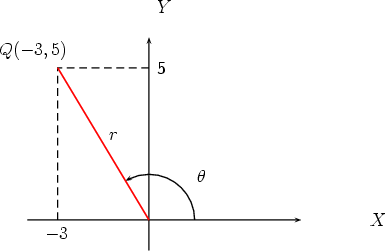

```{r xaringanExtra-clipboard_2, echo=FALSE}
# copy button styles mainly in ude.css
htmltools::tagList(
  xaringanExtra::use_clipboard(
    button_text = "<i class=\"fa fa-clipboard\"></i>",
    success_text = "<i class=\"fa fa-check\" style=\"color: #00ff00\"></i>",
    error_text = "<i class=\"fa fa-times-circle\" style=\"color: #F94144\"></i>"
  ),
  rmarkdown::html_dependency_font_awesome()
)
```

```{r moon_reader, include=FALSE, eval = FALSE}
# setup for moon reader
# copy it to console
options(servr.interval = 0.5)
xaringan::inf_mr()
```


```{r setup, include=FALSE}
knitr::opts_chunk$set(echo = FALSE, warning=FALSE, message=FALSE)
options(htmltools.dir.version = FALSE)
# packages
library(sloop)
library(icons)

# pre-define icons
desktop <- icons::icon_style(icons::fontawesome$solid$desktop, fill = "#004c93")
checker_green <- icons::icon_style(icons::fontawesome$solid$check, fill = "green")
times_red <- icons::icon_style(icons::fontawesome$solid$times, fill = "red")
```
class: title-slide title-oop center middle

# `r rmarkdown::metadata$title`
## `r rmarkdown::metadata$subtitle`
### `r rmarkdown::metadata$author`

---
class: left, top
## Introduction

.smaller[
- Object oriented programming (OOP) is a widespread philosophy: it's the cornerstone of popular languages like Java, Python and C++. 

- The concepts of class and method are central to any OOP system:

    - A **class** defines an object's properties and how it relates to other objects. Every object is an instance of a class.
    
    - A **method** is a function associated with a particular type of object

- While R supports a mixture of OOP and functional programming, the latter is relatively more important than OOP in everyday R usage: 

    We solve complex problems by decomposing them into simple *functions* rather than objects!

- Nonetheless, being familiar with R's widely used OOP systems is important for 

    - a more general understanding of the language
    
    - being able to understand and expand on object oriented code from other authors 
]

---
class: left, top
## Introduction

.smaller[
- R's most important OOP systems are **S3**, **S4**, **R6** and **RC**

    - S3 is R's oldest OO system. It's minimal but elegant. 
    
    - S4 is similar but more formal than S3
    
    - R6 builds on environments
    
    - RC implements encapsulated object orientation

- Engaging with OOP in R is challenging due to 
    
    - differences to the OOP systems used by other languages

    - disagreement over the realtive importance of the available OOP systems
    
- We will elaborate key principles in OOP with R, thereby focusing on S3
]

???
S4 already encountered?
RC implementiert gekapselte Objektorientierung

---
class: left, top
## The `sloop` Package

.smaller[
We 'sail the seas of OOP' using the `sloop` package. It provides helper functions which facilitate the handling of OOP objects.

```{r, echo=T, eval=2}
install.packages('sloop')
library('sloop')
```
</br>
Some Examples:

```{r, echo=T}
otype(base::abs)
otype(3:1)
otype(lm(area ~ poptotal, data = ggplot2::midwest))
```
]

---
class: left, top
## Base Types vs OO Objects

.smaller[
<br>
<blockquote>
*Everything* that exists in R is an object. 
.right[&mdash; <cite>John Chambers</cite>]
</blockquote>
<br>
Thus far we have used the term 'object' somewhat sloppily &mdash; not every R object is *object-oriented*.

<br>

<center>


</center>
]

---
class: left, top
## Base Types vs OO Objects

.smaller[
`base::is.object()` and `sloop::otype()` are useful for identifying objects in the wild.

</br>

```{r, echo=T}
# base object
is.object(1L)
otype(1L)
# OO object
is.object(ggplot2::diamonds)
otype(ggplot2::diamonds)
```
]

---
class: left, top
## Base Types vs OO Objects

**Only OO objects have a `class` attribute.**

</br>

```{r, echo=T}
attr(1L, "class")
attr(ggplot2::diamonds, "class")
```

---
class: left, top
## Base Types vs OO Objects

.smaller[
- There are alternate functions for checking the `class` argument 
    </br>
    </br>
    ```{r, echo=T}
    s3_class(ggplot2::diamonds)
    class(ggplot2::diamonds)
    ```
    </br>
- Be careful with `class()`
    </br>
    </br>
    ```{r, echo=T}
    class(1L)
    ```
]

???

- `class()` can be misleading when used with base objects which is why we use `sloop::s3_class()`: `integer` is an *atomic type*, not an S3 class.
    ```{r, echo = T}
    is.object(1L)
    attributes(1L)
    ```


- `sloop::s3_class()` works safely with base, S3 and S4 objects. 

    (it returns the implicit class used by the respective system)

---
class: left, top
## Base Types 

**Every R object has a base type** of which there are 25.

Important types are `NULL`, `logical`, `integer`, `double` , `complex`, `character`, `list` and `closure`

</br>

```{r, echo=T}
typeof(1L)
typeof(ggplot2::diamonds)
typeof(lm)
```

---
class: left, top
## Base Types &mdash; `numeric` type

The definition of the `numeric` type is inconsistent:

- `numeric` is sometimes used as an alias for the `double` type
- `numeric` is an alias for `integer` and `double` types in S3/S4
- `base::is.numeric()` checks if the object behaves like a number

Let's run the following expressions and comment on the results.

```{r, echo=T, eval=FALSE}
is.numeric(3.14159)
is.numeric(1L)
typeof(factor('x'))
is.numeric(factor('x'))
```

---
class: left, top
## S3 &mdash; Basics

.smaller[

**What is S3?**

- C++ and Java use ***message-passing style*** where ***objects encapsulate data*** and **functions** that may **modify** the data. 
  
    A typical function call looks like **`object.method(arguments)`**.

- S3 implements a ***functional style*** where the associated functions (**generics**) live ***outside the object***. A generic decides which method to call based on the object passed. 

    A typical function call looks like **`generic(object, arguments)`**.

**Why discussing S3?**

- S3 is simple but flexible and will likely be sufficient for your OO code projects. 

- It's used in `base` and `stats` and is the most commonly used system on CRAN.

- This lecture provides you with a working knowledge of the system and its limitations. Being familiar with S3 is a good starting point for engaging with the other systems, if necessary for your work.
]

---
class: left, top
## S3 &mdash; Basics

.medium[
Every S3 object has a **base type** and **at least one class**.

</br>

.blockquote.exercise[
#### `r desktop` Example: class and type of factor object

```{r, echo=T}
f <- structure(1:3, class = "factor", levels = c("a", "b", "c"))
```

We check S3 membership, base type and the class of `f`.

```{r, echo=T}
otype(f)
typeof(f)
class(f)
```
]]

???

Check that `class` is simply an `attribute` of `f` using `attribute()`.

---
class: left, top
## S3 &mdash; Generics

</br>

- A generic function (***generic***) is an interface. It behaves depending on the **class** of the S3 object. 

  This concept is called ***polymorphism*** (many shapes).

- The behavior when an S3 object is passed to a generic may be very different from the underlying base type: Class-specific methods may do weird stuff!

- The process of looking for a class-specific function (***method***) upon a generic function call is called ***method dispatch***


---
class: left, top
## S3 &mdash; Generics

.smaller[
.blockquote.exercise[
#### `r desktop` Example: `print()`

Executing `f` calls a generic (`print`) with specific behavior for objects of class `factor`.

```{r, echo=T}
ftype(print)
print(f) # Or simply `f`
# Integer behaviour
print(unclass(f))
```
]]

???

unclass(f) + unclass(f)

---
class: left, top
## S3 &mdash; Method Dispatch

.smaller[
- S3 methods follow the name convention `generic.class()`


- We may use `s3_dispatch()` to investigate the process of method dispatch for an S3 object
  ```{r, echo = T}
  s3_dispatch(print(f))
  ```
  
    `=>` indicates the method used  
    `*` idicates that the method is defined (but not used)


- Methods are sometimes exported from the package namespace (like `print.factor()`) but generally should not be used directly
  ```{r, echo = T}
  ftype(print.factor) # check if method 
  ```
]

---
class: left, top
## S3 &mdash; Method Dispatch

.smaller[
Use `s3_get_method()` to see the source code of **methods that are not exported**.

</br>

.blockquote.exercise[
#### `r desktop` Example: `lm.print()`

```{r, echo=TRUE}
mod <- lm(price ~ carat, data = ggplot2::diamonds)
typeof(mod)
class(mod)
```
]]

???

- When a package is loaded, only exported functions and objects are added to the user’s search path.

- Non-exported functions/methods are internal to the package and must be accessed explicitly (e.g., via `pkgname:::function_name()`).

- In S3, methods are functions with names like `generic.class`, e.g., `print.lm()` or `summary.glm()`.

- Sometimes, these methods are not exported, meaning they don’t appear in the package’s namespace for direct access

---
class: left, top
## S3 Basics &mdash; Method Dispatch

.smaller[
.blockquote.exercise[
#### `r desktop` Example: `lm.print()` &mdash; ctd.

```{r, echo=TRUE}
# Inspect hidden print method for lm objects
s3_get_method(print.lm)
```
]]

---
class: left, top
## S3 Basics &mdash; Exercises

1. Describe the difference between `t.test()` and `t.data.frame()`. When is each function called?

2. What class does the following code return? What base type is it built on? What attributes does it use?
  ```{r, echo=T, eval=F}
  x <- ecdf(rpois(100, 10))
  x
  ```
  
3. What class of object does the following code return? What base type is it built on? What attributes does it use?
  ```{r, echo=T, eval=F}
  x <- table(rpois(100, 5))
  x
  ```
  
---
class: left, top
## S3 Classes

- Part of S3's simplicity is due to lack of formal definition what a class is. For the largest part, this is up to the programmer.

    We have already seen how to generate an OO object using a base type and a class with `structure()`.
    
- We may use `class()` to change the class of existing objects. There are no checks if objects of the same class share the same structure!
  ```{r, echo = T}
  class(mod) <- "data.frame"
  mod
  ```
  
---
class: left, top
## S3 Classes &mdash; Robust Implementation

We recommended to follow the following conventions when creating your own classes:

- Avoid '`.`' in class names to **prevent confusion with generics**

- **Provide a constructor** function, which generates objects with the **required structure**: schema `new_classname()`

- **Use a validator** function to check that objects of your class have **correct values**: schema `validate_classname()`

- "Sharing is caring": Provide a user-friendly **helper function**, `classname()`, which makes it easy for others to **generate objects of your class**

---
class: left, top
## Case Study &mdash; An S3 Class for Prime Numbers

We now demonstrate how to implement a simple S3 class for prime numbers.

.blockquote.exercise[
#### S3 &mdash; constructur function for `prime` class

Start with a constructor function that accepts `integer` input and returns an object of class `prime`.

```{r, echo=T}
new_prime <- function(x = integer()) {
  
  stopifnot(is.integer(x))
  
  x <- list(x)
  
  class(x) <- 'prime'
  
  x
}
```
]

---
class: left, top
## Case Study &mdash; An S3 Class for Prime Numbers

.smaller[
.blockquote.exercise[
#### S3 &mdash; validator function for `prime` class

The validator function checks if the values of a `prime` object are indeed prime numbers.

An integer $z>2$ is a prime number if $$z\,\text{mod}\,y > 0 \, \forall \, y\in[2,3,...,z-1].$$

```{r, echo=T}
validate_prime <- function(x = list()) {
  for (z in unique(unlist(x))) {
    if (z <= 1 || !(z == 2 || all(z %% (2:(z - 1)) > 0))) {
      stop('Input contains non-prime number(s)!', call. = FALSE)
    }
  }
  x
}
```  

]]

---
class: left, top
## Case Study &mdash; An S3 Class for Prime Numbers

.smaller[
.blockquote.exercise[
#### S3 &mdash; helper function for `prime` class

At last we provide a user-friendly helper function to **generate and validate** `prime` objects.

```{r, echo=T}
prime <- function(x = integer()) {
    validate_prime(
      new_prime(x)
    )
}
```

```{r, echo=T}
(x <- prime(c(3L, 5L, 7L, 11L)))
```

```{r}
class(x)
```
]]

---
class: left, top
## S3 Generics and Methods

.smaller[
- Many prominent R functions are generics. Method dispatch is handled by `base::UseMethod()`.
  ```{r, echo = T}
  mean
  ```
  
- Let's see the dispatch for `mean(x)` where `x` has class `Date`:
  ```{r, echo = T}
  x <- Sys.Date()
  class(x)
  s3_dispatch(mean(x))
  ```
]

---
class: left, top
## S3 Generics and Methods

.smaller[
- The pseudo-class `default` should not be used for `Date` objects (why?) and there is a specific method `mean.Date()` which is called instead

- `sloop::s3_methods_generic()` lists available **methods for a generic**
  ```{r, echo = T}
  s3_methods_generic('mean')
  ```
]

---
class: left, top
## S3 Generics and Methods

`s3_method_class()` provides all registered **methods for a class**.

```{r, echo = T}
head(
  s3_methods_class('Date'), 10
)
```

---
class: left, top
## S3 Generics and Methods

.smaller[
.blockquote.exercise[
#### `r desktop` Example: How to write a generic

Writing your own generic is straightforward
```{r, echo = T}
my_generic <- function(x) {
  UseMethod('my_generic')
}
```
  
`UseMethod(x)` dispatches based on `x` by default. Dispatch based on a second argument is optional.

Let's define methods for default behavior and for a class `my_class`
```{r, echo=T}
my_generic.default <- function(x) {
  cat("Output for default method:\n", x)
}

my_generic.my_class <- function(x) {
  cat("Output for class 'my_class':\n", x)
}
```
]]

???

comment on rules for creating methods (CH 13.4.3 in Advanced R)

---
class: left, top
## S3 Generics and Methods

.smaller[
.blockquote.exercise[
#### `r desktop` Example: How to write a generic &mdash; ctd.

We next check that method dispatch works as desired:

```{r, echo=T}
x <- 1
y <- structure(x, class = 'my_class')

# first for x
s3_dispatch(my_generic(x))

# then for y
s3_dispatch(my_generic(y))
```
]]

---
class: left, top
## S3 Generics and Methods

.smaller[
.blockquote.exercise[
#### `r desktop` Example: How to write a generic &mdash; ctd.

We next check that method dispatch works as desired:

```{r, echo=T}
my_generic(x)
my_generic(y)
```

]]

---
class: left, top
## Case Study &mdash; A Plot Method for `prime` Objects

```{r, fig.align='center', dpi=170, out.width='50%'}
# subset of all prime numbers in 2,...,1e4
x <- 2:1e4
x <- x[sapply(x, function(z) all(z %% 2:(z-1) > 0))] 
x <- prime(x)

plot.prime <- function(x = list(), coord,...) {
  x <- unlist(x)
  if(missing(coord)) {
    d <- data.frame(x = x, y = x)
  } else if(coord == "polar") {
    d <- data.frame(x = cos(x * 180/pi) * x, y = sin(x * 180/pi) * x)
  } 
  plot(d, ...)
}

par(mar=c(5,2,4,2) + 0.1)
plot(x, coord = "polar", pch = 19, col = "red", cex = 0.5, xlab = "", ylab="", bty = "n", xaxt = "n", yaxt = "n")
```

---
class: left, top
## Case Study &mdash; A Plot Method for `prime` Objects

- The image from the previous slide is inspired by [this](https://math.stackexchange.com/questions/885879/meaning-of-rays-in-polar-plot-of-prime-numbers/885894) mathexchange post. 

- Make sure to checkout 3Blue1Brown's [video](https://www.youtube.com/watch?v=EK32jo7i5LQ&t=418s) for a nice explanation of what's going on. 🙃👍🏼

<br>
<div style="margin:auto;width:50%;">
<iframe width="720" height="326" src="https://www.youtube.com/embed/EK32jo7i5LQ" frameborder="0" allow="accelerometer; autoplay; encrypted-media; gyroscope; picture-in-picture" allowfullscreen></iframe>
</div>

---
class: left, top
## Case Study &mdash; A Plot Method for `prime` Objects

Let's write a method for objects of class `prime` for the generic `plot()`. The method should 

- take objects of class prime and all additional arguments which can be passed to `plot()`.

- be able to visualise a prime number $p$ in Cartesian and polar coordinates. 

<br>
<center>



</center>

---
class: left, top
## Case Study &mdash; A Plot Method for `prime` Objects

```{r, echo=T}
plot.prime <- function(x = list(), coord, ...) {
  
  x <- unlist(x)
  
  if(missing(coord)) {
    
    d <- data.frame(x = x, y = x)
    
  } else if(coord == "polar") {
    
    d <- data.frame(x = cos(x * 180/pi) * x, y = sin(x * 180/pi) * x)
    
  } 
  
  plot(d, ...)
}
```

Note that we may pass additional arguments to `plot()` using via `...` (ellipsis operator). 

---
class: left, top
## Case Study &mdash; A Plot Method for `prime` Objects

```{r, echo=T, eval=F, cache=T}
library(purrr)

# Subset of all prime numbers in 2,...,1e4
x <- 2:1e4
x <- x[map_lgl(x, \(x) x > 1 && all(x %% 2:(x - 1) > 0))]

# Assign 'prime' class
x <- prime(x)
```

Let's check the method dispatch for `plot(x)`

```{r, echo=T, eval=T}
s3_dispatch(plot(x))
```

---
class: left, top
## Case Study &mdash; A Plot Method for `prime` Objects

```{r, echo=T, fig.align='center', dpi=170, out.width='40%', cache=T}
plot(x, coord = "polar", pch = 19, cex = 0.5, col = "red", axes = F, xlab = "", ylab = "")
```

---
class: left, top, exercise_slide
## Exercises

1. Read the source code for `t()` and `t.test()` and confirm that `t.test()` is an S3 generic and not an S3 method. What happens if you create an object with class `test` and call `t()` with it? Why?

2. What generics does the `table` class have methods for?

3. Implement a `summary()` method for objects of class `prime`. Use the following strategy:

  1. A `summary()` method should do some computations and return an object of class `summary_print` but *not* print the results
  
  2. A separate `print()` method for `summary_prime` objects should output the results in an appealing format

---
class: left, top
## S3 Inheritance

- **Inheritance** in OOP allows us to derive a new class (child) from an existing one (parent).

- Using inheritance we don't need to start from scratch: the parent may share data, methods etc. with the child 

- Inheritance in S3 boils down to a proper assignment of classes (and proper definitions of corresponding methods)

---
class: left, top
## S3 Inheritance

- Note that we may assign multiple classes to an S3 object
    ```{r, echo=T, eval = F}
    class(x) <- c('A', 'B')
    class(x) <- c('B', 'A')
    ```

- Method dispatch *always* starts with the first element of the class vector and proceeds with subsequent classes if a method is not found.

  This clarifies the **informality of S3**: 
  
  **There is no formal definition of how classes relate to each other.**

---
class: left, top
## S3 Inheritance

```{r, echo = T}
# New generic
g <- function(x) UseMethod("g", x)

# Methods for classes 'A' and 'B'
g.A <- function(x) "A"
g.B <- function(x) "B"

# Two objects with different inheritance hierarchies
ab <- structure(1, class = c("A", "B"))
ba <- structure(1, class = c("B", "A"))

# Class A comes first
g(ab)

# Class B comes first
g(ba)
```

---
class: left, top
## S3 Inheritance

It's possible to **force delegation** to the method of the subsequent class (if defined) using `NextMethod()`. This provides a simple inheritance mechanism:

```{r, echo=T}
g.C <- function(x) NextMethod()
ca <- structure(1, class = c("C", "A"))
cb <- structure(1, class = c("C", "B"))
g(ca)
g(cb)
```

Notice that inheritance depends on how we define the class vector:

- 'For object `ca`, class `C` inherits its `g()` method from class `A`'
- 'For object `cb`, class `C` inherits its `g()` method from class `B`'

---
class: left, top
## S3 Inheritance

.smaller[
We may use these mechanics to implement  (child) classes which inherit (parts of) their `print()` method from the `prime` class.

.blockquote.exercise[
#### `r desktop` Example: Inheritance of `print()` method

```{r, echo = T}
print.prime <- function(x) {
     x[[1]]
}
```

```{r, echo = T}
print.mersenne <- function(x) {
  cat('Mersenne primes:', NextMethod(x))
}
```

```{r, echo = T}
print.fermat <- function(x) {
  cat('Fermat primes:', NextMethod(x))
}
```

</br>

(Wiki for [Mersenne primes](https://en.wikipedia.org/wiki/Mersenne_prime) and [Fermat primes](https://en.wikipedia.org/wiki/Fermat_number#Primality))

]
]

---
class: left, top
## S3 Inheritance

.smaller[
.blockquote.exercise[
#### `r desktop` Example: Inheritance of `print()` method  &mdash; ctd.

```{r, echo = T}
mers <- prime(c(3L, 7L, 31L))
class(mers) <- c('mersenne', class(mers))

ferm <- prime(c(3L, 5L, 17L, 257L))
class(ferm) <- c('fermat', class(ferm))

mers
ferm
```

]]

---
class: left, top
## S3 Inheritance

.smaller[
.blockquote.exercise[
#### `r desktop` Example: Inheritance of `print()` method  &mdash; ctd.
```{r, echo = T}
s3_dispatch(print(mers))
s3_dispatch(print(ferm))
```

'`->`' indicates the method the call to the original method ('`=>`') has been delegated to. 
]]
