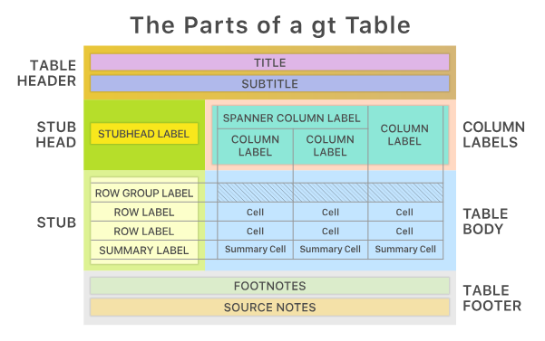

class: title-slide title-rmarkdown center middle
```{r moon_reader, include=FALSE, eval = FALSE}
# setup for moon reader
# copy it to console
options(servr.interval = 0.5)
xaringan::inf_mr()
```

```{r xaringanExtra_progress-bar, echo = FALSE}
xaringanExtra::use_progress_bar(color = "#004c93", location = "bottom")
```

```{r xaringanExtra-clipboard_2, echo=FALSE}
# copy button styles mainly in ude.css
htmltools::tagList(
  xaringanExtra::use_clipboard(
    button_text = "<i class=\"fa fa-clipboard\"></i>",
    success_text = "<i class=\"fa fa-check\" style=\"color: #00ff00\"></i>",
    error_text = "<i class=\"fa fa-times-circle\" style=\"color: #F94144\"></i>"
  ),
  rmarkdown::html_dependency_font_awesome()
)
```

```{r setup, include=FALSE}
knitr::opts_chunk$set(echo=FALSE, warning=FALSE, message=FALSE)
options(htmltools.raw.version = FALSE)
def.chunk.hook  <- knitr::knit_hooks$get("chunk")

library(dplyr)

# pre-define icons
desktop <- icons::icon_style(icons::fontawesome$solid$desktop, fill = "#004c93")
checker_green <- icons::icon_style(icons::fontawesome$solid$check, fill = "green")
times_red <- icons::icon_style(icons::fontawesome$solid$times, fill = "red")
```

# `r rmarkdown::metadata$title`
## `r rmarkdown::metadata$subtitle`
### `r rmarkdown::metadata$author` 
---
class: left, top
## R Markdown

R Markdown provides a framework for combining code, results, and commentary.

You can use R Markdown 

- to generate reports, articles, books ...
- as an environment in which to do data science, as a lab notebook where 
  you can capture not only what you did, but also what you were thinking. 

--

**Some interesting links:**

- [R Markdown: The Definitive Guide](https://bookdown.org/yihui/rmarkdown/) 
- [Introduction to R Markdown](https://rmarkdown.rstudio.com/lesson-1.html)
- [Cheatsheet](https://raw.githubusercontent.com/rstudio/cheatsheets/master/rmarkdown-2.0.pdf)

--

**Example:**

- [Introduction to Econometrics with R](https://www.econometrics-with-r.org)


---
class: left, top

## Basic example

.font80.blockquote.exercise.pull-left-2[

#### `r desktop` Example
```{r echo=FALSE, comment = "", size="tiny"}
cat(htmltools::includeText("old/diamond-sizes.Rmd"))
```

]

--

.pull-right-1.font80[
- If this is stored as `example.rmd` in your working directory run `knitr::render(example.rmd)` to create an output document. 
- Alternatively, hit the `r knitr::include_graphics("../img/knit.PNG")` button in Rstudio.
- Or you can use the short key combination `Ctrl + Shift + K`
]

---
class: left, top

## How it works 

<br> 

An R Markdown document is a basic text file, with the (conventional) extension `.Rmd`.

The example already contains the most important components:

- An (optional) YAML header surrounded by ---
- Chunks of R code surrounded by ` ```{r, ...} ` and ` ``` `
- Inline R code surrounded by ` `r ` and ` ` `
- Text mixed with simple text formatting like **bold** and _italics_
- Mathematical expressions
---

class: left, top

## How it works 

<br>

When we click **knit** in RStudio then 
1. the `knitr` package executes the code chunks and creates a markdown document (`.md`) which contains the text we have written and optionally the code and its output 
2. the `.md` file gets processed by `pandoc` which creates the final file in the desired output format (e.g. `html`, `pdf`, `word`, ...)

<br>

.center[

]

---
class: left, top

## The YAML header

The YAML header contains settings passed to pandoc and the rendering functions.
Here you can: 
- specify the output format with optional output specific options 
- provide information for the title page such as title, name, and date
- include external files (e.g. `.css`) or additional packages for $\LaTeX$
- define parameters. 

--

.blockquote.exercise[
#### `r desktop` Example: Basic YAML header using mostly defaults

```yaml
---
title: Habits
author: John Doe
date: March 22, 2005
output: html_document
---
```
]
???

YAML Ain't Markup Language, a recursive acronym, to distinguish its purpose as data-oriented, rather than document markup.
---
class: left, top

## The YAML header

.blockquote.exercise[
#### `r desktop` Example:  A more complicated YAML header

```nohighlights
---
title: Habits
author: John Doe
date: March 22, 2005
output:
  html_document:
    toc: true
    toc_float:
      collapsed: false
      smooth_scroll: false
    css: my_style.css
params: 
  pi: 3.141593
---
```
]
---
class: left, top

## Output Formats

- [`html_notebook`](https://bookdown.org/yihui/rmarkdown/notebook.html)      - Interactive R Notebooks  
- [`html_document`](https://bookdown.org/yihui/rmarkdown/html-document.html) - HTML document 
- [`pdf_document`](https://bookdown.org/yihui/rmarkdown/pdf-document.html)   &nbsp; - PDF document
- [`word_document`](https://bookdown.org/yihui/rmarkdown/word-document.html) - Microsoft Word document 

<br>

Learn more about further output formats at [https://rmarkdown.rstudio.com](https://rmarkdown.rstudio.com/lesson-9.html).

---
class: left, top

## Text Formatting

- R Markdown is built on [Pandoc Markdown](https://rmarkdown.rstudio.com/authoring_pandoc_markdown.html%23raw-tex#pandoc_markdown), which in turn is a flavour of the markup language Markdown.  
- The advantage of Markdown compared to other markup languages such as HTML and  $\LaTeX$ is its simplicity.

---

class: left, top
## Text Formatting


.pull-left[
.blockquote.exercise[

#### `r desktop` Example: Headers
```markdown
     #   Header 1     
     ##  Header 2   
     ### Header 3 
```
]
<br>

  .scaled[
  #   Header 1 
  ##  Header 2
  ### Header 3
 ]
 
]

--

.pull-right[ 
.blockquote.exercise[

#### `r desktop` Inline formatting

```markdown
     *italics* 
     **bold**
     This ~~is deleted text.~~
     Some code: `lm(y ~ x)`.
```
]
    
    *italics*  
    **bold**  
    This ~~is deleted text.~~  
    Some code: `lm(y ~ x)`. 
]


---
class: left, top

## Text Formatting

.pull-left[.blockquote.exercise[

#### `r desktop`  Unordered Lists

```markdown
  * Item
    - Item belonging to item
    - Another item belonging to item
  * Item
  * Item
```
]

* Item
  - Item belonging to item
  - Another item belonging to item
* Item
* Item  

]

--

.pull-right[.blockquote.exercise[

#### `r desktop` Ordered Lists

```markdown
  1. First item
    - First subitem
    - Second subitem 
  2. Second item
  3. Third item
```
]

1. First item  
    - First subitem
    - Second subitem
2. Second item
3. Third item

]

--

**Note:** Markdown does not support nested ordered lists with numbering 1.1, 1.2.1 and so on. For this, you would have to fall back to HTML or $\LaTeX$. 

---
class: left, top

## Text Formatting

<br>

.pull-left[.blockquote.exercise[

#### `r desktop` Linebreaks  
```markdown
First line  
Second line
```
]

  First line  
  Second line

<br> <br>

A new line is started by two whitespaces at the end of the previous line (which you cannot see here).

]

--

.pull-right[.blockquote.exercise[

#### `r desktop` Paragraphs

```markdown
  First paragraph
  
  Second paragraph
```
]

  First paragraph

  Second paragraph

<br>

A new paragraph is started by a blank line.

]


---
class: left, top
## Math Expressions

When rendering to a pdf $\LaTeX{}$ can be used throughout the document.  
Through `MathJax` the $\LaTeX{}$ math mode can also be used for HTML output as follows: 

--

- Inline $\LaTeX{}$ equations can be written within dollar signs.  

.blockquote.exercise[
```{r, comment = ""}
cat("This is an inline equation $f(x)=\\frac{1}{\\sqrt{2\\pi}}\\exp{\\left(-\\frac{1}{2}x^2\\right)}$.")
```
]

This is an inline equation $f(x)=\frac{1}{\sqrt{2\pi}}\exp{\left(-\frac{1}{2}x^2\right)}$.

--
  
- Display style $\LaTeX{}$ equations can be written within double dollar signs.  

.blockquote.exercise[
```{r, comment = ""}
cat("This is display style $$f(x)=\\frac{1}{\\sqrt{2\\pi}}\\exp{\\left(-\\frac{1}{2}x^2\\right)}$$.")
```
]

This is display style $$f(x)=\frac{1}{\sqrt{2\pi}}\exp{\left(-\frac{1}{2}x^2\right)}$$

---
class: left, top
## Math Expressions

- Even more complex math environments such as `align` can be used 

.blockquote.exercise[

#### `r desktop` Example

```{r echo=FALSE, comment = ""}
cat("\\begin{align}
(a+b)^{3} &=(a+b)(a+b)^{2} \\\\
          &=(a+b)\\left(a^{2}+2 a b+b^{2}\\right) \\\\
          &=a^{3}+3 a^{2} b+3 a b^{2}+b^{3} 
\\end{align}
")
```
]

<br>   

--

\\begin{align}
(a+b)^{3} &=(a+b)(a+b)^{2} \\\\
          &=(a+b)\\left(a^{2}+2 a b+b^{2}\\right) \\\\
          &=a^{3}+3 a^{2} b+3 a b^{2}+b^{3} 
\\end{align}

---
class: left, top
## Code Chunks

.font90[
- You can write arbitrary R code in a code chunk (e.g. run a regression and produce a plot of the result). 
- The code, the result of the code or both can be included into the final document. 
- In the top curly braces, chunk options can be set to control how the output is handled.
]

--

.font90[
Some useful options: 
  - `eval`(`TRUE`; logical): whether to evaluate the code chunk  
  - `echo`(`TRUE`; logical or numeric): whether to include R source code in the output file
  - `cache`(`FALSE`; logical): whether to cache a code chunk 
  - `warning` (`TRUE`; logical): whether to preserve warnings 
  - `message` (`TRUE`; logical): whether to preserve messages 
  - `include` (`TRUE`; logical): whether to include the chunk output in the final output document
]

--

.font90[
For a complete list, we refer to the `knitr` documentation: [Chunk options](https://yihui.name/knitr/options#code-evaluation).
]

--

.font90[
- Press `Ctrl + Alt + I` to insert a new R code chunk.

]

---
class: left, top
## Code Chunks

.blockquote.exercise[

#### `r desktop` Example

````markdown
`r ''````{r lin_reg, echo=TRUE, cache = TRUE}
x <- runif(100)
y <- 0.4 * x + rnorm(100)
lm(y ~ x)
```
````
]

--

<br>

If you mainly use chunk options which are not the default, then it saves time to change the default for the document with `knitr::opts_chunk$set()`.  

.blockquote.exercise[

#### `r desktop` Example: chunk setup 

````markdown
`r ''````{r setup, include=FALSE}
knitr::opts_chunk$set(echo=FALSE, warning=FALSE, message=FALSE)
```
````
]
---
class: left, top
## Inline R Code

You can also use R in your running text. When something changes (e.g. the input data) the numbers in the text adjust accordingly as well. 

.blockquote.exercise[

#### `r desktop` Example

````markdown
`r ''````{r, echo=FALSE}
x <- 4
y <- 38
answer <- x + y
```
The answer is `r '\x60r answer\x60'`
````
]

```{r}
x <- 4
y <- 38
answer <- x + y
```

--

The answer is `r answer`.

---
class: left, top
## Tables 

.font90[
Tables can be created as follows:
<br>
.blockquote.exercise[

#### `r desktop` Example


```markdown
| Right | Left | Default | Center |
|------:|:-----|---------|:------:|
|   12  |   12 |   12    |   12   | 
|  123  |  123 |  123    |  123   | 
|    1  |    1 |    1    |    1   | 
```
]]

--

.font70[

<br><br>

| Right | Left | Default | Center |
|------:|:-----|---------|:------:|
|   12  |   12 |   12    |   12   | 
|  123  |  123 |  123    |  123   | 
|   1   |   1  |   1     |   1    | 
]

--

<br>

In general, however, tables will be produced programmatically.
The following slides show some examples. 


---
class: left, top
## `gt`

- `gt::gt()` is probably the easiest way to transform a matrix or a data frame into a table.

.pull-left[
.blockquote.exercise[
#### `r desktop` Example
````markdown
`r ''````{r}
gtobj <- citizens %>%
  mutate(
    isGerman = Citizenship1 == "German"
  ) %>%
  group_by(District) %>%
  summarise(isNotGerman = sum(!isGerman),
            isGerman = sum(isGerman)) %>%
  gt()
```
````
]]


--


```{r, echo = F}
library(gt)
library(gtsummary)
load("../../OEK_ARE.RData")
```

.pull-right[
```{r}
gtobj <- citizens %>%
  mutate(isGerman = Citizenship1 == "German") %>%
  group_by(District) %>%
  summarise(isNotGerman = sum(!isGerman),
            isGerman = sum(isGerman)) %>%
  gt()

gtobj 
```
]


---
class: left, top
## `gt`


- Following the philosophy of dplyr, gt is a powerful and flexible tool that offers good readability and extensibility, though it may result in slightly longer code.

- A gt table consists of the elements shown below, which can all be customized as needed.

.center[

]


---
class: left, top
## `gt`


.font90.blockquote.exercise[
#### `r desktop` Example

```{r, echo = TRUE, eval = T}
load("../../OEK_ARE.RData")
gtobj <- citizens %>%
  mutate(isGerman = Citizenship1 == "German") %>%
  group_by(District) %>%
  summarise(isNotGerman = sum(!isGerman),
            isGerman = sum(isGerman)) %>%
  gt() %>%
    tab_header(
      title =  "Population of Gelsenkirchen", subtitle = "by District and German Citizenship"
    ) %>%
    grand_summary_rows(
      columns = 2:3, 
      fns = list(label = "TOTALS", fn = "sum"), 
      fmt = ~ fmt_number(., sep_mark = ".", decimals = 0, dec_mark = ","),
      missing_text = ""
    ) %>%
    cols_label(
      District = "District",
      isGerman = "German",
      isNotGerman = "Non-German"
    ) 
```
]


---
class: left, top
## `gt`


.font90.blockquote.exercise[
#### `r desktop` Example

```{r, echo = TRUE, eval = T}
gtobj <- gtobj %>%
  tab_footnote(
    footnote = "Source: City of Gelsenkirchen, Statistics & Monitoring"
  ) %>%
  fmt_number(
    columns = c(isGerman, isNotGerman), sep_mark = ".", decimals = 0
  ) %>%
  gt::opt_all_caps() %>%
  tab_options(
    table.font.size = "small",
    table.border.top.style = "none",
    table.border.bottom.color = "#215E8F",
    heading.border.bottom.color = "#215E8F", 
    column_labels.border.bottom.style = "none",
    table.background.color = "#e8f4fc",
    row.striping.background_color = "#d7ecf8",
    table.width = pct(40),
    heading.align = "left"
  )
```
]


---
class: left, top
## `gt`


.font90.blockquote.exercise[
#### `r desktop` Example

```{r, echo = TRUE, eval = T}
gtobj <- gtobj %>%
  tab_style(
    style = cell_text(weight = "bold", align = "center"),
    locations = cells_column_labels()
  ) %>%
  tab_style(
    style = cell_text(align = "right"), location = cells_column_labels()
  ) %>%
  tab_style(
    style = cell_text(weight = "bold"), locations = cells_stub_grand_summary()
  ) %>%
  tab_style(
    style = cell_text(font = google_font("Newsreader")), 
    locations = list(cells_title(), cells_footnotes())
  ) %>%
  tab_style(
    style = cell_text(size = "x-large"), locations = cells_title(groups = "title")
  )
```
]


---
class: left, top
## `gt`

```{r, echo = F, eval = T}
gtobj %>%
  gt:::dt_options_set_value(data = ., option = "table_id", value ="gtexample") %>%
  tab_options(table.additional_css = "#gtexample .gt_row.gt_right { background-color: #e8f4fc; }")
```


---
class: left, top
## `gtsummary`

- `gtsummary` offers functions to print summary tables (for model objects)


.pull-left[
.blockquote.exercise[
#### `r desktop` Example
````markdown
`r ''````{r}
citizens %>%
  mutate(GermanStatus = ifelse(Citizenship1 == "German", "German", "Non-German")) %>%
  select(District, GermanStatus) %>%
  gtsummary::tbl_summary(
    by = GermanStatus,
    statistic = all_categorical() ~ "{n} ({p}%)",
    label = list(District = "District"),
    missing = "no"
)
```
````
]]


--


```{r, echo = F}
library(gt)
library(gtsummary)
load("../../OEK_ARE.RData")
```

.pull-right[
```{r}
citizens %>%
  mutate(GermanStatus = ifelse(Citizenship1 == "German", "German", "Non-German")) %>%
  select(District, GermanStatus) %>%
  tbl_summary(
    by = GermanStatus,
    statistic = all_categorical() ~ "{n} ({p}%)",
    label = list(District = "District"),
    missing = "no"
)
```
]


---
class: left, top
## `gtsummary`


.font90.blockquote.exercise[
#### `r desktop` Example

```{r, echo = TRUE, eval = T}
linear_model <- lm(mpg ~ cyl + wt, data = mtcars)
tbl_regression(linear_model)
```

]


---
class: left, top
## `stargazer`

- `stargazer` takes model objects as input and automatically creates an output table   

<br>

.pull-left[.blockquote.exercise[
#### `r desktop` Example

````markdown
`r ''````{r, results='asis', echo=TRUE}

linear_model <- lm(mpg ~ cyl + wt, 
      data = mtcars)
      
stargazer::stargazer(linear_model, 
      type = "html", 
      out.header = TRUE, 
      omit.table.layout = "sn")
      
```
````
]]

--

.font60[.pull-right[

```{r, results='asis'}
linear_model <- lm(mpg ~ cyl + wt, data = mtcars)
stargazer::stargazer(linear_model, type = "html", out.header = TRUE, omit.table.layout = "sn")
```

]]

---
class: left, top
## Plots

<br>

.pull-left[.blockquote.exercise[
#### `r desktop` Example
````markdown
`r ''````{r, fig.height = 5}
hist(rnorm(1000))
```
````
]]

--

.pull-right[
```{r, fig.height = 5}
hist(rnorm(1000))
```
]

---
class: left, top
## Links and External Graphics

- Links can be created as follows:

.blockquote.exercise[
```markdown
[This is a link to the R Markdown book](https://bookdown.org/yihui/rmarkdown/)
```
]

--

- To include figures saved on your computer use

.blockquote.exercise[
```markdown

```
]

--

- If you need more control over the appearence of the figure you can use

.blockquote.exercise[
````markdown
`r ''````{r, out.width = "500px", fig.align='center'}
knitr::include_graphics("path/to/figure.png")
```
````
]

---
class: left, top
## Using HTML and $\LaTeX{}$

- If only R Markdown is used the document can be compiled without problems
to all supported output formats. 

- Sometimes R Markdown is too limited and one would like to use the more powerful 
tools provided by HTML or $\LaTeX{}$. 

- If the output format is HTML, you can also use HTML instead of R Markdown 
  or mix both.

- If the output format is PDF, the same can be said about $\LaTeX{}$


---
class: left, top
## Interactive documents

- If the output is HTML, interactive elements (usually some JavaScript) can be included. 
- There are R packages producing interactive output e.g. `plotly` for interactive plots or
`leaflet` for interactive maps. 

--

.blockquote.exercise[
#### `r desktop` Example: plot

````markdown
`r ''````{r}
library(plotly)
mtcars$am[which(mtcars$am == 0)] <- 'Automatic'
mtcars$am[which(mtcars$am == 1)] <- 'Manual'
mtcars$am <- as.factor(mtcars$am)
plot_ly(mtcars, x = ~wt, y = ~hp, z = ~qsec, color = ~am, colors = c('#BF382A', '#0C4B8E')) %>%
  add_markers() %>%
  layout(scene = list(xaxis = list(title = 'Weight'),
                     yaxis = list(title = 'Gross horsepower'),
                     zaxis = list(title = '1/4 mile time')))

```
````
]

---
class: left, top
## Interactive documents

.center[
```{r}
library(plotly)
# Prepare Data
mtcars$am[which(mtcars$am == 0)] <- 'Automatic'
mtcars$am[which(mtcars$am == 1)] <- 'Manual'
mtcars$am <- as.factor(mtcars$am)
# Interactive Plot
plot_ly(mtcars, x = ~wt, y = ~hp, z = ~qsec, color = ~am, colors = c('#BF382A', '#0C4B8E')) %>%
  add_markers() %>%
  layout(scene = list(xaxis = list(title = 'Weight'),
                     yaxis = list(title = 'Gross horsepower'),
                     zaxis = list(title = '1/4 mile time')))
```
]

- For more examples see [plot.ly](https://plot.ly/r/).

---
class: left, top
## Interactive documents

.pull-left[.blockquote.exercise[.font70[
#### `r desktop` Example: map 

````markdown
`r ''````{r, out.width='100%'}
library(leaflet)
leaflet() %>% addTiles() %>%
  setView(7.005070, 51.463675,zoom = 17) %>%
  addMarkers(
    7.005070, 51.463675
  )
```
````
]]]


.pull-right[

```{r, out.height='450'}
library(leaflet)
leaflet() %>% addTiles() %>%
  setView(7.005070, 51.463675,zoom = 17) %>%
  addMarkers(
    7.005070, 51.463675, 
    label = "Uni DUE"  # Uni Essen 
  )
```

]

--

- Learn more at [Leaflet for R](https://rstudio.github.io/leaflet).

---
class: left, top
## Interactive documents

.font80[

- The `DT` package also allows us to include interactive tables. 

.blockquote.exercise[
#### `r desktop` Example: map

````markdown
`r ''````{r}
DT::datatable( head(iris, 10),
  fillContainer = TRUE,  options = list(pageLength = 5))
```
````

]]

--

<br>

.font50[

```{r}
DT::datatable(
  head(iris, 10),
  height = 600,
  fillContainer = TRUE, options = list(pageLength = 5)
)
```
]


---
class: left, top
## Advanced Topics: Hooks

.font70[
- You can define your own chunk options using hooks. This is a topic for you if you want to become 
a professional `knitr` user. 
]

--

#### Chunk Hooks 

.font80[
- A chunk hook is a function defining what should happen before or after a code chunk.
]

.code80[
.blockquote.exercise[
```{r, echo=TRUE}
# Template for a chunk hook
knitr::knit_hooks$set(
foo_hook = function(before, options, envir) {
    if (before) {
        ## code to be run before a chunk
    } else {
        ## code to be run after a chunk
    }
  })
```
]]

--

.font80[
- Before the chunk is evaluated the function is called with `before == TRUE`  
and after with `before == FALSE`.
- `options` is a list with the current chunk options (optional). 
- `envir` is the enviornment in which the the code chunk is evaluated (optional).
]

---
class: left, top
## Chunk Hooks: Example

.font90[
- To reduce the margins of a plot with chunk option `small.mar = TRUE` put the following code chunk 
at the top of your document. 


.blockquote.exercise[
#### `r desktop` Function
````markdown
`r ''````{r, eval = FALSE, echo=TRUE}
knitr::knit_hooks$set(small.mar = function(before) {
    if (before) par(mar = c(1, 1, 1, 1))  
})
```
````
]]

--

.font90[
- `small.mar` now can be used as other chunk options. 

.blockquote.exercise[
#### `r desktop` Example
````markdown
`r ''````{r, small.mar = TRUE}
hist(rnorm)
```
````
]]

---
class: left, top
## Output Hooks

.font70[
- Output hooks are (render) functions that define how source code and its output is presented.
- There are 8 output hooks to deal with differnt types of output: 
  - `source`: the source code
  - `output`: what would have been printed in an R terminal except warnings, messages and errors. 
  - `warnings`: warnings from `warning()`
  - `message`: messages from `message()`
  - `error`: errors from `stop()`
  - `plot`: graphics output
  - `inline`: output of inline R code
  - `chunk`: all the output of a chunk
  - `document`: the output of the whole document 
]

--

.font70[.blockquote.exercise[
#### `r desktop` Example
```{r, eval = FALSE, echo = TRUE}
knitr::knit_hooks$set(small.mar = function(before) {
    if (before) par(mar = c(1, 1, 1, 1))  
})
```
]]

--
.font70[
- There is for each of the above a default which you can adjust to your needs. 
]

---
class: left, top
## Output Hooks: Example

- You can e.g. use a hook to consistently style all your gt tables 

.font70[.blockquote.exercise[
#### `r desktop` Example
```{r, eval = FALSE, echo=TRUE}
default_output_hook <- knitr::knit_hooks$get("output")
knitr::knit_hooks$set(
  output = function(x, options) {
    if (isTRUE(options$gttable)) {
      result <- eval(parse(text = paste(options$code, collapse = "\n")))
      
      html <- result %>%
        gt::opt_all_caps() %>%
        gt::tab_options(
          table.border.bottom.color = "#215E8F",
          table.border.bottom.style = "solid",
          table.border.bottom.width = "5px",
          column_labels.border.bottom.color = "#215E8F", 
          column_labels.border.bottom.style = "solid",
          column_labels.border.bottom.width = "5px", 
          table.background.color = "#e8f4fc"
        ) %>%
        gt::as_raw_html()

      knitr::asis_output(html)
    } else {
      default_output_hook(x, options)
    }
  }
)
```
]]

---
class: left, top
## The `here` package

.font90[
- `here::here()` is returning the path to the directory where your project file lives in. 
]

--

.font90[
**Why is this useful?** 

- If an Rmarkdown file is compiled it sets the working directory to the folder where your `.rmd` file is stored.
- Usually you do some interactive work before compiling. If you work in a project then the working directory 
  for the interactive part is set to the path of your project file. 
- If your project becomes more complex and you are using subdirectories the working directory set for compilation
  and interactive work are not necessary the same. This is quite annoying.
]

--

.font90[
#### Solution

- use `here::here()` when setting a path.

.blockquote.exercise[
#### `r desktop` Example
```{r, eval = FALSE, echo=TRUE}
load(here::here("Data", "my_dataset.rda"))
```
]]

---
class: left, top
## The `pagedown` package

- `pagedown` builds on the CSS paged media module and the JavaScript library `paged.js`
- the knitr output (*.md) is rendered to HTML and then paged.js "cuts" it in discrete pages (compared to an "inifinite webpage")
- Advantages: no need for Latex and full control about layout and design

.pull-left-1[
```yaml
---
title: Crime Report
author: Martin Schmelzer
date: May 21, 2025
output: pagedown::html_paged
---
```
]

.pull-right-1[

]


---
class: left, top
## Custom formats

Custom formats in R Markdown allow users or developers to create tailored output types beyond the default ones (HTML, PDF, Word, etc.).

- Customize look and feel (themes, templates)
- Standardize document appearance for a team or organization
- Extend R Markdown with new functionality

Example Use Cases: Company-branded reports, Academic journal templates


- You can create your own customized formats that build on exisiting ones like `pdf_document` or `pagedown::html_paged`.

- After creation, you can easily distribute them within your department

- More on that here: [https://bookdown.org/yihui/rmarkdown/new-formats.html](Creating New Formats)


---
class: left, top
## Custom formats

.font90[
1. Build on top of `rmarkdown::pdf_document()` and customize options.
2. Wrap with a function

.blockquote.exercise[
#### `r desktop` Example
```{r, eval = FALSE, echo=TRUE}
my_pdf_format <- function(...) {
    rmarkdown::pdf_document(
      toc = TRUE,
      number_sections = TRUE,
      latex_engine = "xelatex",
      keep_tex = TRUE,
      template = "my_template.tex"  # modify the tex template
      ...
    )
}
```
]

<ol start="3"> 
<li>Package your format or save it in a script.</li>

<li>Use it in your YAML: `output: mypackage::my_pdf_format` or as an argument to  `rmarkdown::render()`.</li>
</ol>
]


---
class: exercise_slide
## Exercises

1. Create an R Markdown document that is compiled to an HTML document. 
   The document should consist of two sections:
    - Crime Incidents Report Data
    - Explorative Data Analysis.
2. Use the first section to read in the "Crime Incident Reports" available under 
   [Boston crime](https://data.boston.gov/dataset/crime-incident-reports-august-2015-to-date-source-new-system). Add some information about the source of the data and list all available columns with a short description  
   Hint: Take a look at the table `RMS_Crime_Incident_Field_Explanation`. 

3. Optimize your code chunks so that the document doesn't load the data every time you compile. 

4. Use the second section for an EDA. You are free to do whatever you like but produce at least one table and one graphic. 

5. Hide all your code chunks by setting a global option. 

6. Create a PDF document containing what you did. For this $\LaTeX{}$ needs to be 
   installed. 

---
class: exercise_slide
## Exercises
<ol start="7"> 
<li>  Remember that nested ordered lists are not supported by Rmarkdown. Nonetheless, produce one in your HTML and your PDF document. </li>
<li> Also, build some slides using the code you have written. You are free to choose one presentation format among all available formats. </li>
<li> Find out how to always use the current date in the YAML header.</li>
</ol>


