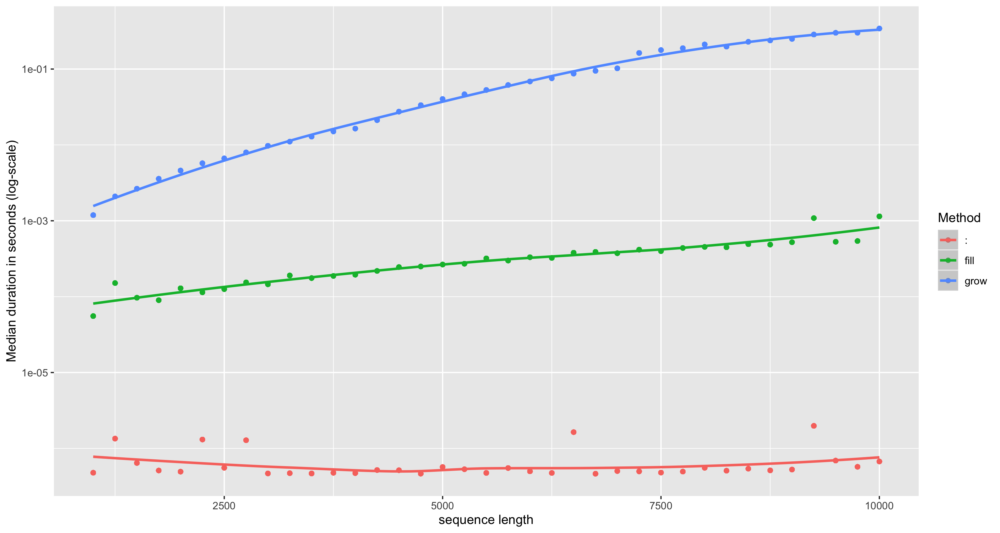
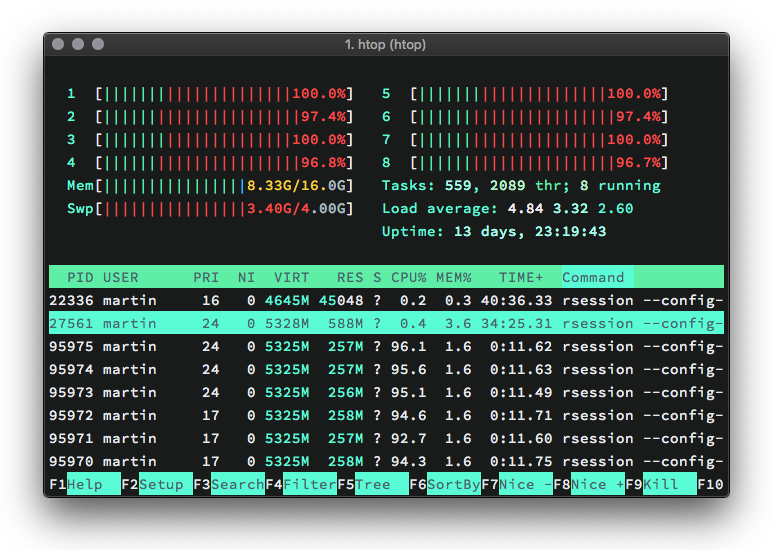
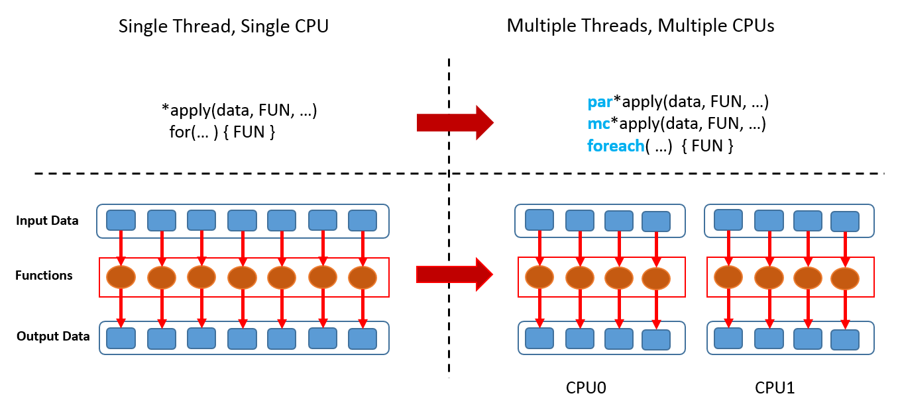

```{r xaringanExtra-clipboard_2, echo=FALSE}
# copy button styles mainly in ude.css
htmltools::tagList(
  xaringanExtra::use_clipboard(
    button_text = "<i class=\"fa fa-clipboard\"></i>",
    success_text = "<i class=\"fa fa-check\" style=\"color: #00ff00\"></i>",
    error_text = "<i class=\"fa fa-times-circle\" style=\"color: #F94144\"></i>"
  ),
  rmarkdown::html_dependency_font_awesome()
)
```

```{r setup, include=FALSE}
options(htmltools.dir.version = F)
knitr::opts_chunk$set(warning = F, message = F)
```

```{r, include=FALSE}
# packages needed
library(microbenchmark)
library(parallel)
library(tictoc)
library(dplyr)
library(tidyr)
library(icons)

# pre-define icons
desktop <- icons::icon_style(icons::fontawesome$solid$desktop, fill = "#004c93")
checker_green <- icons::icon_style(icons::fontawesome$solid$check, fill = "green")
times_red <- icons::icon_style(icons::fontawesome$solid$times, fill = "red")
```

class: title-slide title-performance center middle

# `r rmarkdown::metadata$title`
## `r rmarkdown::metadata$subtitle`
### `r rmarkdown::metadata$author`

---
class: left
## Improving Performance

```{r, eval = F}
# packages needed
library(tidyverse) # for `bench` package
library(furrr)
library(parallel)
```

<style>
  strong {
    color:#e64626;
  }
</style>

<blockquote style ="margin-top:10%;">
We should forget about small efficiencies, say about 97% of the time: premature optimisation is the root of all evil. Yet we should not pass up our opportunities in that critical 3%. A good programmer will not be lulled into complacency by such reasoning, he will be wise to look carefully at the critical code; but only after that code has been identified.
.right[&mdash; <cite>Donald Knuth</cite>]
</blockquote>

---
## Improving Performance &mdash; Overview

We already learned how to identify bottlenecks in our code. In the following, we will discuss some techniques that are broadly useful for resolving them:

1. **Use existing solutions**  
   Don’t reinvent the wheel. A quick search can save hours.

2. **Be precise**  
   Use optimized functions for specific tasks.

3. **Vectorise**  
   Avoid loops where possible.

4. **Parallelise**  
   Use multiple cores for independent tasks.

5. **Use AI tools to get hints**  
   Tools like Copilot or ChatGPT can suggest improvements / identify common mistakes.

---
## 1. Look for Existing Solutions

There is a good chance that someone has already tackled the same problem.

- Find out if there is a [Cran Task View](https://cran.rstudio.com/web/views/) related to your problem and search the packages listed there

- Limit your search to packages that depend on the `Rcpp` package (and thus likely implement high-performant C++ code). This is easily done by checking reverse dependencies of [Rcpp](https://cran.r-project.org/web/packages/Rcpp/).

- Check if a question related to your problem has been asked on [stackoverflow](https://stackoverflow.com/). Narrow the search by using suitable tags, e.g., `[r]`, `[performance]`.

- Google. For R-related results, use [rseek](https://rseek.org/).

**Record all solutions that you find not just those that immediately appear to be faster!**

- Some solutions might be initially slower but are are easier to optimise and thus end up being faster. 

- Sometimes combining the fastest parts from different approaches is helpful. 

---
## Improving Performance &mdash; Golden Rule

Before we continue, we introduce a rule we have already followed implicitly: the **golden rule of R programming**:

  ***Access the underlying C/FORTRAN routines as quickly as possible; the fewer functions calls required to achieve this, the better.***

  ***(Lovelace and Gillespie, 2016)***

<center>

</center>

The techniques discussed next follow this paradigm. If this is not enough, we still may rewrite (some of) the code in `C++` using the `Rcpp` package (discussed in the Rcpp lecture).

---
## 2. Do as Little as Possible

.smaller[

<br>

If you cannot find existing solutions, start by reducing your code to the bare essentials.

<br>

.blockquote.exercise[
#### `r desktop` Exercise: coercion of inputs / robustness checks

```{r, cache = T}
X <- matrix(1:1000, ncol = 10)
Y <- as.data.frame(X)
```

Which approach is faster and why?

```{r, eval = F}
apply(X, 1, sum)
apply(Y, 1, sum)
```

]]

---
## 2. Do as Little as Possible

.smaller[

<br>

A function is faster than an alternative if it has less to do &mdash; obvious but often neglected! 

**Use functions tailored to specific input and output types / specific problems!**

<br>

.blockquote.exercise[
#### `r desktop` Exercise: coercion of inputs / robustness checks &mdash; ctd.

Which approach is faster and why?

```{r, eval = F}
rowSums(X)
apply(X, 1, sum)
```

]]

---
## 2. Do as Little as Possible

</br>
</br>
</br>
.smaller[
.blockquote.exercise[
#### `r desktop` Exercise: searching a vector

What is the fastest way to check if `10` is an element of `1:100`?

]]

---
## 2. Do as Little as Possible

.smaller[
.blockquote.exercise[
#### `r desktop` Exercise: Linear Regression &mdash; computation of $SE(\widehat\beta)$

Which approach is faster and why? Elaborate disadvantages of the fastest one.

```{r, cache=F}
set.seed(1)

X <- matrix(rnorm(100), ncol = 1)
Y <- X + rnorm(100)

# Approach a
a <- function() {
  coefficients(summary(lm(Y ~ X - 1)))[1, 2]  
}

# Approach b
b <- function() {
  fit <- lm.fit(X, Y)
  c(
    sqrt(1/(length(X)-1) * sum(fit$residuals^2) * solve(t(X) %*% X))
    )
}
```

]]

---
## 2. Do as Little as Possible

.smaller[

Be as explicit as possible.

<br>

.blockquote.exercise[
#### `r desktop` Example: method dispatch takes time

```{r}
x <- runif(1e2)

bench::mark(
  mean(x),
  mean.default(x)
)
```
]]

---
## 2. Do as Little as Possible

.smaller[

Benchmark against alternatives that rely on primitive functions.

<br>

.blockquote.exercise[
#### `r desktop` Example: primitives are faster
```{r}
bench::mark(
  mean.default(x),
  sum(x)/length(x)
)
```
]]

---
## 2. Do as Little as Possible &mdash; Exercises

.smaller[

1. Can you come up with an even faster implementation of `b()` in the linear regression example?
```{r, include=F}
fit <- .lm.fit(X, Y)
sqrt(1/(length(X)-1) * sum(fit$residuals^2) * 1/X^2)
```

2. What’s the difference between `rowSums()` and `.rowSums()`?

3. `rowSums2()` is an alternative implementation of `rowSums()`. Is it faster for the input `df`? Why?
    ```{r, eval=F}
    rowSums2 <- function(df) {
      out <- df[[1L]]
      if (ncol(df) == 1) return(out)
        for (i in 2:ncol(df)) {
          out <- out + df[[i]]
        }
      out
    }
        
    df <- as.data.frame(
      replicate(1e3, sample(100, 1e4, replace = TRUE))
    )
    ```

]

---
## 3. Vectorise your code

.smaller[

**What is vectorization?** 

- Vectorization means converting an algorithm from operating on a single value at a time to **operating on a set of values** (a vector) at one time.

- Vectorization simplifies: Code that operates on vectors instead of single entries of an array is often less complex to write.

**Why is it efficient?** 

On a low level, where functions map closely to processor instructions:

- **Computers run vectorised operations** 

- A vectorised function may run **multiple operations from a single instruction** which is faster than sending individual instructions for each operation.  

]

---
## 3. Vectorise your code

.font90[

**Why is vectorisation efficient? &mdash; ctd.** 

Many languages (including R) work on arrays that are stored in the memory in [column-major order](https://en.m.wikipedia.org/wiki/Row-_and_column-major_order).

<center>

</center>

Disregarding these patterns by writing code which operates on $1\times1$ vectors thus means 'fighting the language'.

]

---
## 3. Vectorise your code

.font90[
**Why is vectorisation efficient? &mdash; ctd. **

.blockquote.exercise[
#### `r desktop` Example: vector addition

$$\begin{pmatrix} 1 \\ 2\\ 3 \end{pmatrix}+\begin{pmatrix} 4 \\ 5\\ 6 \end{pmatrix} = \begin{pmatrix} 5 \\ 7\\ 9 \end{pmatrix}$$

- **Slow:** three instructions, **three seperate operations**

    - *add $\ 1$ and $\ 4$*
    - *add $\ 2$ and $\ 5$*
    - *add $\ 3$ and $\ 6$*

- **Fast:** one instruction, **one vectorised operation**:

    - *add $\begin{pmatrix} 1 \ 2 \  3 \end{pmatrix}'$ and $\begin{pmatrix} 4 \ 5 \  6 \end{pmatrix}'$*

    - The three additions are effectively done *in parallel*.
]]

???

Again, less related to R itself but to what the CPU does.


---
## 3. Vectorise your code

.smaller[
**What does it mean to write 'vectorised' code in `R`?**

Remember that there are no 'real' scalars in `R`. Everything that looks like a scalar is a vector.

<center>

</center>

Otherwise, this shouldn't work:
```{r}
1[1]
```
Therefore, 'scalar' operations work on vector *elements* which is (often) needlessly cumbersome.
]

---
## 3. Vectorise your code

.smaller[

**What does it mean to write 'vectorised' code in `R`?**

By 'vectorised' we mean that the function works on vectors: performing vector arithmetic and calling functions which work on vectors.

<br>

.blockquote.exercise[
#### `r desktop` Example: scalar vs. vectorised computation of euclidean norm

$$f(\boldsymbol{x}) = \lVert \boldsymbol{x}\rVert := \sqrt{\sum x_i^2} $$

.pull-left[
```{r}
L2_scalar <- function(x) {
  out <- numeric(1)
  for(i in 1:length(x)) {
    out <- x[i] * x[i] + out 
  }
  return(sqrt(out))
}
```
]

.pull-right[
```{r}
L2_vec <- function(x) {
 return(
   sqrt(
     sum(x * x)
     )
   )
}
```
]]

]

---
## 3. Vectorise your code

.smaller[

**What does it mean to write 'vectorised' code in `R`?**

By 'vectorised' we mean that the function works on vectors: performing vector arithmetic and calling functions which work on vectors.

<br>

.blockquote.exercise[
#### `r desktop` Example: scalar vs. vectorised computation of euclidean norm
```{r, cache=T}
bench::mark(
  L2_scalar(1:1e4),
  L2_vec(1:1e4)
)
```
]]

---
## 3. Vectorise your code &mdash; Some Principles

.smaller[

- **Do not torture the interpreter**

    Vectorisation reduces the amount of intepreting `R` has to do: Validating that `x <- 1L` and `y <- 1:100L` are of type `integer` is equally expensive. Checking that each element of `y` is an integer is not!   

- **Use functions from base R that work on vectors**

    Vectorisation may avoid loops in `R`. Loops in many 'vectorised' R functions are carried out in `C` and thus are much faster. 

    The following functions are prominent examples:

    `rowSums()`, `colSums()`, `rowMeans()`, `colMeans()`, `cumsum()`, `diff()`

- **Use matrix algebra**

    Most matrix operations that involve loops are executed by highly optimised external `FORTRAN` and `C` libraries. See, e.g., [BLAS](https://en.wikipedia.org/wiki/Basic_Linear_Algebra_Subprograms).

]

---
## 3. Vectorise your code

.smaller[

**Are `for()` loops slower than `*apply()`?**

`for()` loops have the reputation of being slow(er than `*apply()`). This is widespread wisdom and not generally true:

- `for()` is *not* slow if we iterate over data and apply a (non-vectorised) function. Execution time is comparable to `*apply()`.

- Loops are often used in an *inefficient* manner: 

    Growing an object and improper initialisation means overhead due to **growing / copying** in every iteration. 
    
    Getting used to `*apply()` is a good practice as it prevents us from doing silly stuff like the above.
    
**What if I need to use `for()` / how to properly write a loop?**

Allocate the required storage before the loop and *fill* (*do not grow!*) the object.

]

---
## 3. Vectorise your code

.blockquote.exercise[
#### `r desktop` Example: avoid growing objects &mdash; $\mathcal{O}(n^2)$ vs. $\mathcal{O(n)}$

```{r, include=FALSE, eval=F}
library(tidyverse)

grow <- function(n) {
  vec <- numeric(0)
  for(i in 1:n) vec <- c(vec, i)
  vec
  }

fill <- function(n) {
  vec <- numeric(n)
  for(i in 1:n) vec[i] <- i
  vec
}

direct <- function(n) {
  vec <- 1:n
  vec
  }

bmk <- bench::press(n = seq(1e3, 1e4, 250), 
             {
               bench::mark(
                "grow" = grow(n),
                "fill" = fill(n),
                ":" = direct(n),
                iterations = 100
                )
             }
)

bmk %>% unnest() %>% ggplot(aes(x = n, y = as.numeric(median), color = as.character(expression))) +
  geom_point() +
  geom_smooth(method = "loess") +
  scale_y_continuous(trans='log10') + 
  labs(color = "Method", y = "Median duration in seconds (log-scale)", x = "sequence length") +
  ggsave(filename = "../img/growing_objects.png", device = "png", width = 30, height = 16, units = "cm")
```

<center>

</center>
]


---
## 3. Vectorise your code

<br>

.blockquote.exercise[
#### `r desktop` Example: good and bad `for()` loops
.pull-left[.smaller[
```{r}
# Bad: c()/cbind()/rbind()
rw_bad <- function(N) {
  set.seed(1)
  out <- rnorm(1)
  
  for(i in 2:N) {
   out <- c(out, 
            out[i-1] + rnorm(1))
  }
  
  return(out)
}
```
]]
.pull-right[

]]

---
## 3. Vectorise your code

<br>

.blockquote.exercise[
#### `r desktop` Example: good and bad `for()` loops
.pull-left[.smaller[
```{r}
# Good: proper initialisation/iteration
rw_good <- function(N) {
  set.seed(1)
  out <- vector("double", N)
  
  out[1] <- rnorm(1)
  for(i in 2:N) {
   out[i] <- rnorm(1) + out[i-1]
  }
  
  return(out)
}
```
]]
.pull-right[

]]

---
## 3. Vectorise your code

<br>

.blockquote.exercise[
#### `r desktop` Example: good and bad `for()` loops
```{r, cache = T}
bench::mark(
  "good" = rw_good(1e4), 
  "bad" = rw_bad(1e4)
)
```
]

---
## 3. Vectorise your code

**Are `for()` loops slower than the `*apply()` functions?**

<br>

.blockquote.exercise[
#### `r desktop` Example: `for()` vs. `apply()`
```{r}
X <- matrix(rnorm(1e4), ncol = 1e4)

colmax <- function(x) {
  out <- numeric(ncol(x))
  
  for(j in 1:ncol(x)) {
    out[j] <- max(x[, j])
  }
  
  return(out)
}
```
]

---
## 3. Vectorise your code

**Are `for()` loops slower than the `*apply()` functions?**

<br>

.blockquote.exercise[
#### `r desktop` Example: `for()` vs. `apply()` &mdash; ctd. 
```{r}
bench::mark(
  "colmax" = colmax(X),
  "apply" = apply(X, 2, max)
)
```
]

---
## 3. Vectorise your code &mdash; Exercises

<br>

1. Compare the speed of `apply(X, 1, sum)` with the vectorised `rowSums(X)` for varying sizes of the square matrix `X` using `bench::mark()`. Consider the dimensions `1`, `1e1`, `1e2`, `1e3`, `0.5e4` and `1e5`. Visualise the results using a violin plot.

2. 

    (a) How can you vectorise the computation of a weighted sum?

    (b) How can you use `crossprod()` to compute that same sum? 

    (c) Compare performance of the approaches in (a) and (b)

3.  Find an approach to compute column maxima of a numeric matrix `X` using an `*apply()` function which outperforms `apply(X, 2, max)`.

---
## 4. Parallelisation &mdash; FAQs

**What is parallelisation?**

- In the simplest sense, parallelisation means the **simultaneous use of multiple hardware resources** for solving a computational problem.

- In the following we refer to parallelisation as the **distribution of computing tasks over several CPUs/cores/threads** in a **shared memory system** (a system where multiple CPUs access the same memory).

**Does `R` perform parallelisation by default?**

No. The 'stock' `R` version on `CRAN` is a single-threaded program: it does not benefit from modern multi-threading, multiple cores let alone multiple CPUs in most cases.

---
## 4. Parallelisation &mdash; FAQs

**Is it complicated to parallelise code?**

- In general, yes. Fortunately, there are **`R` packages** that **do the work for us**. These packages facilitate the process *substantially*. 

- In most cases, we don't even have to adjust our code in order for it to be executable in parallel.

**Which tasks can be done in parallel?**

- In principle, all **operations that can be executed *independently***. 

- **Parallel computing in statistics** is often used in **simulations** which require computation of a large number of **homogeneous and independent tasks**.

**Is parallelisation always faster than 'serial' computation?**

No. The cost of managing the computations (the **overhead**) may **offset or even surpass time benefits** from parallel computation. This occurs, e.g., when a small number of simple tasks is solved in parallel. We will discuss an example.

---
## 4. Parallelisation &mdash; the `parallel` package

The `parallel` package (comes with base `R`) is a good starting point for parallel computing.

```{r, cache=T}
# detect number of cores (including logical cores)
library(parallel)
detectCores()
```

The notebook used to compile this script has an Apple M1 processor with 10 physical CPUs:

```{r}
# detect number of physical cores
detectCores(logical = F)
```

Note that the behavior of `detectCores()` is platform specific and not always reliable, see `?detectCores()`.

---
## 4. Parallelisation &mdash; `parallel::mclapply()`

.smaller[
.blockquote.exercise[
#### `r desktop` Example: send them cores to sleep (on MacOS)
```{r, eval=F}
res <- mclapply(1:8, \(i) Sys.sleep(20), mc.cores = 10)
```

<center>

</center>

]]

---
## 4. Parallelisation &mdash; `parallel::mclapply()`

.smaller[
.blockquote.exercise[
#### `r desktop` Example: send them cores to sleep (on MacOS) &mdash; ctd.
What happened?

- The `R` session (the main process) opened 10 sub-processes, so-called *forks* (labeled `rsession` in the activity monitor)

- The forks operate independently from the main process (but they 'know' about each other). Each fork operates on a separate core.

- `mclapply()` passes a call of `function(i) Sys.sleep(20)` to each fork. Computation (or rather doing nothing for 20 seconds) now proceeds in parallel.

- After 20 seconds the results are gathered in `res` and all forks are killed. Note that `res` is just a list with `NULL` entries.
]]
  
---
## 4. Parallelisation - `parallel::mclapply()`

.smaller[
.blockquote.exercise[
#### `r desktop` Example: send them cores to sleep (Windows)  

An alternative on Windows is to use `parallel::parLapply()`. The setup is somewhat more complex.

```{r, eval = F}
# set number of cores to be used
cores <- detectCores(logical = TRUE) - 1

# initialise cluster
cl <- makeCluster(cores)

# run lapply in parallel
parLapply(cl, 1:cores, function(i) Sys.sleep(20))

# stop cluster
stopCluster(cl)
```

]]
              
---
## 4. Parallelisation

**"Embarrassingly parallel operations"**

<center>

</center>


---
## 4. Parallelisation

.smaller[
.blockquote.exercise[
#### `r desktop` Example: too much overhead &mdash; parallelisation may be inefficient

```{r, eval=F}
system.time(mclapply(1:1e5, sqrt, mc.cores = 10))
```

```{r, echo=F}
cat('
##   user  system elapsed 
##  0.107   0.110   0.062 
    ')
```

```{r, eval=F}
system.time(lapply(1:1e5, sqrt))
```

```{r, echo=F}
cat('
##   user  system elapsed 
##  0.034   0.001   0.035 
    ')
```

This is because the cost of the individual computations is low, and additional work is needed to send the computation to the different cores and to collect the results. This **overhead** exceeds the time savings. 
]]

---
## References

Gillespie, C. and Lovelace (2016), *R. Efficient R Programming*. O'Reilly Media.

Peng, Roger D. (2016). *R Programming for Data Science*. The bookdown Archive.

Wickham, H. (2019). *Advanced R*. 2nd Edition. Taylor & Francis, CRC Press.

---
class: segue-red


### Thank You! 
