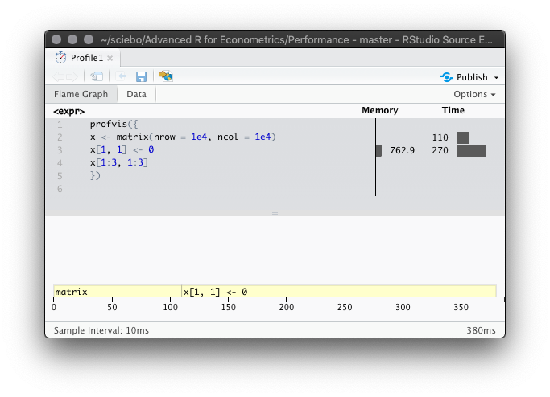

```{r setup, include=FALSE}
knitr::opts_chunk$set(echo = TRUE, eval = FALSE)
```

## Slide 6: Profiling - `utils::Rprof()`

- The *function call stack* is a record of the function currently executing, the function that called the function, and so on (from right to left)

- The default time interval between sampling is 0.02 seconds. If the profiled code executes faster you need to pass an appropriate sampling time to the argument `interval`.

- The output of `Rprof()` is a complete listing of the function call stack *at every sampling iteration* (which, on its own, is often not very informative) and is printed to a binary file in the current working directory (in the example we save it in a temporary file)

- The number of lines printed to the console therefore depends on the number of stops were the profiler records the current call stack, set using `interval`:

    In the example, the sampling interval is 0.1 and total execution time is 0.3 seconds. The full call stack is displayed 3 times since random number generation using `rnorm()` takes almost 100% of the time.


**Example: profiling a call of `replicate()` &mdash; ctd.**

- A more useful output is produced by `utils::summaryRprof()`: 

    By appending `$by.total` we get the time spend in each function by the total run time. 

    ```{r, eval=F}
    summaryRprof(tmp)$by.total
    ```

    ```{r, echo = F}
    cat('
                 total.time total.pct self.time self.pct
    "rnorm"            0.3       100       0.3      100
    "FUN"              0.3       100       0.0        0
    "lapply"           0.3       100       0.0        0
    "mean"             0.3       100       0.0        0
    "replicate"        0.3       100       0.0        0
    "sapply"           0.3       100       0.0        0
    ')
    ```

    So `rnorm()` is six levels deep in the call stack and it seems that R spends most of time evaluating `rnorm(1e6)` (which takes ~ 0.3 seconds).

-  By appending `$by.self` the results are adjusted for the time needed to run functions above the current function in the call stack.

    ```{r, eval=F}
    summaryRprof(tmp)$by.self
    ```
    ```{r, echo = F}
    cat('
           self.time self.pct total.time total.pct
    "rnorm"       0.3      100        0.3       100
    ')
    ```

    As expected, random number generation takes ~ 100% of the total computation time.

## Slide 7: Visualising profiles: `profvis::profvis()`

- We use `profvis::pause()` since the time spend in `sys.sleep()` is not measured as computing time.

- Visualisation using `profvis()` works best when the code is sourced from an .R-script:
    ```{r, eval=FALSE}
    # source f(), g(), h() form R script
    source("codes/profiling-example.R")
    
    # visualise profiling results
    profvis(f())
    ```

- After profiling, `profvis()` opens an interactive HTML window will *RStudio* which lets us explore the results (see Figure 1).

- The interface provided by `profvis()` connects the profiling data back to the source code. This makes it easier to build up a 'mental' model of what you may improve.

```{r echo=FALSE, out.width='40%', eval = T, fig.align='center', fig.cap="profvis()", fig.show='hold'}
knitr::include_graphics(c('../img/profiling.png', '../img/profiling_data_tab.png'))
```

The top pane in the left panel of Figure 1 

- displays bar plots of running times and memory allocations with the latter being no issue here (why?)

- provides a good overall feel for bottlenecks but is quite imprecise about the *cause*

`h()` is not significantly slower than `g()`: `h()` is reported to take 150 ms (twice as long as `g()`) because it is called two times.

The bottom pane shows a *flame graph* of the full call stack. The full sequence confirms that

 - `h()` is called from two different places (once by `g()` and once by `f()`)

 - the execution time of `h()` is roughly the same in each call.
 
 - Mousing over a cell in the function stack indicates the corresponding line in the source code.

The data tab (Figure 1, right panel) provides a tree-based representation of the top pane. This is useful for analysing more complicated components of the code.

## Slides 8: Visualising profiles: `profvis::profvis()`

- Notice that the actual computation of model is relatively fast. The plot functions are the root of all evil!

## Slide 11: Memory Profiling

**Solution to Exercise**

What is going on?

- It looks like R spends most of the time modifying the data in-place, but that’s not actually what’s happening internally.

- The memory column indicates that large amounts of memory are being allocated (right bar) and freed (left bar)

  Reasons: 
  
  1. A new memory object is generated by modifying a copy of the 'old' `x` which is then reassigned to `x` in each iteration
  
  2. Garbage collection (GC) automatically frees memory by deleting no more required objects

- While `c()` runs for a total of 170 ms, a considerable amount of this time is due to garbage collection (`<GC>`)

When you see the garbage collector taking up a lot of time, you can often come up with a more efficient alternative.

```{r echo=FALSE, out.width='40%', eval = T, fig.align='center', fig.cap="Memory profiling with profvis()"}
knitr::include_graphics('../img/profiling_gc.png')
```

## Slide 12: Memory Profiling

**Solution to Exercise**

```{r echo=FALSE, out.width='40%', eval = T, fig.align='center', fig.cap="profiling coercion to another type"}

```

**What is going on?**

The code seems fairly innocent, but it turns out that it is very inefficient in terms of both memory and speed:

- Line 3 assigns a numeric value upon which `x` is written to the memory. It requires `(1e4 * 1e4 * 8)/1024^2 = 762.9395 MB`.

- `x` is initialized with type `logical` (it is filled with `NA`s) and thus cannot contain numeric values.

- `x[1, 1] <- 0` internally coerces `x` to a `numeric` matrix before assigning `0` to the (1,1) element which is quite costly: initializing `x` was more than twice as fast!

Especially if a large number of computations need to be performed, coercion should be avoided wherever possible!

## Slide 14: Memory Profiling

**Example: primitive functions**

Primitive functions cannot be profiled:
  
```{r, eval=F}
profvis({
  sqrt(sum(abs(rnorm(sum(1e6)))))
  })
```

## Slide 21:

```{r, results='hide', cache=T}
set.seed(42)

create_df <- function(rows, cols) {
  as.data.frame(matrix(
      unlist(replicate(cols, runif(rows, 1, 1000), simplify = FALSE)),
      nrow = rows, ncol = cols))
}

results <- bench::press(
  rows = c(10000, 100000),
  cols = c(10, 100),
  {
    dat <- create_df(rows, cols)
    bench::mark(
      min_iterations = 100,
      bracket = dat[dat$x > 500, ],
      which = dat[which(dat$x > 500), ],
      subset = subset(dat, x > 500)
    )
  }
)
```

`ggplot2::autoplot()` automatically generates a facet plot for `results`.

```{r, eval=F}
plot(results)
```

## Slide 22: Microbenchmarking --- Exercises

1. Instead of using `bench::mark()`, you could use the built-in function `system.time()` which is, however, much less precise, so you’ll need to repeat each operation many times with a loop, and then divide to find the average time of each operation, as in the code below.

    How do the estimates from `system.time()` compare to those from `bench::mark()`? Why are they different?

    **Solution:**

    As `bench::mark()` doesn’t calculate the mean value, we calculate it from the time list-column in the tibble output.

    ```{r, eval=F}
    n <- 1e6
    x <- runif(100)
    
    bench_res <- bench::mark(
      sqrt(x), 
      x ^ 0.5
    )
    
    # Compute mean across all runs
    t_sqrt_bench  <- mean(unlist(bench_res[1, "time"]))
    t_power_bench <- mean(unlist(bench_res[2, "time"]))
    
    t_sqrt_systime  <- system.time( for (i in 1:n) sqrt(x) ) / n
    t_power_systime <- system.time( for (i in 1:n) x^0.5 ) / n
    
    # Compare the results
    t_sqrt_systime["elapsed"]
    #>  elapsed 
    #> 1.06e-06
    t_sqrt_bench
    #> [1] 8.97e-07
    
    t_power_systime["elapsed"]
    #>  elapsed 
    #> 8.64e-06
    t_power_bench
    #> [1] 1.05e-05
    ```

    Both approaches get the order of magnitude right. The results differ a little and `bench::mark()` is generally more precise.
  
2. Here are two other ways to compute the square root of a vector. Which do you think will be fastest? Use microbenchmarking to test your answers.

    **Solution:**

    ```{r, eval=F}
    x <- runif(100)

    bench::mark(x^(1/2),
            exp(log(x)/2),
            relative = TRUE)
    ```

    So `x^(1/2)` is faster (which is due to overhead produced by calling `exp()` and `log()`.

## Slide 25: (Why) is R slow? &mdash; Slow Code Interpretation

In the example, the interpreter cannot predict that the loop always adds `1` to an integer `x`. `R` needs to look for the right `+` method (the method for adding two integers) in *every* iteration of the loop!

