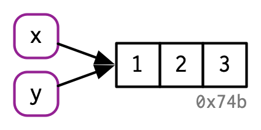
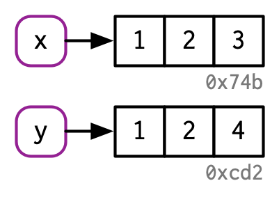
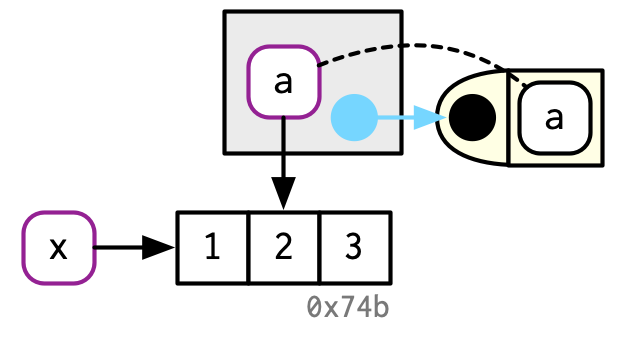
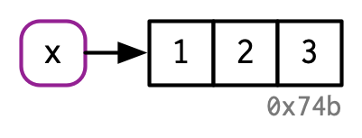
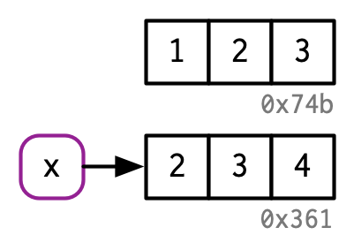
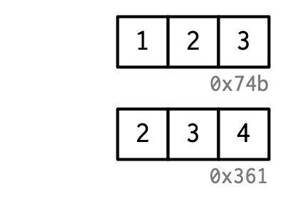

class: title-slide title-rintro center middle

```{r setup, echo = F, eval = T, warning = F}
knitr::opts_chunk$set(echo = TRUE, eval = FALSE, warning = FALSE)
source(here::here("SoSe_2026/utils.R"))
fontawesome::fa_html_dependency()
library(lobstr)
```

```{r moon_reader, include=FALSE, eval = FALSE}
# setup for moon reader — copy to console for live preview
options(servr.interval = 0.5)
xaringan::inf_mr()
```

# `r rmarkdown::metadata$title`
## `r rmarkdown::metadata$subtitle`
### `r rmarkdown::metadata$author`

---
## Overview

Make sure the `lobstr` package is installed and attached:

```{r, eval=F}
install.packages("lobstr")
library(lobstr)
```

**Outline**

- Names and Values

    - Bindings and references

    - Copy-on-modify / in-place modification

    - Unbinding and Garbage Collection

- Functions

    - Fundamentals, scoping, and Lazy Evaluation

    - Function forms

---
class: segue-red
### Names and Values

---
## Assignment Operators

.smaller[

`<-` is the standard assignment operator; `=` is an alias but has lower precedence when mixed in the same expression.

.blockquote.exercise[
#### `r ICONS$desktop` Example: operator *precedence*

.pull-left[
```{r}
a <- b <- 1   # chaining works
a = b = 1     # so does this
a == b
```
]

.pull-right[
```{r, error=TRUE}
a = b <- 1    # fine: <- has precedence
a == b
a <- b = 1    # error: ambiguous
```
]
]

Assignment operators work in the environment where they are invoked. The **super assignment** operator `<<-` assigns in the *enclosing* environment.

.blockquote.exercise[
#### `r ICONS$desktop` Example: super assignment with `<<-`

```{r}
counter <- 0
increment <- function() counter <<- counter + 1
increment()
counter    # 1
```
]
]

???

- R interprets `a <- b = 1` as `'<-<-'(a, b = 1, value = 1)`, which is an error.
- `<<-` walks up the environment chain until it finds an existing binding; if none exists, it creates one in the global environment.

---
## Bindings

.smaller[

- The idiom *"the object `x` stores the vector"* is misleading.
- **Binding** means that the name has a **value**: `x` is a **reference** to a value living in the computer's memory.

.blockquote.exercise[
#### `r ICONS$desktop` Example: binding a vector

.pull-left[
  
  <br>
  
  
]
.pull-right[
.code80[
```{r, eval = TRUE}
x <- c(1, 2, 3)
y <- x   # y is a second reference to the same value

# identical addresses confirm no copy was made
obj_addr(x)
obj_addr(y)
```
]
]
]
]

???

- Both `x` and `y` point to the same memory location — no copy is made on assignment.
- This distinction matters for performance: passing large objects to functions does not copy them unless they are modified.

---
## Copy-on-modify

.font90[

R's copy-on-modify behaviour is both a blessing and a curse:

- We may use references without the risk of breaking existing code (convenient).
- *Modifying* a reference may trigger a copy of the value (potentially expensive).

.blockquote.exercise[
#### `r ICONS$desktop` Example: copy-on-modify

.pull-left[
  <br>
  
  
]
.pull-right[
.code90[.font90[
```{r}
x <- c(1, 2, 3)
y <- x

y[[3]] <- 4   # triggers a copy of x's value
x             # x is unchanged
```

```{r}
obj_addr(x)
obj_addr(y)   # now different addresses
```
]
]
]
]
]

???

- In many other languages (e.g., C++), assignment would mutate the original object in-place. R's copy-on-modify makes code safer but can be slower.
- The distinction between one and two bindings (see "Modify-in-place") is key for performance.

---
## Copy-on-modify: Tracking with `tracemem()`

.code90[
.font90[

Use `tracemem()` to receive a notification whenever a copy of an object is made.

.blockquote.exercise[
#### `r ICONS$desktop` Example: keeping track of copies

`tracemem()` reports the old and new memory address, plus the **call stack** if functions are involved.

```r
x <- c(1, 2, 3)
tracemem(x)
```

`[1] "<0x7fba7740ebb8>"`

```r
y <- x          # no copy yet — two names, one value
y[[3]] <- 4     # copy triggered here
```

`tracemem[0x7fba7740ebb8 -> 0x7fba76883958]:`

```r
y[[3]] <- 5     # y now has only one binding → modifies in-place
untracemem(x); untracemem(y)
```

]
]
]

???

- A call stack describes the order of nested function calls. It appears in `tracemem()` output when a copy occurs inside a function.
- After `y[[3]] <- 4`, `x` and `y` each have exactly one binding. The next modification of `y` is therefore in-place.

---
## Copy-on-modify: Function Calls

.font90[

The same rules apply inside function calls.

.blockquote.exercise[
#### `r ICONS$desktop` Example: "External" variables in function calls

.pull-left[
  <br>
  
  
]
.pull-right[
```{r}
f <- function(a) a   # does not modify a
x <- c(1, 2, 3)
```
```r
tracemem(x)
```
```
## [1] "<0x74b050b21318>"
```
```{r}
z <- f(x) # no copy: z references x's value
untracemem(x)
```
]
]

<br>

.content-box-white[
**Task:** Predict what `tracemem()` outputs for `f(x)` and `z <- f(x)` when `f()` *modifies* its argument:<br/> `f <- function(a) { a[[1]] <- 0; a }`.
]
]

???

- No copy for the identity `f()` because `z` is just another reference to the same value.
- When `f()` modifies `a`, a copy is triggered. `z <- f(x)` creates one copy (not two): `z` then references the same modified object that `a` pointed to.

---
## Copy-on-modify: Lists and Data Frames

.font90[

List elements are themselves *references*: only the list spine is copied when an element is modified (a **shallow copy**).

.blockquote.exercise[
#### `r ICONS$desktop` Example: shallow copy of a list

```{r, eval = TRUE}
l1 <- list(1, 2, 3)
l2 <- l1
l2[[3]] <- 4           # shallow copy: only the spine is duplicated
ref(l1, l2)            # shared element references are visible
```
]
<br/>
.content-box-white[
**Task:** Explain why `df[1, ] <- c(42, 42)` is more expensive than `df$x <- c(7, 7, 7)` for a two-column data frame `df`.
]
]

???

- `ref()` output shows that `l1[[1]]` and `l2[[1]]` share the same memory address after modification — the copy is shallow.
- Row modification touches all column vectors, so R must copy each one. Column modification touches only a single vector.

---
## Exercises

.font90[.code90[

1. Why is `tracemem(1:10)` not useful?

2. Explain why `tracemem()` shows a copy below. (*Hint:* consider the *type* of `x` and the replacement value.)
    ```r
    x <- c(1L, 2L, 3L)
    tracemem(x)
    x[[3]] <- 4
    ```

3. Explain the results. Why does multiplying the length by 100,000 not change the memory footprint?
    ```{r}
    obj_size(1:10)
    obj_size(1:1e6)
    ```

<!-- 4. Rewrite the Case Study loop using `lapply()`. Does it reduce the number of copies? -->

]
]

???

1. `1:10` is not a binding — there is no name to track. `tracemem()` requires a bound object.
2. `x` is an integer vector; assigning `4` (a double) triggers coercion of the entire vector to double, which always requires a copy.
3. `:` stores integer sequences from just the start and end value — the number of elements does not affect memory usage.
4. `lapply()` constructs a new list rather than modifying `x` in-place, so no copies of `x` are triggered within the loop.


---
## Modify-in-place

.font90[.code90[

R modifies in-place (without triggering a copy) in two cases:

1. The object has **only one binding**
2. The object is an **environment**

.blockquote.exercise[
#### `r ICONS$desktop` Example: single-binding modification

```r
v <- c(1, 2, 3)
obj_addr(v)
```

```
## [1] "0x7fcce1ca03d8"
```

```r
v[[2]] <- 4
obj_addr(v)   # same address — no copy made
```

```
## [1] "0x7fcce1ca03d8"
```

]

<br/>

.content-box-white[
**Note:** Running this in RStudio will still trigger a copy because the Environment pane holds an additional reference to `v`.
]
]
]

???

- For testing in-place modification, run code in the R console (not RStudio) to avoid the extra binding from the Environment pane.
- Environments are always modified in-place regardless of the number of bindings — this is one reason they are used as mutable reference objects.

    
---
exclude: True
## Case Study: Copy-on-Modify Inferno

.smaller[

Column-wise subtraction of medians — a common data-cleaning step — reveals a costly copy pattern when applied to a data frame inside a loop.

.blockquote.exercise[
#### `r ICONS$desktop` Example: loop modification of a data frame

```{r, eval=F}
x <- data.frame(matrix(runif(5 * 1e4), ncol = 5))
medians <- apply(x, 2, median)
tracemem(x)

for (i in seq_along(medians)) {
  x[[i]] <- x[[i]] - medians[[i]]   # triggers 3 copies per iteration!
}
```
]

Each `[[<-.data.frame` call internally creates a temporary binding `*tmp*` and rebuilds the data frame — generating **three copies per column**:

```r
tracemem[... -> ...]:
tracemem[... -> ...]: [[<-.data.frame [[<-
tracemem[... -> ...]: [[<-.data.frame [[<-
```
]

???

- `x` is referenced in the global environment, inside `[[`, and inside `[[<-.data.frame()` — more than one binding means every modification triggers a copy.
- We revisit the performance implications later in the chapter on Performance.

---
exclude: True
## Case Study: Solution

.smaller[

Converting the data frame to a list reduces the copy overhead dramatically.

```{r, eval=F}
y <- as.list(x)
tracemem(y)

for (i in seq_along(medians)) {
  y[[i]] <- y[[i]] - medians[[i]]
}
```

```r
tracemem[0x... -> 0x...]:   # only one copy for the entire loop
```

.pull-left[
*Before loop:*
```
█ [1:0x7fba72971928] <named list> 
├─X1 = [2:0x10f1ec000] <dbl> 
...
```
]
.pull-right[
*After loop:*
```
█ [1:0x7fba72a2e178] <named list> 
├─X1 = [2:0x115cc7000] <dbl> 
...
```
]

Only the list spine is copied once (by internal C code on the first `[[<-` call); the column vectors are then modified in-place. For even better performance, see the `Rcpp` chapter.
]

???

- The single copy of the spine occurs because `y` initially has more than one binding; after that copy it has one, and subsequent modifications are in-place.
- Each column ends up at a new address because each vector is replaced (modified in-place from that point on), not because the whole structure is copied each time.

---
## Garbage Collection

.smaller[

When a name is rebound or removed, the old value becomes unreachable: it is **unbound**.

R's **tracing Garbage Collector** (GC) automatically frees memory when objects become unreachable. It runs *on demand*. There is no need to call `gc()` manually.

.blockquote.exercise[
#### `r ICONS$desktop` Example: unbinding an object

.row[
.pull-left[
  <br/>
  **(a) binding** &nbsp; 
]
.pull-right[
```{r}
x <- 1:3
```
]
]
.row[
.pull-left[
  <br/>
  **(b) implicit unbinding** &nbsp; 
]
.pull-right[
```{r}
x <- 2:4   # 1:3 is now unreachable
```
]
]
.row[
.pull-left[**(c) explicit unbinding** &nbsp; ]
.pull-right[
```{r}
rm(x)
```
]
]
]
]

???

- A **tracing garbage collector** is a memory-management system that starts from known live references, follows (“traces”) all reachable objects, and automatically frees objects that cannot be reached anymore.
- `gc()` can be called for its **side effect**: it prints a summary of current memory use. `vcells` = vector memory (atomic, interger, numeric, logical, character, raw), `ncells` = everything else.
- `gcinfo(TRUE)` prints a message every time the GC runs — useful for diagnosing unexpected memory pressure.


---
class: segue-red
### Functions

---
## Functions

<blockquote style ="margin-top:15%;">
To understand computations in R, two slogans are helpful:<br><br>
Everything that exists is an object.
Everything that happens is a function call.
.right[&mdash; <cite>John Chambers</cite>]
</blockquote>

---
## Regular Functions vs. Primitives

.smaller[

- **Regular functions** (`closure` type) live in environments and consist of a **body** and **formals** (the argument list)
- **Primitives** are special `base` R functions implemented in C — they have no formals or body

.blockquote.exercise[
#### `r ICONS$desktop` Example: regular functions vs. primitives

.medium[
.pull-left[
```{r}
typeof(lm)
environment(lm)
names(formals(lm))[1:4]
# body(lm) is large — check yourself!
```
]
.pull-right[
```{r}
typeof(sum)
environment(sum)   # NULL
formals(sum)       # NULL
body(sum)          # NULL
```
]
]
]
]

???

- The `typeof()` of regular functions is `"closure"` — reflecting that they close over their defining environment.
- Primitives (`sum`, `+`, `[`) call C code directly and bypass the normal function-call mechanism, making them faster.

---
## First-Class Functions

.smaller[

*R functions are **objects**!* They can be stored in lists, passed as arguments, and called without ever being bound to a name.

<br/>

.blockquote.exercise[
#### `r ICONS$desktop` Example: anonymous functions

.pull-left[
```{r}
funs <- list(
  function(x) x^2,
  function(x) x^3
)
sapply(funs, function(z) z(5))
```
]

.pull-right[
```{r}
# call immediately — no binding needed
(\(x) x^2)(5)
(\(x) x^3)(5)
```
]
]

<br/>

.content-box-white[
**Task:** Explore what "`(`" is as a function. What does it return? Explain why `(x <- 5)` is valid R and what makes it useful.
]
]

???

- `(\(x) ...)` is the modern lambda syntax introduced in R 4.1. It is equivalent to `(function(x) ...)`.
- `(` is a primitive semantically equivalent to `function(x) x`. It returns its argument unchanged but forces *visible* evaluation. `(x <- 5)` therefore assigns 5 to `x` *and* prints the result — useful in one-liners.

---
## R's Environment Hierarchy

.font90[
Each environment holds a **parent pointer**. Name lookup follows these pointers until the name is found or `R_EmptyEnv` is reached.

```{r env-graph, eval=TRUE, echo=FALSE, fig.height=2.6, fig.width=11, dpi=192, out.width='100%', fig.align='center'}
library(ggplot2)

node_x <- c(1.0, 3.5, 6.0, 8.5, 11.0)
labels <- c("f()'s exec. env", ".GlobalEnv", "search path", "base", "R_EmptyEnv")
fills  <- c("#1e6eb5", "#004c93", "#7aaed4", "#d4e4f7", "#f0f0f0")
tcols  <- c("#ffffff", "#ffffff", "#002d6e", "#004c93", "#444444")

p <- ggplot() + theme_void() +
  coord_cartesian(xlim = c(-0.1, 12.1), ylim = c(-0.9, 0.9), clip = "off")

# Parent-pointer arrows: child -> parent (left to right)
for (i in 1:4) {
  p <- p + annotate("segment",
                    x = node_x[i] + 0.92, xend = node_x[i+1] - 0.92,
                    y = 0, yend = 0,
                    arrow = arrow(length = unit(0.22, "cm"), ends = "last",
                                  type = "closed"),
                    color = "#555555", linewidth = 0.9)
}

# Node boxes
for (i in seq_along(node_x)) {
  p <- p + annotate("label",
                    x = node_x[i], y = 0,
                    label = labels[i],
                    fill = fills[i], color = tcols[i],
                    fontface = "bold", size = 3.8,
                    label.size = 0.4, label.r = unit(0.25, "lines"),
                    label.padding = unit(0.45, "lines"))
}

p
```

- `f()`'s execution env is created fresh **per call**; its parent is where `f` was **defined** (here `.GlobalEnv`)
- Package envs form the **search path** between `.GlobalEnv` and `base` — inspect with `search()`
- Hitting `R_EmptyEnv` without finding the name raises: *"object 'x' not found"*
]

???

- The search path can be inspected with `search()`. Packages loaded with `library()` are inserted between `.GlobalEnv` and `base`.
- `environment(f)` returns the enclosing environment of a function — the parent of any execution environment `f` creates.
- This hierarchy is also why `library()` order can matter: a name in a later-loaded package shadows one in an earlier-loaded one.

---
## Lexical Scoping

.smaller[

**Scoping** is the process of finding the value associated with a name. R uses **lexical scoping**:

1. **Name masking** — names defined *inside* a function mask names defined *outside* it
2. **Functions before variables** — R ignores non-function objects when a name is used in a function call
3. **Execution environments** — each function call creates its own *ephemeral* environment
4. **Dynamic look-up** — R searches for values *when the function runs*, not when it is created

.blockquote.exercise[
#### `r ICONS$desktop` Example: all four rules at once

```{r}
z <- function(x) x^2

f <- function() {
  if (!exists("x")) x <- 1 else x <- x + 1   # (3) x lives in f's env.
  z <- 2                                     # (1) masks the global z
  z(x + y)                                   # (2) z() finds the function, not 2
}                                            # (4) y is looked up at call time
y <- 20
f()
```
]
]

???

- `z <- 2` inside `f()` masks the outer name, but when R evaluates `z(x + y)` it looks for a *function* named `z` — finding the global `z <- function(x) x^2`.
- `y` is not defined inside `f()` and is resolved dynamically at runtime in the global environment.


---
## Lazy Evaluation

.smaller[

Function arguments in R are **lazy**: they are not evaluated until they are actually needed. Each argument is represented internally as a **promise** — an expression paired with its evaluation environment.

.blockquote.exercise[
#### `r ICONS$desktop` Example: a promise is evaluated only once

```{r, eval = TRUE, message = TRUE}
double <- function(x) {
  message("Computing...")
  x * 2
}

clone <- function(x) c(x, x)

clone(double(20))   # "Computing..." appears only once
```
]

The argument `double(20)` is a promise. Although `clone()` accesses `x` twice in `c(x, x)`, the promise is **evaluated once** and its result is cached for subsequent accesses.

]

???

- After the first access, the promise is "forced" and replaced by its value in the function's environment. Subsequent accesses read the cached value directly.
- This is why `c(x, x)` prints only one message despite referencing `x` twice.


---
## Lazy Evaluation: Default Arguments

.smaller[

Default argument expressions are evaluated *in the function's environment*, not the caller's.

.blockquote.exercise[
#### `r ICONS$desktop` Example: default arguments evaluated lazily

```{r}
f <- function(x = 1, y = x * 2, z = a + b) {
  a <- 10
  b <- 100
  c(x, y, z)
}
f()   # z uses a and b defined *inside* f
```
]

Unevaluated arguments are simply ignored if they are never accessed:

```{r}
ignore <- function(x) "I never use x"
ignore(x = stop("never evaluated"))
```

]

???

- Default expressions can reference variables that do not yet exist at function definition — they are resolved lazily inside the function environment at call time.
- The `stop()` example shows that R never evaluates arguments that are not needed. This is useful for expensive defaults.

---
## Lazy Evaluation: Short-circuit Evaluation

Lazy evaluation extends to control flow: `&&` and `||` use **short-circuit evaluation**.

```{r}
x <- NULL
if (!is.null(x) && x > 0) {
  # do something
}
```

.content-box-white[
**Task:**

1. Why does `x > 0` look problematic when `x` is `NULL`?

2. Why does the code not throw an error despite `x` being `NULL`?
]

???

- `x > 0` compares `NULL` to a number, which normally returns `logical(0)` — causing an error in `if()` because `if` requires a length-1 logical.
- `&&` short-circuits: if the left-hand side is `FALSE`, the right-hand side is never evaluated. Since `!is.null(NULL)` is `FALSE`, `x > 0` is never reached.

---
## Function Forms

Not all function calls look the same. R has four forms:

<br/>

| Form | Example | Notes |
|------|---------|-------|
| **prefix** | `f(a, b)` | Standard call |
| **infix** | `a + b`, `a %in% b` | Operators; user-definable with `%...%` |
| **replacement** | `names(x) <- c("a", "b")` | Assignment-like modification |
| **special** | `for`, `[[`, `if` | Control structures and subsetting |

<br/>

Every call can be rewritten in **prefix** form:

```{r}
`+`(1, 2)    # infix as prefix
`[`(1:3, 3)  # special as prefix
```

???

- User-defined infix operators must begin and end with `%`, e.g., `%+%`, `%between%`.
- Backticks or single quotes work equally well for calling operators in prefix form.

---
## Function Forms: Infix Operators

It is straightforward to define custom operators in infix form.

<br/>

.blockquote.exercise[
#### `r ICONS$desktop` Example: `paste()` as a custom infix operator

```{r}
`%+%` <- function(a, b) paste(a, b)
"Hello" %+% "World"
```
]

<br/>

.blockquote.exercise[
#### `r ICONS$desktop` Example: a `%between%` operator for range checks

```{r}
`%between%` <- function(x, range) x >= range[1] & x <= range[2]
5 %between% c(1, 10)
```
]

???

- Custom infix operators are simply regular functions with `%` delimiters in the name.
- The `data.table` package uses `%between%` and `%like%` extensively for readable filter expressions.

---
## Function Forms: Replacement Functions

Replacement functions allow assignment-like syntax for modifying objects.

```r
`name<-` <- function(x, value) {
  # modify x using value
  x   # must return the modified object
}
```

.blockquote.exercise[
#### `r ICONS$desktop` Example: replacing the last vector element

```{r}
`last<-` <- function(x, value) {
  x[length(x)] <- value
  x
}

x <- c(1, 2, 3)
last(x) <- 99
x
```
]

Replacement functions **always trigger a copy** because R desugars the assignment into a replacement-function call and rebinds `x`, creating a temporary binding.

???

- Replacement functions must accept `x` and `value` as arguments and return the full modified object.
- The copy overhead mirrors other copy-on-modify situations: one copy is made for the temporary binding inside `[[`.

---
## Exercises

.font90[

1. Explain why the following code errors. Provide a fix using `with()`.
    ```{r, error=TRUE}
    f <- function(x, z) z + x^2
    f(x = z^2, z = 2)
    ```

2. What does the `...` (ellipsis) argument do? Explain using this example:
    ```{r}
    f <- function(...) names(list(...))
    f(a = 1, b = 2)
    ```

3. Define a replacement function `winsorise<-` that clips a numeric vector to a given range.
    The `value` argument is a length-2 vector `c(lower, upper)`: values below `lower` are set to
    `lower`, values above `upper` are set to `upper`. Test it:
    ```{r}
    returns <- c(-0.52, 0.03, 0.15, 1.20, -0.08, 0.97)
    winsorise(returns) <- c(-0.5, 0.5)
    returns   # extreme values clipped to the bounds
    ```

]

???

1. Lazy evaluation resolves `x = z^2` in the *calling* environment (the global env.), where `z` is not yet defined. Fix: `with(list(z = 2), f(x = z^2, z = 2))`. Alternatively, make `z^2` the default: `f <- function(x = z^2, z) z + x^2`.
2. `...` captures any number of named or unnamed additional arguments and allows them to be forwarded to other functions. Here, `f()` wraps them in a list and returns the names — demonstrating that `...` preserves argument names.
3. `winsorise<-` must accept `x` and `value`, apply `x[x < value[1]] <- value[1]` and `x[x > value[2]] <- value[2]`, then return `x`. The vector-valued `value` argument is the key challenge. Winsorisation is standard in empirical finance and labour economics to handle extreme observations without dropping them.


---
class: segue-red


### Thank You!

