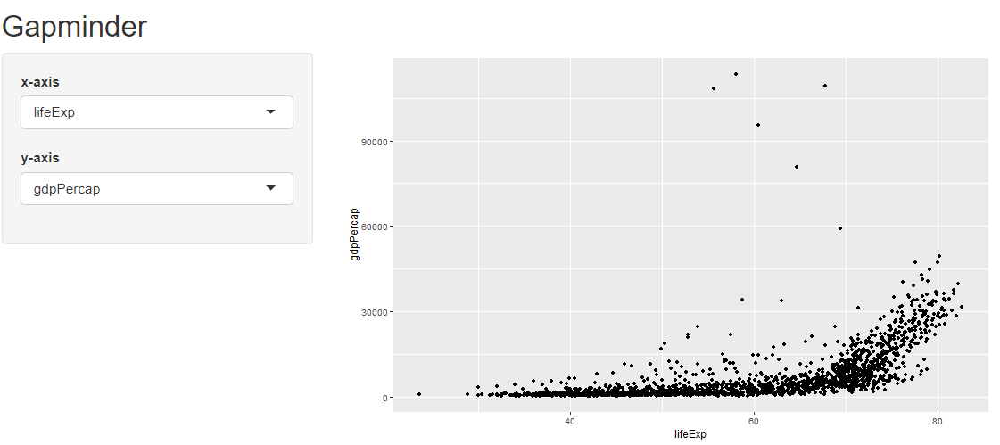
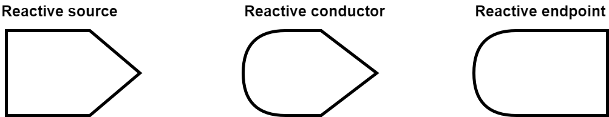
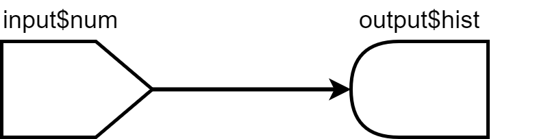
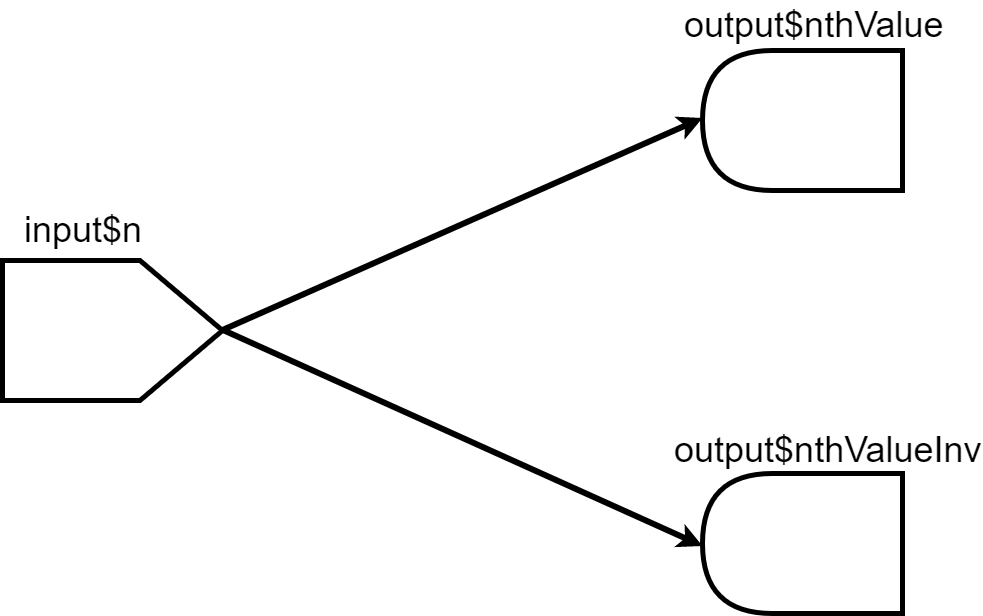
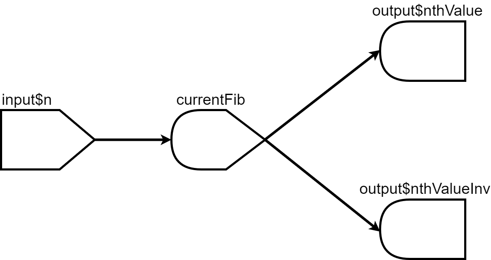

class: title-slide title-shiny center middle
```{r setup, echo = FALSE, eval = TRUE, warning = FALSE}
knitr::opts_chunk$set(echo = TRUE, eval = FALSE, warning = FALSE)
source(here::here("SoSe_2026/utils.R"))
```

```{r moon_reader, include = FALSE, eval = FALSE}
# setup for moon reader
# copy it to console
options(servr.interval = 0.5)
xaringan::inf_mr()
```

# `r rmarkdown::metadata$title`
## `r rmarkdown::metadata$subtitle`
### `r rmarkdown::metadata$author`

---
## What is Shiny? 

.font90[
The `shiny` package allows to build interactive web applications for, e.g., data analysis.
]

--

.font90[
It can be used for, among other things:

- building a graphical user interface for R
- reporting results
- creating interactive documents.
]

--

.font90[
- To build a Shiny app you only need to learn the Shiny syntax.  
- If you want to customize your app you can use HTML/CSS/Javascript.  
]

--
.font90[
Some examples:

- [Shiny Gallery](https://shiny.posit.co/r/gallery/)

There is also a [cheatsheet](https://posit.co/wp-content/uploads/2022/10/shiny-1.pdf).
]


---

## Structure

A Shiny app consists of 2 parts

1. The **user interface** (`ui`)
    - controls the layout and appearance of the app
    - contains elements for user input
    - contains placeholders for output

--

2. The **server** function
    - contains the instructions for the R session running in the background
    - takes user input and produces output sent back to the UI


---

## A minimal example 

.blockquote.exercise[
```{r}
library(shiny)

ui     <- fluidPage()                           # the user interface
server <- function(input, output, session) {}   # the R backend

shinyApp(ui = ui, server = server)              # run the app
```
]

--

**Alternative:** create a directory (e.g. `App-1/`) with files `ui.R` and `server.R`, then call `shiny::runApp("App-1")`.

---

## User Interface  

We extend the app with a sidebar layout.

.blockquote.exercise[
```{r}
ui <- fluidPage(
  titlePanel("Title Panel"),
  sidebarLayout(
    sidebarPanel("Sidebar Panel"),
    mainPanel("Main Panel")
  )
)
server <- function(input, output, session) {}
shinyApp(ui = ui, server = server)
```
]

--

- `fluidPage()` creates a page that adapts to the browser window size.
- Type any layout function in the console to see the HTML it generates.

---
## Adding Elements for User Input 

.blockquote.exercise[  
```{r}
ui <- fluidPage(
  titlePanel("Title Panel"), 
  sidebarLayout(
    sidebarPanel("Sidebar Panel",
                 br(),                           # linebreak
                 br(),
                 sliderInput(
                 inputId = "num",                # input value can be accessed from the server 
                 label = "Choose a number",      # function via the inputId
                 value = 25, min = 1, max = 100)
                 ),
    mainPanel("Main Panel")
  )
)
```
]

--

An overview of all input widgets: [shiny.posit.co/r/components/inputs/](https://shiny.posit.co/r/components/inputs/).  
A particularly useful one: [`varSelectInput()`](https://shiny.posit.co/r/reference/shiny/latest/varselectinput.html) for selecting data frame columns.
---
## Create Output in the Server Function 

The server reads `input$inputId` values and writes to `output$outputId` using **render functions**.

- Access inputs via `input$inputId`.
- Wrap reactive output in a render function.
- Assign to `output$outputId`.

--

.blockquote.exercise[
#### `r ICONS$desktop` Example
```{r}
server <- function(input, output, session) {
  output$hist <- renderPlot({
    hist(rnorm(input$num))
  })
}
```
]

---
## Display Output in the User Interface

Use an **output function** in `ui` to display the rendered result.

.font90.blockquote.exercise[
#### `r ICONS$desktop` Example
```{r}
ui <- fluidPage(
  titlePanel("Title Panel"),
  sidebarLayout(
    sidebarPanel(
      br(),
      sliderInput(inputId = "num",
                  label   = "Choose a number",
                  value = 25, min = 1, max = 100)
    ),
    mainPanel(
      br(),
      plotOutput("hist")
    )
  )
)
```
]

---
## Preventing Errors with `req()`

When an app starts, inputs may be `NULL` before the user interacts with them.  
`req()` **silently stops execution** until the required input is available.

.blockquote.exercise[
#### `r ICONS$desktop` Example
```{r}
server <- function(input, output, session) {
  output$hist <- renderPlot({
    req(input$num)          # stop silently if input$num is NULL or empty
    hist(rnorm(input$num))
  })
}
```
]

--

`req()` is essential whenever inputs depend on earlier user selections (e.g., a dropdown that populates a plot).

---
## Render and Output Functions

Each output type requires a matching render function:

.font90[
| Output function | Render function | Displays |
|---|---|---|
| `plotOutput()` | `renderPlot()` | plots (e.g. ggplot2) |
| `tableOutput()` | `renderTable()` | data frames / matrices |
| `dataTableOutput()` | `renderDataTable()` | interactive DT table |
| `textOutput()` | `renderText()` | plain text values |
| `verbatimTextOutput()` | `renderPrint()` | `print()` output |
| `imageOutput()` | `renderImage()` | image files (.png, .jpg) |
| `uiOutput()` | `renderUI()` | dynamic Shiny UI |
| `downloadButton()` | `downloadHandler()` | file downloads |
]


---
## Gapminder 

<iframe width="1051" height="550" src="https://www.youtube.com/embed/jbkSRLYSojo?list=PLB33D8_2SjkZvPYB1CbyMtQhlM-D106hk" frameborder="0" allow="accelerometer; autoplay; encrypted-media; gyroscope; picture-in-picture" allowfullscreen></iframe>

---
class: exercise_slide
## Exercises

Install and load the `gapminder` package.

1. Recreate the following app.  
Hints: The variables on the x and y axis must be numeric. The values returned by the input widgets are character strings.  

```{r, eval = TRUE, echo = FALSE, out.width = "800px"}

```


---
class: exercise_slide
## Exercises (cont.)
<ol start=2>
<li> Add two more input variables that control the color and size of the points. </li>
<li> Add a slider that allows to subset the data by year.<br>
<br>
    ```{r, eval = TRUE, echo = FALSE, out.width = "700px"}
knitr::include_graphics("../img/shiny2.png")
    ```
</li>
</ol>

---
## Reactivity — Three Kinds of Reactive Objects

We have seen that the output created by a render function changes automatically when we change input values. This behavior is called reactivity. 

- There are 3 kinds of reactive objects. 

```{r, eval = TRUE, echo = FALSE, fig.align='center', out.width="40%"}

```

--

- The reactive source is usually the user input which is accessible through `input$inputId`. It can only have dependents (it is always a parent node). 
- The reactive endpoint is usually produced by one of the render functions and assigned to `output$OutputId`. It can only be dependent (it is always a child node). 

---
## Reactivity — A Simple App

We have already written a simple app using those two elements.  

<br>

```{r, eval = TRUE, echo = FALSE, fig.align='center', out.width="40%"}

```

<br>
Whenever  `input$num` changes the reactive endpoints using this input are notified that they need to re-execute. 

---
## Reactivity — Avoiding Redundant Computation

.font90[
Which structure has the following code?
.blockquote.exercise[
```{r}
# Calculate nth number in Fibonacci sequence
fib <- function(n) ifelse(n<3, 1, fib(n-1)+fib(n-2))
server <- function(input, output, session) {
  output$nthValue    <- renderText({ fib(as.numeric(input$n)) })
  output$nthValueInv <- renderText({ 1 / fib(as.numeric(input$n)) })
}
```
]]

--

.font90[
There are two child nodes depending on one parent node. 

```{r, eval = TRUE, echo = FALSE, fig.align='center', out.width="35%"}

```

Furthermore, each of the children evaluates `fib()` separately, which leads to redundant computations.  
]

---
## Reactive Conductors with `reactive()`
.font90[
Use `reactive()` to cache an intermediate computation — `fib()` now runs only **once**.
.blockquote.exercise[
```{r}
server <- function(input, output, session) {
  currentFib         <- reactive({ fib(as.numeric(input$n)) })
  output$nthValue    <- renderText({ currentFib() })
  output$nthValueInv <- renderText({ 1 / currentFib() })
}
```
]]

--

```{r, eval = TRUE, echo = FALSE, fig.align='center', out.width="35%"}

```

.font90[  
Access the cached value using `currentFib()` (with parentheses).
]

---
## Triggering Reactions on Demand

**Problem:** with multiple numeric inputs, a heavy computation re-runs on *every* keystroke.

**Solution:** `eventReactive()` re-runs only when a specific event fires (e.g., a button click).

.blockquote.exercise[
#### `r ICONS$desktop` Example
```{r}
server <- function(input, output, session) {
  # Only re-runs when goButton is clicked
  x <- eventReactive(input$goButton, {
    rnorm(input$n, mean = input$mean, sd = input$sd)
  })
  output$hist <- renderPlot({ hist(x()) })
}
```
]

--

For **side effects** without a return value (e.g., logging, updating state), use `observeEvent()`:
```{r}
observeEvent(input$goButton, {
  cat("Button clicked, n =", input$n, "\n")
})
```

---
## `r ICONS$desktop` Example

.font90.blockquote.exercise[
```{r}
ui <- fluidPage(
  numericInput("n",    "Number of observations", 100),
  numericInput("mean", "Mean",                   0),
  numericInput("sd",   "Standard Deviation",     1),
  actionButton("goButton", "Go!"),
  plotOutput("hist")
)

server <- function(input, output, session) {
  x <- eventReactive(input$goButton, {
    rnorm(input$n, mean = input$mean, sd = input$sd)
  })
  output$hist <- renderPlot({ hist(x()) })
}

shinyApp(ui, server)
```
]

.font90[
> **Note:** `isolate()` is a lower-level alternative that suppresses reactivity for a specific expression inside a render function. `eventReactive()` is the preferred idiomatic approach.
]
---
class: exercise_slide
## Exercises 

<ol start=4>
<li> Add an action button to the Gapminder app. The graph should only re-render when the button is clicked. Use <code>eventReactive()</code>. </li>
<li> Add a checkbox “Only continents” to your app. If activated, aggregate the data at continent level in a sensible way. Use a reactive conductor (<code>reactive()</code>) so the aggregated data is computed only once when the checkbox changes. </li>
</ol>

---
## DataTables

The `DT` package provides interactive inspection and filtering of rectangular data.

--

.blockquote.exercise[
#### `r ICONS$desktop` Example
```{r}
library(DT)

ui <- basicPage(
  h2("The mtcars data"),
  DT::dataTableOutput("mytable")
)

server <- function(input, output, session) {
  output$mytable <- DT::renderDataTable(
    mtcars,
    filter = "top"
  )
}

shinyApp(ui, server)
```
]
---
## DataTables — Using Filtered Rows

.font90[
The filtered row indices are accessible as a reactive value and can be used for further computation.
]

--

.font90.blockquote.exercise[
#### `r ICONS$desktop` Example
```{r}
ui <- basicPage(
  h2("The mtcars data"),
  DT::dataTableOutput("mytable"),
  plotOutput("hist")
)

server <- function(input, output, session) {
  output$mytable <- DT::renderDataTable(
    mtcars,
    filter = "top"
  )
  output$hist <- renderPlot({
    rows <- input$mytable_rows_all
    req(rows)
    hist(mtcars[rows, "wt"], xlim = range(mtcars$wt))
  })
}

shinyApp(ui, server)
```
]
---
class: exercise_slide
## Exercises 
<ol start=6>
<li> Add a DataTable displaying the selected data to your Gapminder app. Use a <a href="https://shiny.posit.co/r/articles/build/tabsets/">Tab Panel</a> to allow switching between the table and the plot. </li>  
</ol>


