```{r setup, echo = F, eval = T, warning = F, message = F}
knitr::opts_chunk$set(echo = TRUE, eval = TRUE, warning = FALSE, message = FALSE)
library(dplyr)
library(purrr)
library(readr)
source(here::here("SoSe_2026/utils.R"))
fontawesome::fa_html_dependency()
```

```{r moon_reader, include=FALSE, eval = FALSE}
options(servr.interval = 0.5)
xaringan::inf_mr()
```

class: title-slide title-purrr center middle

# `r rmarkdown::metadata$title`
## `r rmarkdown::metadata$subtitle`
### `r rmarkdown::metadata$author`

---
class: segue-red
### Part I

Functional Programming Using `purrr`

---
class: left 
## Functional Style Programming

<blockquote style ="margin-top:15%;">
To become significantly more reliable, code must become more transparent. In particular, nested conditions and loops must be viewed with great suspicion. Complicated control flows confuse programmers. Messy code often hides bugs.
.right[&mdash; <cite>Bjarne Stroustrup</cite>]
</blockquote>

---
## What is Functional Programming?

.font90[

**Two key properties of FP languages:**

1. **First-class functions** — functions behave like any other data type: assign them, store them in a `list`, pass them as arguments to other functions

2. **Pure functions** (optional) — no side-effects; output depends only on input. R does not strictly enforce this.

]

--

.font90[

**R and functional style**

- R is not a "pure" FP language but supports a **functional style** of programming
- R **functionals** take functions as input and return vector output — you already know `lapply()` and `integrate()`
- FP is often **space efficient**, **readable**, and functionals are easy to **optimise and parallelise**

```{r, eval = FALSE}
library(dplyr); library(purrr); library(readr)  # or: library(tidyverse)
```

]

???

- Side effects: writing to disk, modifying global variables, printing output, etc.
- Functions that return pseudo-random numbers are not pure functions.
- You've probably used functionals already: `lapply()` and `integrate()` are prominent examples.

---
## Functional Style in R

.font90[

<blockquote>
Functional programming style means decomposing a big problem into smaller pieces, then solving each piece with a function or combination of functions.
.right[&mdash; <cite>Hadley Wickham</cite>]
</blockquote>

We focus on **`purrr` functionals** and **function factories**:

<center>


]

???

Function Operators are also called *higher-order functions*:

```
# Function operator: takes a function and returns its logical negation
negate <- function(f) {
  function(x) {
    !f(x)
  }
}

# A basic function: checks if a number is positive
is_positive <- function(x) x > 0

is_not_positive <- negate(is_positive)
```

---
## Functionals

.font90[

A **functional** takes a function as an input and returns a vector as output.

Let's do something that might seem strange at first sight:

<br>

```{r}
randomise <- function(f) f(rnorm(1e3))
randomise(mean)
randomise(sum)
```

]

???

Functionals can also produce other data structures, e.g., data frames as output.

---
## Functionals and iteration problems

<br>

.font90[

- Functionals are often used as **alternatives to loops**. Not because loops are inherently "bad", but because loops 

    - make it relatively **cumbersome** to harness the power of iteration

    - are **prone to typos** that are difficult to identify

    - can be **overly flexible**: loops convey that an iteration is done, but may make it relatively hard to grasp _what is done_ and what should be done with the results.
    
- Functionals are **tailored to specific tasks** which immediately **convey for what** they do and the **type of output** they produce.
    
- Switching from loops to functionals doesn't necessarily mean that we must write our own functionals: the `purrr` package provides functionals which are very easy to apply and also fast as they are written in _C_.

]

???

- With functionals we don't need to worry about indexing, brackets, curly braces etc. 

- Of course, flexibility isn't bad. They idea of a FP is to use functionals that perform a specific iteration which returns a specific output format.

- Others are likely to be puzzled by looking at your code if it uses a lot of loops. Functionals immediately convey which iteration is done and which output is returned.

    'Others' also includes your future self :-)

---
## Functionals &mdash; `purrr::map()`

.font90[

`map()` is the `purrr` version of `lapply()`. 

.pull-left[
<br>
<br>
<br>
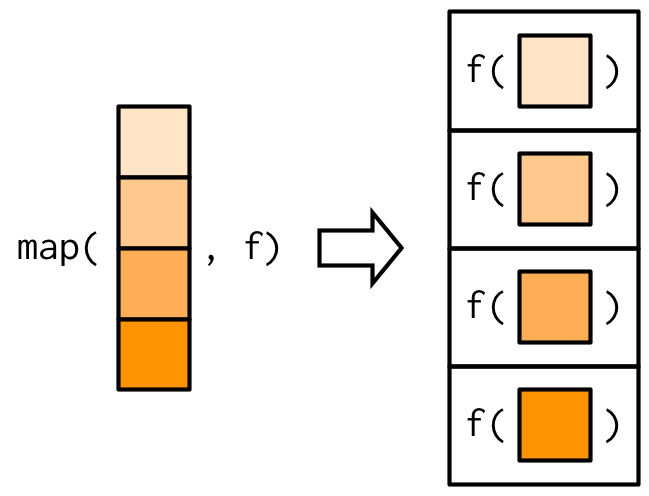

]

.pull-right[
<br>
<br>
.blockquote.exercise[
#### `r ICONS$desktop` Example: `map()`

`map(1:3, f)` is `list(f(1), f(2), f(3))`.
```{r}
triple <- function(x) x * 3
map(1:3, triple)
```
]]]

???

- Do the example using `lapply()`: `lapply(1:3, function(x) x * 3)`

- Obviously `map()` returns a list, too.

---
## `purrr::map_*()` &mdash; Producing Atomic Vectors

.font90[

- **Typed variants** return an atomic vector of the specified type: `map_lgl()`, `map_int()`, `map_dbl()`, `map_chr()`

- **`map_vec()`** (purrr ≥ 1.0.0) handles any vector type including dates, factors, and other S3 vectors

- Base R equivalents are `sapply()` and `vapply()`

]

<br>

.font80[

.blockquote.exercise[
#### `r ICONS$desktop` Example: `map_*()`
.pull-left[
<br>
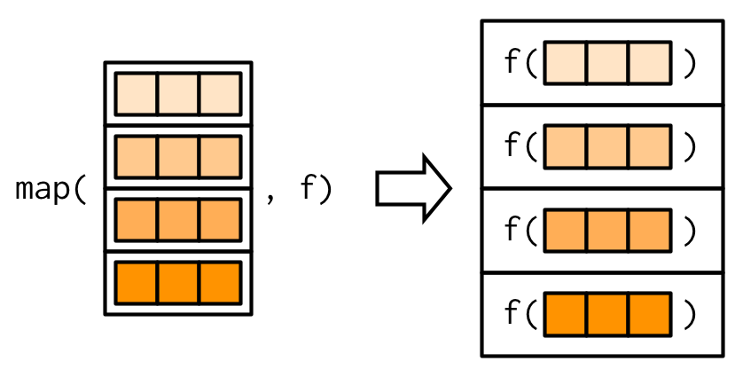

]

.pull-right[
.smaller[
```{r}
# check class of mtcars data
class(mtcars)

map_lgl(mtcars, is.double)

n_unique <- function(x) length(unique(x))
map_int(mtcars, n_unique)
```
]]]]

???

- Remember that `logical`, `integer`, `double` and `character` are atomic types

- `mtcars` is a data frame thus the `map_*()` functions map the columns

- Of course, the `*` in `map_*()` must match the return type of the functions used for mapping

---
## `purrr::map_*()` &mdash; Anonymous Functions

.font90[

Since R 4.1, the **native lambda** `\(x)` is the preferred shorthand for anonymous functions in `purrr`.

.blockquote.exercise[
#### `r ICONS$desktop` Example: `map_*()` with anonymous function

```{r}
map_dbl(mtcars, function(x) length(unique(x)))   # verbose but explicit
```

```{r}
map_dbl(mtcars, \(x) length(unique(x)))           # preferred: native lambda
```

```{r}
map_dbl(mtcars, ~ length(unique(.x)))             # legacy twiddle (~) with .x
```

]]

???

- Both `\(x)` and `~` are converted to functions internally via `as_mapper()`.
- Prefer `\(x)` in new code for consistency with modern R style.
- Good rule of thumb: if a function spans multiple lines or uses `{...}`, give it a name.

---
## `purrr::map_*()` &mdash; Element Extraction and `pluck()`

.font90[

`map_*()` is useful for selecting elements from a `list` by name, position, or both.

.blockquote.exercise[

#### `r ICONS$desktop` Example: element extraction with `map_*()`

.pull-left[
```{r}
x <- list(
  list(-1, x = 1, y = c(2), z = "a"),
  list(-2, x = 4, y = c(5, 6), z = "b"),
  list(-3, x = 8, y = c(9, 10, 11))
)
```

```{r}
map_dbl(x, "x")   # select by name
map_dbl(x, 1)     # select by position
```
]

.pull-right[
For deep extraction from a **single** element, use `pluck()`:

```{r}
pluck(x, 2, "y")                   # → c(5, 6)
pluck(x, 3, "z", .default = NA)    # safe: returns NA if missing
```
]]]

???

In base R we'd have to write a function that iterates through `x` or use `sapply()`.

---
## `purrr::map_*()` &mdash; Producing Atomic Vectors

<br>
<br>
<br>
<br>
.content-box-white[
**Task:** 

Write short Base R code which works on `x` from the previous slide and returns 

  1. all entries named `'x'` and 
  
  2. all entries at position 1 from this nested list.
]

???

```{r, results='hold'}
# 1.
sapply(x, "[[", "x")
# 2.
sapply(x, "[[", 1)
```

---
## `purrr::map_*()` &mdash; Producing Atomic Vectors

.font90[

Note that components must exist in all entries of the object we iterate over (here a _nested_ list). 

<br>

.blockquote.exercise[
#### `r ICONS$desktop` Example: element extraction with `map_*()`

```{r, error=TRUE}
map_chr(x, "z")   # z doesn't exist in x[[3]]
```

To prevent this error a `.default` value can be supplied.

```{r}
map_chr(x, "z", .default = NA)
```
]]

???

Keep in mind that this requires your subsequent code to work with `NA`s.

---
## `purrr::map_*()` &mdash; Producing Atomic Vectors

.font90[

- Additional arguments to the mapping function may be passed *after* the function name. 

- We need to be careful with **evaluation**!

<br>

.blockquote.exercise[
#### `r ICONS$desktop` Example: mapping with additional arguments

.pull-left[
  <br>
  
  
]

.pull-right[

```{r}
x <- list(1:5, c(1:10, NA))
map_dbl(x, \(x) mean(x, na.rm = TRUE))
```

More efficient:

```{r}
map_dbl(x, mean, na.rm = TRUE)
```

]]]

???

Arguments passed to an anonymous function are evaluated in every iteration. The latter approach is more efficient because additional arguments are evaluated just once.

---
## `purrr::map_*()` &mdash; Producing Atomic Vectors

.font90[

Additional arguments are **not decomposed**: `map_*()` is only vectorized over the first argument (the data). Further (vector) arguments are passed along.

<br>

.blockquote.exercise[
#### `r ICONS$desktop` Example: mapping with additional arguments &mdash; ctd.

.pull-left[
<br>
 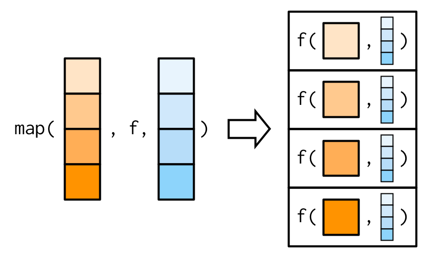
 
]

.pull-right[
```{r}
# Arg. 'mean' is recycled
map(1:3, rnorm, mean = c(100, 10, 1))
```
]]]

???

Question to students:

Explain the outcomes of `map(1:4, rnorm, mean = c(100, 10, 1))`

---
## `purrr::map_*()` &mdash; Producing Atomic Vectors

<br>

.blockquote.exercise[
#### `r ICONS$desktop` Example: mapping over a different argument

.font80[

Assume you'd like to investigate the impact of different amounts of trimming when computing the mean of observations sampled from a heavy-tailed distribution.

.pull-left[
  <br>
  <br>
  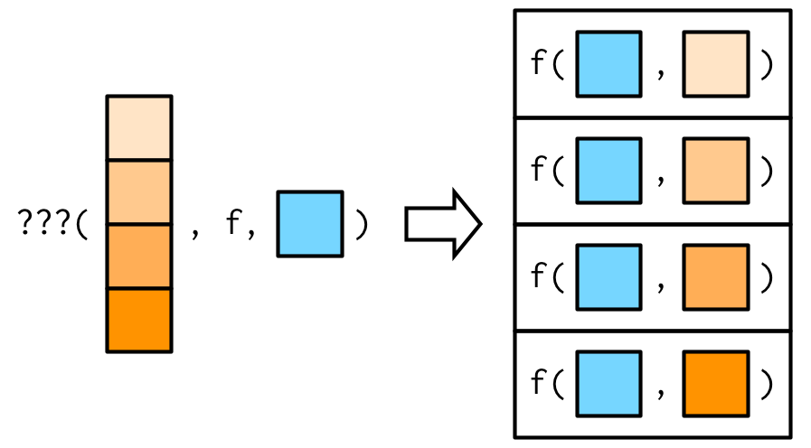
  
]

.pull-right[

```{r}
trims <- c(0, 0.1, 0.2, 0.5)
x <- rcauchy(1000)
```

We may switch arguments using a lambda:

```{r}
map_dbl(trims, \(trim) mean(x, trim = trim))
```

The legacy twiddle shorthand is equivalent:

```{r}
map_dbl(trims, ~ mean(x, trim = .x))
```

]]]

---
## `purrr::map_*()` &mdash; Exercises

<br>

.font90[

1. `map(1:3, ~ runif(2))` is a useful pattern for generating random numbers, but `map(1:3, runif(2))` is not. Why not? Can you explain why it returns the result that it does?

2. The following code simulates t-tests for non-normal data. Extract the p-value from each test, then visualise.
    ```{r, eval=F}
    trials <- map(1:100, ~ t.test(rpois(10, 10), rpois(10, 7)))
    ```

3. Use `map()` to fit linear models to the `mtcars` dataset using the formulas stored in this list:
    ```{r, eval = F}
    formulas <- list(
       mpg ~ disp,
       mpg ~ disp + wt,
       mpg ~ I(1 / disp) + wt
    )
    ```

]

???

1. `map(1:3, ~ runif(2))` evaluates `runif()` with `n = 2` in every iteration since `~` converts to an anonymous function. `map(1:3, runif(2))` evaluates `runif(2)` only once and cannot do mapping because `runif(2)` is not treated as a function.

2. Code:
    ```r
    library(ggplot2)
    
    trials_df <- tibble(p_value = map_dbl(trials, "p.value"))
    
    trials_df |> 
      ggplot(aes(x = p_value, fill = p_value < 0.05)) + 
      geom_histogram(binwidth = .025) +
      ggtitle("Distribution of p-values for random Poisson data.")
    ```

3. Code:
  ```r
  models <- map(formulas, lm, data = mtcars)
  ```

---
## Case Study: Model Fitting with `purrr`

.font90[

Tired of `mtcars`? We're too... let's use `cars2018`, a dataset on fuel efficiency of real cars of today from a US Department of Energy instead! 🚗🚗🚗

We will now take a look at how `purrr` functions can be used to fit a regression model to subgroups of data, extract estimates and then compare the approach to base R approaches.

**Instructions**

1. Load the `cars2018.csv` dataset and split it by `Drive`, see `?split`

2. Use `purrr` (preferably together with `dplyr`) to

      - fit the model `MPG ~ Cylinders` to each subgroup
      - extract the estimated coefficient of `Cylinders`
    
3. Contrast your `purrr` approach to base R alternatives that rely on `*apply()` and `for()`, respectively

]

---
exclude: true
## Case Study: Model Fitting with `purrr`

```{r, message = F}
cars2018 <- readr::read_csv("../data/cars2018.csv")
by_drive <- split(cars2018, cars2018$Drive)
```

**`purrr` style:**

```{r}
by_drive |>
  map(\(data) lm(MPG ~ Cylinders, data = data)) |>
  map(coef) |>
  map_dbl(2)
```

---
exclude: true
## Case Study: Model Fitting with `purrr`

.smaller[

**`apply()`-style R**

```{r}
models <- lapply(by_drive, function(data) lm(MPG ~ Cylinders, data = data))
vapply(models, function(x) coef(x)[[2]], double(1))
```

**`for()` loop**

```{r}
slopes <- double(length(by_drive))
for (i in seq_along(by_drive)) {
  model <- lm(MPG ~ Cylinders, data = by_drive[[i]])
  slopes[[i]] <- coef(model)[[2]]
}
slopes
```

]

---
exclude: true
## Case Study: Model Fitting with `purrr`

- `purrr` code is most accessible as each line encapsulates a single step and the `purrr` helpers allow us to concisely describe what to do in each step.

- Moving from `purrr` to base R we see that the number functions which iterate decreases while each iteration becomes increasingly complicated:

  - Using `purrr` we iterate 3 times (`map()`, `map()` and `map_dbl()`)

  - The `apply()` approach iterates twice (`lapply()` and `vapply()`)

  - Everything can be done in one `for()` loop

<br>
.content-box-white[
**Take-away-message**: functional-style programming using `purrr` allows to decompose the task into simple steps. The code is easier to understand, modify and adapt to other applications.
]

---
## Map Variants

.font90[

There are 23 variants of `map*()` which are variants of the following functions:

- Output same type as input: **`modify()`**

- Iterate over two inputs: **`map2()`**

- Iterate with an index: **`imap()`**

- Return nothing: **`walk()`**

- Iterate over any number of inputs: **`pmap()`**


|    	                   | List          |	Atomic       | Same type     | Nothing      |
| ---------------------- | ------------- | ------------- | ------------- | ------------ |
| One argument	         | `map()`	     | `map_*()`	   | `modify()`    | `walk()`     |
| Two arguments	         | `map2()`	     | `map2_*()`	   | `modify2()`   | `walk2()`    |
| One argument + index	 | `imap()`	     | `imap_*()`	   | `imodify()`	 | `iwalk()`    |
| N arguments	       	   | `pmap()`      | `pmap_*()`	   | `—`	         | `pwalk()`    |

.font80[**Note:** `map_dfr()` / `map_dfc()` and similar row/col-binding variants are **superseded** — prefer `map() |> list_rbind()` or `map() |> list_c()`.]

]

???

The table shows input (rows) and output types (columns).

---
## `purrr::modify()`

.font90[

The `modify()` function works on the input *components* and returns an object of the same type as the input.

<br>

.blockquote.exercise[
#### `r ICONS$desktop` Example: `data.frame` in / `data.frame` out

```{r}
df <- data.frame(
  x = 1:3,
  y = 6:4
)

modify(df, ~ .x * 2)
```

Note that `modify()` never modifies in-place but creates a copy, which must be (re)assigned.

```{r}
df <- modify(df, ~ .x * 2)
```

]]

---
## Predicate Functionals: `keep()`, `discard()`, and friends

.font90[

Filter list or vector elements based on a **predicate function**.

.blockquote.exercise[
#### `r ICONS$desktop` Example: `keep()`, `discard()`, and `compact()`

```{r}
# keep only well-fitting models
models <- map(split(mtcars, mtcars$cyl), \(d) lm(mpg ~ wt, data = d))
keep(models, \(m) summary(m)$r.squared > 0.75)
```

```{r}
# discard NULL elements; every()/some()/none() test predicates across all elements
compact(list(1, NULL, 3, NULL, 5))
every(models, \(m) nobs(m) >= 3)   # do ALL models have at least 3 observations?
```

]]

---
## `purrr::map2()`

.font90[

`map2()` is vectorised over two arguments.

<br>

.blockquote.exercise[
#### `r ICONS$desktop` Example: weighted mean using `map2()`

.pull-left[
  <br>
  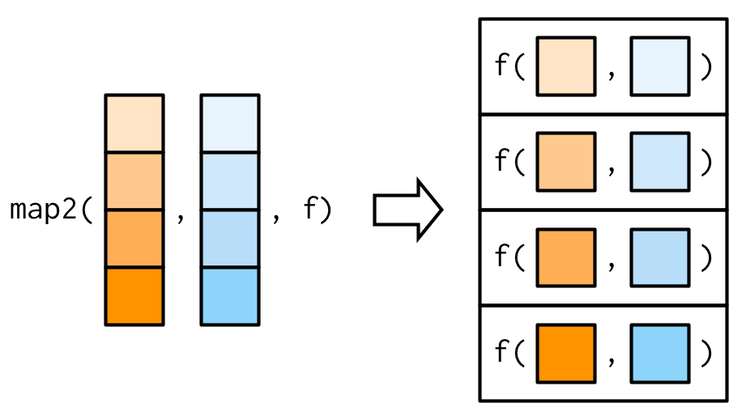
  
]

.pull-right[

Let's generate lists of observations and associated weights.

```{r}
set.seed(123)
xs <- map(1:4, ~ runif(4))
xs[[1]][[1]] <- NA
ws <- map(1:4, ~ rpois(4, 5) + 1)
```

`map2_dbl` varies both `xs` and `ws` as inputs to `weighted.mean()`.

```{r}
map2_dbl(xs, ws, weighted.mean)
```

]]]

---
## `purrr::map2()`

.font90[

Additional arguments may be passed just as with `map()`.

<br>

.blockquote.exercise[
#### `r ICONS$desktop` Example: weighted mean using `map2()` &mdash; ctd.

.pull-left[
  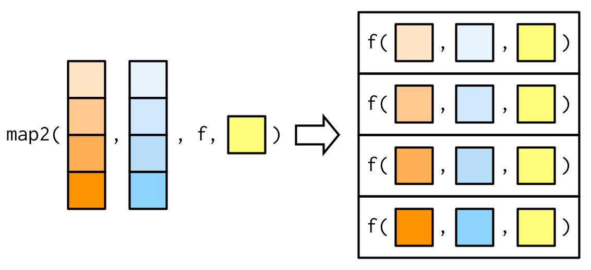
  
]

.pull-right[

```{r}
# passing na.rm = TRUE
map2_dbl(xs, ws, weighted.mean, na.rm = TRUE)
```

]]]

---
exclude: true
## `purrr::map2()`

.font90[

Note that `map2()` also recycles inputs to ensure that they are the same length.

<br>

.blockquote.exercise[
#### `r ICONS$desktop` Example: weighted mean using `map2()` &mdash; ctd.

.pull-left[
  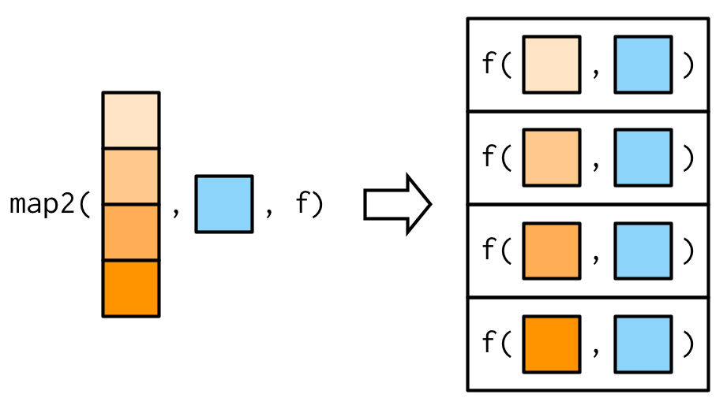
  
]

.pull-right[

```{r}
map2_dbl(1:6, 1, ~ .x + .y)
```

]]]

---
exclude: true
## `purrr::walk()`

.font90[

- `walk()` ignores the return value of `.f` and returns `.x` invisibly. This is useful for functions that are called for their side-effects.

- There is no base R equivalent but wrapping `lapply()` with `invisible()` comes close

.blockquote.exercise[
#### `r ICONS$desktop` Example: assigning and passing objects

.pull-left[
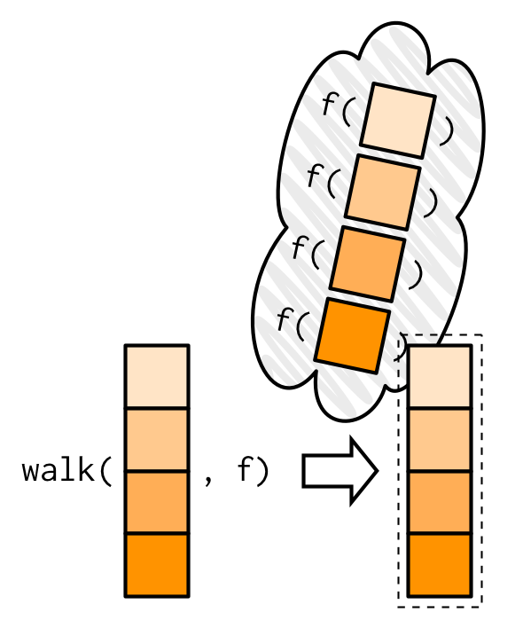

]

.pull-right[

Assignment to an environment is a side-effect.

<br>
<br>
<br>


]]]

---
exclude: true
## `purrr::walk()`

.font90[

`walk2()` is a convenient alternative which is vectorised over two arguments. 

.blockquote.exercise[
#### `r ICONS$desktop` Example: write to disc

.pull-left[
  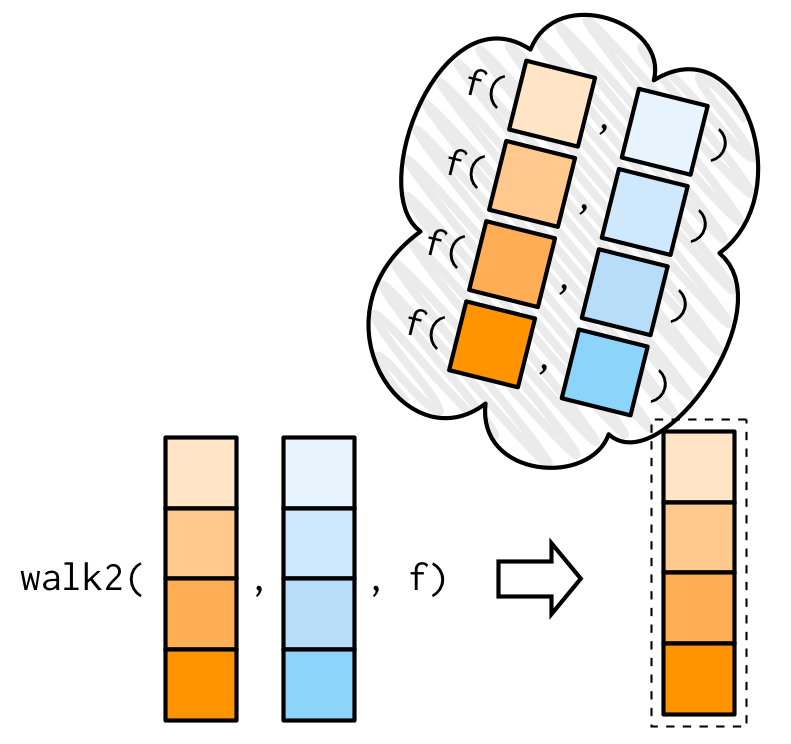
  
]

.pull-right[

A common side-effect which needs two arguments (object and path) is writing to disk.

<br>
<br>
<br>


]]]


---
exclude: true
## `purrr::imap()`

.font90[

- `map(.x, .f)` is essentially an analog to `for(x in xs) <apply .f to x and assign to list>`

- `for(i in seq_along(xs))` and `for(nm in names(xs))` are analogous to `imap()`: 

    `imap(.x, .f)` applies `.f` to values `.x` *and indices or names derived from* `.x`.

.blockquote.exercise[
#### `r ICONS$desktop` Example: named column means

`imap()` is a useful helper if we want to work with values along with variable names.

<br>
<br>


]]

???

- When using the formula shortcut, the first argument `.x` is the value, and the second `.y` is the position/name

- `cars2018 |> select_if(is.numeric)` returns a list so `.y` is a name and `.x` the value

- `character` vectors index by name, `numeric` vectors index by position

---
## `purrr::pmap()`

.font90[

`pmap()` generalises `map()` and `map2()` to `p` vectorised arguments. Thus `pmap(list(x, y), f)` is the same as `map2(x, y, f)`.

<br>

.blockquote.exercise[
#### `r ICONS$desktop` Example: weighted mean with `pmap()`

.pull-left[
  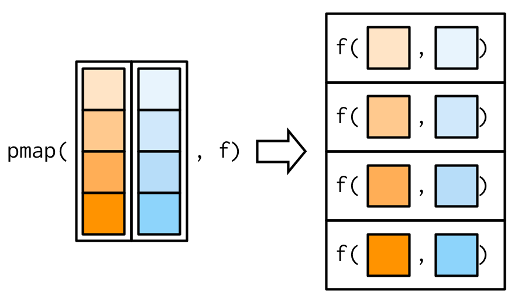
  
]

.pull-right[

`map2_dbl()` behaves as `pmap_dbl()` in the two-argument case:

```{r}
map2_dbl(xs, ws, weighted.mean)
```

```{r}
pmap_dbl(list(xs, ws), weighted.mean)
```
]]]

---
## `purrr::pmap()`

.font90[

As before, additional arguments may be passed after `.f` and they are recycled, if necessary.

<br>

.blockquote.exercise[
#### `r ICONS$desktop` Example: weighted mean with `pmap()` &mdash; ctd.

.pull-left[
  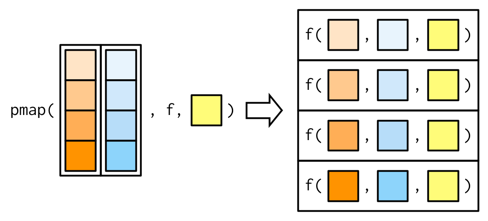
  
]

.pull-right[

Now with the additional argument `na.rm = TRUE`:

```{r}
pmap_dbl(list(xs, ws), 
         weighted.mean, 
         na.rm = TRUE)
```
]]]

---
## `purrr::pmap()` &mdash; Named and Data Frame Inputs

.font90[

Use **named lists** or **data frames** to map arguments by name — especially useful with many or complex inputs.

.blockquote.exercise[
#### `r ICONS$desktop` Example: named list and `data.frame` inputs

.pull-left[

Named list: `pmap()` matches by argument name.

```{r}
trims <- c(0, 0.1, 0.2, 0.5)
x <- rcauchy(1000)

pmap_dbl(
  list(trim = trims, na.rm = FALSE),
  .f = mean,
  x = x
)
```

]

.pull-right[

A `data.frame` is a `list` — column names match argument names automatically.

```{r}
params <- tibble::tribble(
  ~ n, ~ min, ~ max,
   1L,     0,     1,
   2L,    10,   100
)
pmap(params, runif)
```

]]]

???

`tribble()`: create tibbles using an easier to read row-by-row layout.

---
## `purrr::pmap()` &mdash; Exercises

.font90[

<br>

1. Explain the results of `modify(cars2018, 1)`

2. Explain how the following code transforms a `data.frame` using functions stored in a `list`.
    ```{r, eval=F}
    trans <- list(
      Displacement = function(x) x * 0.0163871,
      Transmission = function(x) factor(x, labels = c("Automatic", "Manual", "CVT"))
    )
    
    nm <- names(trans)
    cars2018[nm] <- map2(trans, cars2018[nm], ~ .x(.y))
    ```

3. Compare and contrast the `map2()` approach to this `map()` approach:
    ```{r, eval=F}
    cars2018[nm] <- map(nm, ~ trans[[.x]](cars2018[[.x]]))
    ```

]

???

1. `modify()` is a shortcut for `x[[i]] <- f(x[[i]]); return(x)`. So every row is filled with it's first value.

2. Too lenghty, see class notes

3. As above
    
---
## Combining Map Output: `list_rbind()` and `list_c()`

.font90[

`map_dfr()` / `map_dfc()` are **superseded**. The modern idiom explicitly combines with `list_rbind()` or `list_c()`.

.blockquote.exercise[
#### `r ICONS$desktop` Example: replacing `map_dfr()`

.pull-left[

**Superseded:**

```{r, eval = FALSE}
map_dfr(split(mtcars, mtcars$cyl),
  \(d) broom::tidy(lm(mpg ~ wt, d)))
```

]

.pull-right[

**Modern:**

```{r, eval = FALSE}
split(mtcars, mtcars$cyl) |>
  map(\(d) broom::tidy(lm(mpg ~ wt, d))) |>
  list_rbind()
```

`list_c()` collapses a list of vectors into one:

```{r}
map(1:3, \(n) runif(n)) |> list_c()
```

]]]

---
## Adverbs: `safely()` and `possibly()`

.font90[

**Adverbs** modify functions so they never throw errors — essential for robust iteration.

.blockquote.exercise[
#### `r ICONS$desktop` Example: `safely()` and `possibly()`

.pull-left[

`safely()` returns `list(result, error)` — always succeeds:

```{r, eval = FALSE}
safe_log <- safely(log)

results <- map(list(10, -1, "a"), safe_log)
results |> map("result") |> compact()   # successes
results |> map("error")  |> compact()   # errors
```

]

.pull-right[

`possibly()` returns a default on error — simpler:

```{r, eval = FALSE}
safe_log <- possibly(log, NA_real_)
map_dbl(list(10, -1, "a"), safe_log)
```

| | `safely()` | `possibly()` |
|---|---|---|
| On error | `list(result, error)` | Returns default |
| Use when | Need to inspect errors | Just need fallback |

]]]

---
exclude: true
## `purrr::reduce()`

Having only two main variants, the `reduce` family of functions is much smaller than the `map` family and implements a less commonly needed yet powerful concept:

`reduce()` produces a vector of length 1 from vector input by calling `f` with a pair of values at a time: `reduce(1:4, f)` gives `f(f(f(1, 2), 3), 4)`.

<br>

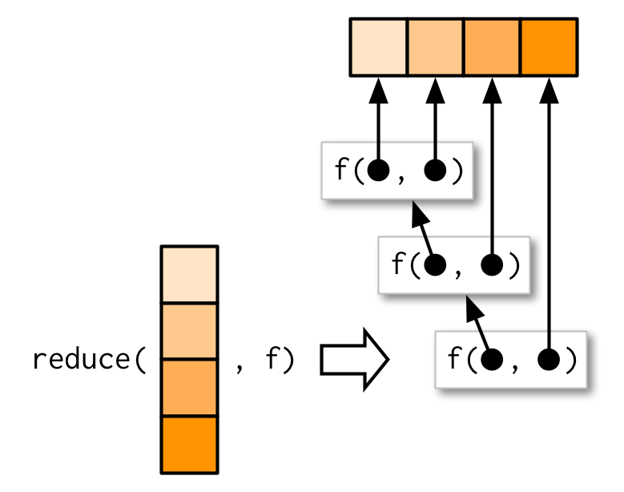


---
exclude: true
## `purrr::reduce()`

.smaller[

`reduce()` is useful for generalising a binary function (a function with two inputs) to any number of inputs.

.blockquote.exercise[
#### `r ICONS$desktop` Example: set operations with vectors

Consider the following list of numeric vectors `l`.

```{r}
l <- map(1:4, ~ sample(1:10, 15, replace = T))
str(l)
```

Suppose you want to find values which occur in all vectors in `l`. Note that `intersect()` is binary, i.e. it returns the intersection of elements in two input vectors.
]]

---
exclude: true
## `purrr::reduce()`

.medium[
.blockquote.exercise[
#### `r ICONS$desktop` Example: set operations with vectors &mdash; ctd.

A base R solution is rather cumbersome even for a small set of vectors.

```{r}
out <- l[[1]]
out <- intersect(out, l[[2]])
out <- intersect(out, l[[3]])
out <- intersect(out, l[[4]])
out
```

We could generalise the above to an arbitrary number of vectors using a loop but such operations are conveniently handled by `reduce()` which is also more efficient.

```{r}
reduce(l, intersect)
reduce(l, union)
```
]]

---
exclude: true
## `purrr::accumulate()`

.smaller[

`accumulate()` is a variant of `reduce()` which returns the final and all intermediate results.

.blockquote.exercise[
#### `r ICONS$desktop` Example: cumulative sum

The difference between `reduce()` and `accumulate()` is best understood using a sequence of binary arithmetic operations.

```{r}
x <- 1:3
reduce(x, `+`)
```

vs.

```{r}
x <- 1:3
accumulate(x, `+`)
```
]]

---
exclude: true
## `purrr::accumulate()`

.smaller[
.blockquote.exercise[
#### `r ICONS$desktop` Example: set operations with vectors &mdash; ctd.

So with `.f` a function for binary intersection we also obtain the 'intermediate' sets.

```{r}
accumulate(l, intersect)
```
]]

---
class: segue-red
### Part II

Function Factories

---
## Function Factories

.font90[

A function factory is a function that *produces* functions.

<br>

.blockquote.exercise[
#### `r ICONS$desktop` Example: function factory

```{r}
nth_root <- function(n) {   # function factory
  function(x) {
    x^(1/n)
  }
}

cube_root <- nth_root(3)    # manufactured function
cube_root(8)
```

]]

---
## Function Factories

.font90[

The enclosing environment of the manufactured function is an **execution environment** of the function factory.

<br>

.blockquote.exercise[
#### `r ICONS$desktop` Example: function factory &mdash; ctd.

```{r}
rlang::env_print(cube_root)     # inspect enclosing environment
rlang::fn_env(cube_root)$n      # retrieve from enclosing environment
```

]]

???

- Remember that execution environments are _ephemeral_ in general: they are destroyed once the function has run.

- This is different here: the enclosing environment of `cube_root()` was the execution environment of `nth_root()`&mdash;a mechanism which makes function factories possible.

---
## Function Factories &mdash; Lazy Evaluation and `force()`

.font90[

R uses **lazy evaluation**: arguments are not evaluated until first used — this can cause unexpected behaviour in factories.

.blockquote.exercise[
#### `r ICONS$desktop` Example: lazy evaluation bug and fix with `force()`

```{r}
n <- 2; sq <- nth_root(n); n <- 16
sq(64)             # Bug! n is evaluated lazily as 16 → 1.297...
```

Fix: use `force(n)` to evaluate `n` immediately when the factory runs.

```{r}
nth_root <- function(n) {
    force(n)
    function(x) x^(1/n)
}
n <- 2; sq <- nth_root(n); n <- 16
sq(64)             # 8 — correct ✓
```

**Rule of thumb:** Always `force()` factory arguments that manufactured functions depend on.

]]

???

- `64^(1/16) = 1.29684` (with the bug)
- `n` is lazily evaluated when `sq()` is run, not when `nth_root()` is run.
- Question to students: why `force(n)` and not just `n`? (check def. of `force()`)

- Note on Garbage Collection:
    
    As manufactured functions hold on to the execution environment of the function factory you need to remove large objects manually.
```r
f1 <- function(n) {
  x <- runif(n)
  m <- mean(x)
  rm(x) # use lobstr::obj_size() on a man. function to see difference
  function() m
}
```

---
## Function Factories &mdash; Stateful Functions

.font90[

Function factories allow us to create *functions with a memory*.

<br>

.blockquote.exercise[
#### `r ICONS$desktop` Example: counter

```{r}
# factory for a counter
new_counter <- function() {
  i <- 0
  function() {
    i <<- i + 1
    i
  }
}
counter_one <- new_counter()
counter_two <- new_counter()

replicate(2, counter_one())
replicate(5, counter_two())
```

]]

???

- Should be used with moderation. The _S6_ system is more suitable if your manufactured functions are to manage multiple variables.

- The "state" (`i` here) is tracked in the execution environment. This is a _different_ environment for each function produced by the factory.

    ```r
    rlang::env_print(counter_one)
    rlang::env_print(counter_two)
    ```

---
exclude: true
## Case Study: Maximum Likelihood Estimation

Consider the problem of finding the MLE for $\lambda$ when modelling data $\mathbb{x} = (x_1, x_2, \dots, x_n)$ using the Poisson distribution. We have

\begin{align*}
P(\lambda, \mathbb{x}) =& \, \prod_{i=1}^n\frac{\lambda^{x_i}\exp{\lambda}}{x_i!} \Leftrightarrow \log(P(\lambda, \mathbb{x})) = \log(\lambda)\sum_{i=1}^n x_i - n\lambda - \sum_{i=1}^n\log(x_i!).
\end{align*}

The log-likelihood is easily implemented as an R function:

```{r}
lprob_poisson <- function(lambda, x) {
  n <- length(x)
  (log(lambda) * sum(x)) - (n * lambda) - sum(lfactorial(x))
}
```

- Implement a function factory `ll_poisson()` which manufactures a Poisson log-likelihood for a given data vector `x`

- Use `ll_poisson()` to estimate $\lambda$ based on a sample of 100 pseudorandom numbers from $poiss (\lambda = 30)$

---
exclude: true
## Case Study: Maximum Likelihood Estimation

.smaller[
A general Poisson log-likelihood for data `x` can also be implemented using a function factory.
]

```{r}
ll_poisson <- function(x) {
  # components that depend on x only
  n <- length(x)
  sum_x <- sum(x)
  c <- sum(lfactorial(x))

  # manufactured function
  function(lambda) {
    log(lambda) * sum_x - n * lambda - c
  }
}
```

???

- The advantage of using a function factory here is fairly small, but there are two niceties:

    - We can precompute some values in the factory, saving computation time in each iteration.

    - The two-level design better reflects the mathematical structure of the underlying problem.

- These advantages get bigger in more complex MLE problems, where you have multiple parameters and multiple data vectors.

---
exclude: true
## Case Study: Maximum Likelihood Estimation

Let's find the MLE for a Poisson random vector.

```{r, cache=T}
x1 <- rpois(100, 30)
llp <- ll_poisson(x1)

optimise(lprob_poisson, x = x1, c(0, 40), maximum = T)
# better:
optimise(llp, c(0, 40), maximum = T)
```

---
class: segue-red


### Thank You! 


